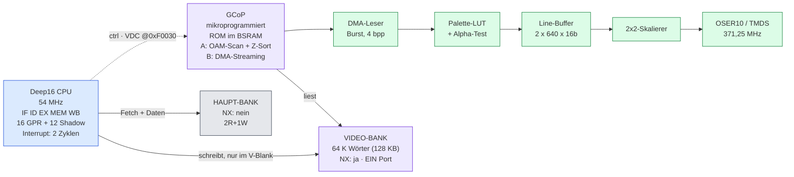
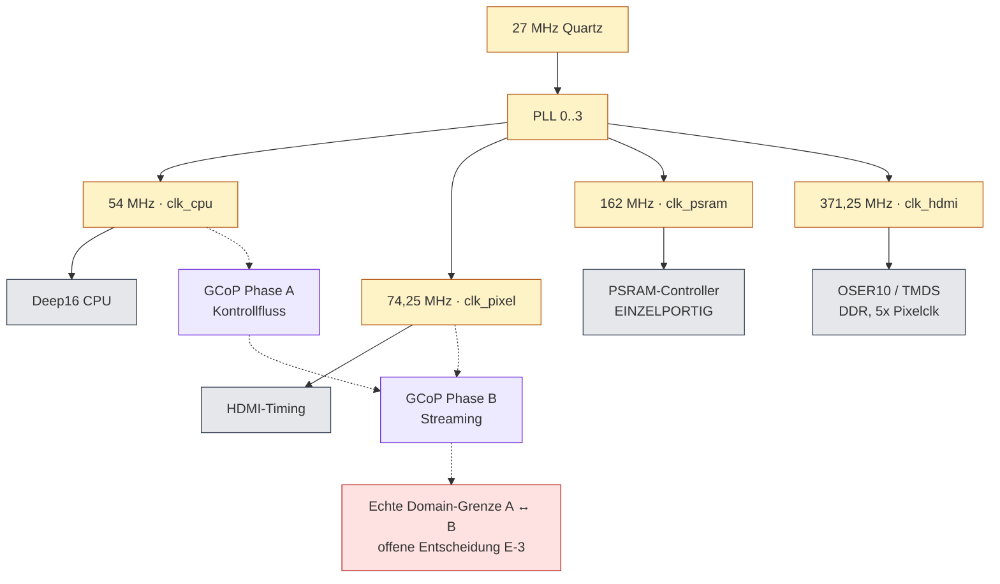
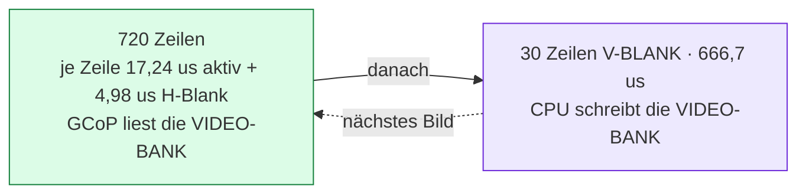
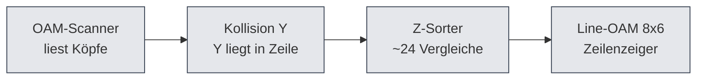
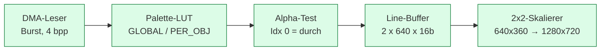

# Deep16 Grafik-Subsystem (GCoP) — Architektur-Übersicht

**Dokumenttyp:** Übersichtsdiagramme zum Entwurf in [`GFX.md`](GFX.md).
**Diese Datei enthält keine neuen Entscheidungen.** Sie veranschaulicht den dort
festgelegten Stand. Bei Widerspruch gilt `GFX.md`.

Projekt-Status: Design-Phase / Planungsgrundlage — fernes Future.
Ziel-Hardware: Sipeed Tang Nano 9K (Gowin GW1NR-9K).

> **Zum Diagrammformat:** Die Block- und Datenflussbilder sind Mermaid, wie in
> `STYLE.md` §4 und den Buchkapiteln. GitHub rendert sie nativ. Die Zeitachsen in
> §3 bleiben ASCII, weil dort die **Proportion** die Aussage ist (1280 px gegen
> 370 px) — die kann ein Flussdiagramm nicht transportieren.
> `book/build/mermaid_filter.lua` gilt nur für `book/kap*.md`; dieses Dokument
> liegt im Wurzelverzeichnis und wird davon nicht erfasst.

---

## 1. Systemüberblick

Die CPU ist Host und Schreiber, der GCoP ist rasterbarer Leser. Beide greifen auf
denselben Speicher zu, aber auf **verschiedene Bänke**.



**Die Kernaussage steckt in den Pfeilen.** Weil die Video-Bank NX ist, führt vom
CPU-Fetch dorthin *kein* Pfad — die Konsumenten der Video-Bank sind ausschließlich
CPU-Schreiben und GCoP-Lesen. Und weil das nie gleichzeitig passiert, genügt dort
**ein einziger physischer Port** (`GFX.md` §9.2).

---

## 2. Taktbereiche

Vier PLLs aus dem 27-MHz-Quarz. Die Zuordnung bestimmt, wo Clock-Grenzen zu behandeln
sind — GCoP-Phase A und Phase B liegen in **verschiedenen** Domänen.



`clk_hdmi_serial` ist die einzige Domain ohne Rückwirkung auf Logik. Die Umschaltung
A↔B ist die einzige echte Domain-Grenze im Entwurf.

---

## 3. Zeilen-Timeline — das Kernbild

Dieses Bild erklärt, warum der Entwurf funktioniert: die beiden GCoP-Phasen brauchen
**verschiedene** Speicher, und der CPU fällt in Phase A nicht ins Gehege.

```
  Eine Zeile: 22,22 us = 1650 Pixelclocks = 45,0 kHz
          1280 px / 17,24 us                        370 px / 4,98 us
  <---------------------------------------------...........................>
  +--------------------------------------------+--------------------------+
  | PHASE B   ACTIVE VIDEO                     | PHASE A   H-BLANK        |
  |                                            |                          |
  | GCoP liest Pixeldaten per Burst            | GCoP scant das OAM,      |
  | aus der VIDEO-BANK                         | liest nur Objektkoepfe   |
  |                                            |                          |
  | CPU frei auf der HAUPT-BANK                | CPU frei                 |
  | -> kein Konflikt                           |                          |
  |                                            |                          |
  +--------------------------------------------+--------------------------+

            17,24 us                             4,98 us = 269 Zyklen @ 54 MHz
```

```
  Ein Bild: 16,67 ms = 750 Zeilen = 60,00 Hz
                      720 Zeilen                              30 Zeilen
  <-------------------------------------------------------.................>
  +------------------------------------------------------+----------------+
  | 720 mal Phase B hintereinander                       | V-BLANK        |
  |                                                      |                |
  | GCoP liest die VIDEO-BANK                            | 666,7 us       |
  |                                                      |                |
  | CPU laeuft auf der HAUPT-BANK                        | CPU schreibt   |
  |                                                      | VIDEO-BANK     |
  |                                                      |                |
  +------------------------------------------------------+----------------+
```



**Der entscheidende Punkt:** In der Video-Bank *schreibt* die CPU nur im V-Blank und
*liest* der GCoP nur außerhalb. Daher genügt **ein** Port. Der Preis ist die Regel
*Video-RAM ist schreib-only für die CPU* (`GFX.md` §2.4, offene Punkte E-9/E-10).

---

## 4. GCoP-Bausteine und Pixelkette

**Phase A — das knappe Budget.** 269 Zyklen bei 54 MHz, geteilt **seriell** zwischen
Scanner, Kollisionstest und Sortierer, nicht parallel.



**Phase B — die Pixelkette.** Läuft ausschließlich hier; in Phase A wartet sie auf den
Line-Buffer.



Die Kette setzt am **Line-OAM** aus Phase A an: dessen Zeilenzeiger sagen der DMA-Leser,
welche Zeile aus welchem Objekt zu holen hat. 640 × 360 logisch → 2×2 exakt → 1280 × 720:
kein Raster, kein Flimmern.

Palette-Modi: `GLOBAL` (Default), `PER_OBJ`, `PER_16PX` (`GFX.md` §5). Der Alpha-Test
mischt nicht; die Hintergrundfarbe ist noch offen (E-4).

**Offen an dieser Stelle:** Y-Bucket-Index ist zwingend (E-6), Sortierverfahren offen (E-7).

---

## 5. Speicheraufteilung

| Bank | Adressen | Konsumenten | Ports | NX | Trägt |
|---|---|---|---|---|---|
| Haupt | `0x00000`–`0xDFFFF` | CPU Fetch, CPU Daten | 2R+1W, Cache deckt ab | nein | Programm, Daten, Stack, Heap |
| Video | `0xE0000`–`0xEFFFF` | GCoP Read, CPU Write (V-Blank) | **1 Port** | **ja** | Objektköpfe, Pixeldaten, Objektliste |
| I/O | `0xF0000`–`0xFFFFF` | GCoP-Steuerregister, CPU | 1R+1W | Textpuffer ja | VDC @0xF0030, Text @0xF1000 |

Die Aufteilung ist in §1 bereits als Blöcke mit NX-Zustand dargestellt; die Tabelle
trägt die Einzelheiten.

**Adressierung:** `Adresse = (seg << 4) + Wort-Offset`, geprüft in
`rtl/deep16_core.sv:571`. Ein Segmentwert ergibt damit ein **überlappendes 128-KB-Fenster**,
keine 64-KB-Partition — der Grund, warum NX über base+limit läuft und nicht über ein
Segment-Bit (`GFX.md` §2.2, E-8).

---

## 6. Steuerregister des GCoP

Vollständige Karte in `GFX.md` §7.1.

| Adresse | Register | Bedeutung |
|---|---|---|
| `0xF0030` | `VDC_CTRL` | Enable, Reset, Interlace (reserviert) |
| `0xF0031` | `VDC_STATUS` | Busy-in-H-Blank, VBlank-Flag, OAM-Überlauf |
| `0xF0032` | `VDC_OAMLIST` | Segmentadresse der Objektliste → Video-Bank |
| `0xF0033` | `VDC_OBJCOUNT` | Anzahl Objekte (~7, siehe `GFX.md` §4.4) |
| `0xF0034` | `VDC_BGPAL` | Basis der globalen Palette → BSRAM |
| `0xF0035` | `VDC_BGCOLOR` | Hintergrundfarbe RGB565 (offen: E-4) |
| `0xF0036` | `VDC_SCALING` | logische Breite/Höhe, Default 640×360 |
| `0xF0037` | `VDC_IRQEN` | Interrupt-Maske → VBlank-ISR |

---

## 7. Bandbreite

Nach der korrigierten Objektzahl (`GFX.md` §4.4) ist die PSRAM **kein** limitierender
Faktor — auch nicht im Extremfall.

| Szenario | `GLOBAL` | `PER_16PX` |
|---|---|---|
| 7 × 640 px — **Worst-Case**, volle Überdeckung | 131 MB/s (40 %) | 195 MB/s (60 %) |
| 7 × 160 px | 33 MB/s (10 %) | 49 MB/s (15 %) |
| 7 × 80 px — typisch | 17 MB/s (5 %) | 24 MB/s (8 %) |

Verfügbar: 324 MB/s (162 MHz × 16 Bit). Der Wert von 60 % im Worst-Case ist ohne
CPU-Anteil gerechnet — mit parallelem CPU-Zugriff ist das die harte Obergrenze, aus der
die CPU-Politik abgeleitet werden muss (`GFX.md` §4.5, E-1).

---

## 8. Abgleich mit GFX.md

| Abschnitt GFX.md | Diagramm hier |
|---|---|
| §1.1 Zeitbasis | §3 Zeilen-Timeline |
| §2.1–2.3 Adressierung, Objektlayout | §5 Speicheraufteilung |
| §2.4 Non-executable Video-RAM | §1 Gesamtbild, §5 |
| §3 Clock-Domänen | §2 Taktbereiche |
| §4.1 / §4.2 Phase A und B | §3 Timeline, §4 GCoP-Bausteine |
| §4.4 OAM-Budget (269 Zyklen) | §4 obere Kette |
| §5 Palettenmodi | §4 Palette-LUT, §7 |
| §6.2 Bandbreite | §7 |
| §7.1 / §7.2 Register, Interrupts | §6 |
| §9.2 Port-Aufteilung | §1 Pfeile, §5 Tabelle |

---

## 9. Legende

| Farbe | Bedeutung |
|---|---|
| blau | Host-Seite (CPU) |
| lila | Video-Bank bzw. GCoP, **NX** |
| grau | Haupt-RAM und allgemeine Blöcke |
| grün | Video-Ausgabekette (läuft nur in Phase B) |
| gelb | Takt- bzw. I/O-Bereich |
| rot | offene Entscheidung |

Ein Pfeil `──▸` ist ein Datenpfad, `╌╌▸` ein Steuer- oder Hinweg. **Fehlt** ein Pfeil
zwischen CPU-Fetch und Video-Bank, ist das Absicht: NX schließt diesen Pfad aus.