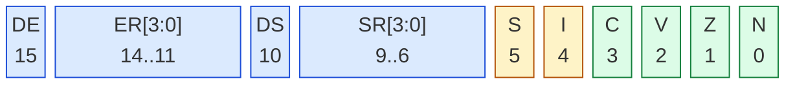

# Anhang A — Befehlsreferenz

Diese Übersicht listet **alle** Befehle der Deep16 mit ihrer Bit-Codierung und
einem Beispielwort. Die Codierungen stammen aus `doc/Deep16-Arch.md`, die
Beispielwörter sind **am Assembler gemessen** (`probe_anhang_a.mjs`), nicht
gerechnet — das Wort, das du beim Assemblieren bekommst.

Vier Felder bedeuten ein Register oder eine 4-Bit-Zahl, fünf ein 5-Bit-Wert.
`#` vor einem Wert kennzeichnet ein Immediate, das im Quelltext eine
Konstante ist.

---

## A.1 Laden und Verteilen

Diese Befehle bewegen Werte zwischen Registern und dem Speicher. Sie setzen
**keine** Flags — außer, wo es ausdrücklich anders steht.

**Tabelle A-1: Laden, Verteilen und Segmentzugriff**

| Befehl | Codierung | Wirkung | Beispielwort |
|---|---|---|---|
| `LDI imm` | `0000 0 imm15` | `R0 ← sign_extend(imm15)` | `LDI 0x1234` = `1234`; `LDI -1` = `7FFF` |
| `LSI Rd, imm` | `1111110 Rd4 imm5` | `R0 ← sign_extend(imm5)`, dann `Rd ← R0` | `LSI R3, 5` = `FC65` |
| `MOV Rd, Rs, imm2` | `111110 Rd4 Rs4 imm2` | `imm2` wählt die Funktion (Tabelle A-2) | `MOV R2, R1` = `F884` |
| `MVS Sx, Rd` | `111111110 0 Rd4 seg2` | Segmentregister `Sx ← Rd` | `MVS ES, R0` = `FF43` |
| `MVS Rd, Sx` | `111111110 1 Rd4 seg2` | `Rd ←` Segmentregister `Sx` | `MVS R1, ES` = `FF07` |
| `SMV Rx, alt` | `11111110 Rx4 alt4` | `Rx ←` Wert aus der **anderen** Bank | `SMV R5, AR0` = `FE58` |

**Tabelle A-2: Die vier `imm2`-Funktionen von `MOV`** (Spezifikation §3.4, §5.1.2)

| `imm2` | Schreibweise | Wirkung | aus `R1` = 5 |
|---|---|---|---|
| `00` | `MOV Rd, Rs` | kopieren | `5` |
| `01` | `MOV Rd, Rs << 1` | links schieben | `10` |
| `10` | `MOV Rd, Rs + 2` | plus zwei | `7` |
| `11` | `MOV Rd, Rs << 1 + 1` | schieben, Bit 0 setzen | `11` |

> **Merke:** `LDI` kennt nur `R0`, und sein Feld fasst 15 Bit. Jede andere
> 16-Bit-Konstante kostet deshalb **zwei** Instruktionen: `LDI` + `MOV` (§3.1).
>
> Und noch etwas, das man leicht für einen Fehler hält: `LDI -1` kodiert
> `7FFF`, **nicht** `FFFF`. Das Feld trägt 15 Bit, die CPU erweitert das Muster
> vorzeichenrichtig auf `FFFF` (§6.2). Das einzige Befehlswort, das `FFFF`
> ergibt, ist `HLT`.

**Tabelle A-3: Die `alt_sel`-Werte von `SMV`**

| `alt` | Name | liest … | Beispielwort |
|---|---|---|---|
| `0000` | `ACS` | `CS`′ | `FE50` |
| `0001` | `ADS` | `DS`′ | `FE51` |
| `0010` | `ASS` | `SS`′ | `FE52` |
| `0011` | `AES` | `ES`′ | `FE53` |
| `0100` | `APSW` | `PSW`′ | `FE54` |
| `0101`–`0111` | — | reserviert | — |
| `1000` | `AR0` | `R0`′ | `FE58` |
| `1001` | `AR1` | `R1`′ | `FE59` |
| `1010` | `AR2` | `R2`′ | `FE5A` |
| `1011` | `AR3` | `R3`′ | `FE5B` |
| `1100` | — | reserviert | — |
| `1101` | `AR13` | `SP`′ | `F25D` |
| `1110` | `AR14` | `LR`′ | `F25E` |
| `1111` | `APC` | aktiver `PC` | `FE5F` |

`APC` ist die einzige Ausnahme von der Regel „`SMV` liest die andere Bank" —
sie umgeht das Forwarding und liest den aktiven `PC`. §4.2 zeigt, wofür
`ALINK` (= `SMV LR, APC`) sie braucht.

---

## A.2 Arithmetik, Logik und Bitprüfung

Alle Befehle beginnen mit `110`. Danach folgen **drei** Bits für die
Grundoperation und ein viertes, das die Form wählt: `0` = zweites Register,
`1` = Immediate.

**Tabelle A-4: Die ALU-Befehle mit Grundoperation**

| Grundop | Registerform | Immediateform | Wirkung | Flags |
|---|---|---|---|---|
| `000` | `ADD Rd, Rs` | `ADD Rd, imm` | `Rd ← Rd + Rs` bzw. `+ imm` | `N`,`Z`,`V`,`C` |
| `001` | `SUB Rd, Rs` | `SUB Rd, imm` | `Rd ← Rd − Rs` bzw. `− imm` | `N`,`Z`,`V`,`C` |
| `010` | `CMP Rd, Rs` | `CMP Rd, imm` | Vergleich, **schreibt nicht** | `N`,`Z`,`V`,`C` |
| `011` | `AND Rd, Rs` | `CLRB Rd, imm` | UND, bzw. Bit `imm` löschen | `N`,`Z` |
| `100` | `TBC Rd, Rs` | `TBC Rd, imm` | **Test** Bit gelöscht? | `Z` |
| `101` | `OR Rd, Rs` | `OR Rd, imm` | ODER, bzw. Bit `imm` setzen | `N`,`Z` |
| `110` | `XOR Rd, Rs` | `XOR Rd, imm` | XOR, bzw. Bit `imm` kippen | `N`,`Z` |
| `111` | `TBS Rd, Rs` | `TBS Rd, imm` | **Test** Bit gesetzt? | `Z` |

**Tabelle A-5: Gemessene Beispielworte der ALU-Gruppe** (jeweils `R1`, dazu `R2` bzw. Immediate `3`)

| Befehl | Wort | Befehl | Wort |
|---|---|---|---|
| `ADD R1, R2` | `C012` | `ADD R1, 3` | `C113` |
| `SUB R1, R2` | `C212` | `SUB R1, 3` | `C313` |
| `CMP R1, R2` | `C412` | `CMP R1, 3` | `C513` |
| `AND R1, R2` | `C612` | `CLRB R1, 3` | `C713` |
| `TBC R1, R2` | `C812` | `TBC R1, 3` | `C913` |
| `OR R1, R2` | `CA12` | `OR R1, 3` | `CB13` |
| `XOR R1, R2` | `CC12` | `XOR R1, 3` | `CD13` |
| `TBS R1, R2` | `CE12` | `TBS R1, 3` | `CF13` |

> **Borrow bedeutet `C = 1`.** Bei `SUB` und `CMP` ist `C` gesetzt, wenn ein
> Unterlauf stattfand — nicht, wenn **kein** Übertrag passierte. Das ist gegen
> die 6502 genau umgekehrt (§3.2).

### Schieben und Rotieren

**Tabelle A-6: Die zwölf Schiebe- und Rotationsbefehle** (`count` = 0 bis 15)

| Opcode | Logisch | Arithmetisch | Mit `C` | Nach links rotieren |
|---|---|---|---|---|
| `1101 0000` | `SL` | `SLA` | `SLAC` | `ROL` |
| `1101 0001` | `SLA` | `SRA` | `SRAC` | `RLC` |
| `1101 0010` | `SLAC` | — | — | `ROR` |
| `1101 0011` | `SLC` | `SRC` | `RRC` | — |

Gemessene Beispielworte (`R1`, `count` = 3): `SL` = `D013`, `SLA` = `D113`,
`SLAC` = `D213`, `SLC` = `D313`, `SR` = `D413`, `SRC` = `D513`,
`SRA` = `D613`, `SRAC` = `D713`, `ROL` = `D813`, `RLC` = `D913`,
`ROR` = `DA13`, `RRC` = `DB13`.

### Multiplizieren und Dividieren

**Tabelle A-7: Die vier Rechenbefehle mit hohem Ergebniswort**

| Befehl | Codierung | Ergebnis | `Rd` muss gerade sein |
|---|---|---|---|
| `MUL Rd, Rs` | `110 11100` | `Rd ←` unteres 16-Bit-Produkt | nein |
| `MUL32 Rd, Rs` | `110 11101` | `Rd:Rd+1 ←` 32-Bit-Produkt (**hoch:niedrig**) | **ja** |
| `DIV Rd, Rs` | `110 11110` | `Rd ←` Quotient | nein |
| `DIV32 Rd, Rs` | `110 11111` | `Rd ←` Quotient, `Rd+1 ←` Rest | **ja** |

Gemessen: `MUL R1, R2` = `DC12`, `MUL32 R2, R3` = `DD23`, `DIV R1, R2` =
`DE12`, `DIV32 R2, R3` = `DF23`.

> **Zwei Fallen, beide in Kapitel 7 passiert.** Erstens: Das 32-Bit-Paar steht
> **hoch in `Rd`**, niedrig in `Rd+1` — für Ergebnis *und* für den Dividenden.
> Zweitens: `MUL32` **überschreibt beide Operandenregister**. Wer danach noch
> mit ihnen rechnet, rechnet mit dem Ergebnis — im schlimmsten Fall mit `0`,
> was den nächsten `DIV` zu einer Division durch Null macht (`0xFFFF`, §3.2).

---

## A.3 Speicherzugriff

**Tabelle A-8: Die vier Speicherbefehle**

| Befehl | Codierung | Wirkung | Beispielwort |
|---|---|---|---|
| `LD Rd, Rb, offset` | `10 0 Rd4 Rb4 offset5` | `Rd ← Mem[DS:(Rb + offset)]` | `LD R1, R2, 0` = `8240` |
| `ST Rd, Rb, offset` | `10 1 Rd4 Rb4 offset5` | `Mem[DS:(Rb + offset)] ← Rd` | `ST R1, R2, 0` = `A240` |
| `LDS Rd, seg, Rb` | `11110 0 seg2 Rd4 Rb4` | `Rd ← Mem[seg:Rb]` | `LDS R1, ES, R2` = `F312` ✔ |
| `STS Rd, seg, Rb` | `11110 1 seg2 Rd4 Rb4` | `Mem[seg:Rb] ← Rd` | `STS R1, ES, R2` = `F712` |

Der Offset ist **5 Bit mit Vorzeichen** (−16 bis +15). Alles darüber braucht
einen Zeiger in einem Register.

> **Nur `LDS` und `STS` erreichen die Ports.** `LD` und `ST` lesen und
> schreiben immer RAM — auch dann, wenn die Adresse stimmt. An `0xF0060`
> liefern sie den Füllwert `0xFFFF`, nicht den Portstatus (§6.1).

---

## A.4 Sprünge

**Tabelle A-9: Die acht bedingten Sprünge** — jeweils mit Delay Slot

| Befehl | Bedingung | `1110`-Feld |
|---|---|---|
| `JZ target` | `Z = 1` | `000` |
| `JNZ target` | `Z = 0` | `001` |
| `JC target` | `C = 1` | `010` |
| `JNC target` | `C = 0` | `011` |
| `JN target` | `N = 1` | `100` |
| `JNN target` | `N = 0` | `101` |
| `JO target` | `V = 1` | `110` |
| `JNO target` | `V = 0` | `111` |

Das Sprungziel steckt in einem **9-Bit-Feld**. Gemessen gilt: Das Feld ist der
Wortabstand zur Instruktion **hinter** dem Delay Slot, gezählt ab **1** — ein
Sprung auf die unmittelbar folgende Instruktion ergibt Feld `1`. Der Assembler
rechnet das für dich; entscheidend ist, dass der Compiler in einem 512-Wörter-
Fenster rund um den Sprung bleibt. Weiter entfernt trägt der Assembler die
Meldung `Jump target too far: -257 words from current position`.

> **Der Delay Slot läuft immer.** Egal ob die Bedingung zutrifft: die
> Instruktion direkt hinter dem Sprung wird ausgeführt. Deshalb gehört neben
> jeden `Jcc` ein `NOP` — außer man hat dort bewusst etwas stehen (§4.1).

**Tabelle A-10: Die unbedingten Sprünge**

| Befehl | Codierung | Wirkung | Beispielwort |
|---|---|---|---|
| `JMP Rx` | `MOV PC, Rx, 0` | `PC ← Rx` | `JMP LR` = `FBF8` |
| `JML Rx` | `111111111110 Rx4` | Sprung über den 16-Bit-Raum hinaus | `JML R1` = `FFE1` |

---

## A.5 System und Flags

**Tabelle A-11: Flag- und Systembefehle**

| Befehl | Codierung | Wirkung | Beispielwort |
|---|---|---|---|
| `SET imm` | `11111111110 0 imm4` | `PSW[imm] ← 1` | `SET 3` = `FFC3` |
| `CLR imm` | `11111111110 1 imm4` | `PSW[imm] ← 0` | `CLR 3` = `FFD3` |
| `NOP` | `1111111111110 000` | nichts | `FFF0` |
| `FSH` | `1111111111110 001` | Registerkontext sichern | `FFF1` |
| `SWI` | `1111111111110 010` | Software-Interrupt | `FFF2` |
| `RETI` | `1111111111110 011` | Rückkehr aus dem Interrupt | `FFF3` |
| `SETI` | `1111111111110 100` | Interrupts erlauben | `FFF4` |
| `CLRI` | `1111111111110 101` | Interrupts sperren | `FFF5` |
| `INV Rx` | `1111111110 00 Rx4` | `Rx ← ~Rx`, `C ← letztes Bit` | `FF81` |
| `NEG Rx` | `1111111110 01 Rx4` | `Rx ← −Rx`, setzt `V`, lässt `C` | `FF91` |
| `SPSW Rx` | `1111111110 10 Rx4` | `PSW ← Rx` | `FFA1` |
| `LPSW Rx` | `1111111110 11 Rx4` | `Rx ← PSW` | `FFB1` |
| `HLT` | `1111111111111111` | Programm anhalten | `FFFF` |

> **Zur Codierungstabelle in `doc/Deep16-Arch.md`:** Sie ist an drei Stellen
> älter als der Assembler. Gemessen gilt für die Schiebegruppe
> `110 10000` bis `110 11011` (`SL` … `RRC`), für `MUL`/`MUL32`/`DIV`/`DIV32`
> `110 11100` bis `110 11111`, und die Systemgruppe `SET`/`CLR` beginnt bei
> `11111111110`, `NOP` bei `1111111111110`. Die 33 Opcode-Diagramme in den
> Kapiteln 3 bis 6 wurden gegen den Assembler geprüft und stimmen alle.

---

## A.6 Pseudonyme des Assemblers

Der Assembler kennt einige Kurzformen, die **kein eigenes Befehlswort** haben.
Sie sind reine Schreibweisen für das, was in Tabelle A-12 steht.

**Tabelle A-12: Pseudonyme**

| Pseudonym | ist wirklich | Lesart |
|---|---|---|
| `LINK` | `MOV LR, PC, 2` | Rücksprungadresse sichern |
| `ALINK` / `ALNK Rx` | `SMV LR, APC` / `SMV Rx, APC` | Rücksprungadresse vom aktiven `PC` |
| `JMP Rx` | `MOV PC, Rx, 0` | unbedingter Sprung |
| `HLT` | `HALT` | Programm anhalten |

`LINK` **setzt nur `LR`** — es springt nicht. Der Aufruf ist immer zwei
Befehle: `LINK` und danach ein `JMP` mit der Zieladresse in einem Register
(§4.2, Listing 8-4).

---

## A.7 Was es nicht gibt

**Tabelle A-13: Befehle, die der Assembler ablehnt**

| Gesucht | Antwort des Assemblers | Warum |
|---|---|---|
| `JSR` | `Unknown instruction: JSR` | Kein Adress-Stapel (§4.2) |
| `RTS` | `Unknown instruction: RTS` | dito |
| `ADC` | `Unknown instruction: ADC` | Kein Carry-Eingang, `ADD` setzt `C` selbst |
| `SBC` | `Unknown instruction: SBC` | dito |
| `INX` | `Unknown instruction: INX` | 16 Bit, dafür `ADD Rd, 1` |
| `ASL` | `Unknown instruction: ASL` | `SL`/`SLA` mit ausdrücklicher Stellenzahl |
| `LDX #n` | `Unknown instruction: LDX` | Konstanten kommen über `LDI` (§2.1) |
| `CLD` / `SED` | `Unknown instruction: CLD` | Kein Dezimalmodus, `D` gibt es nicht |

Die letzte Zeile ist der tiefere Unterschied: Die 6502 hat ein
**Dezimalflag**, die Deep16 nicht. Arithmetik ist bei ihr ausnahmslos binär,
und wer eine Dezimalzahl braucht, teilt und nimmt den Rest (§7.3).
---

# Anhang B — PSW und Flags auf einen Blick

Das **PSW** (Processor Status Word) ist ein einziges 16-Bit-Register. Es
sammelt vier Arithmetik-Flags, die Interrupt-Steuerung, das Schatten-Bit und
die Segmentauswahl.

**`PSW` — alle 16 Bit**

Blau = Segment- und Kontextmechanik, gelb = Interruptsteuerung, grün =
Arithmetik-Flags. Dieselbe Farbgebung wie in den Diagrammen der Kapitel.

**Tabelle B-1: Belegung des PSW**

| Bit(s) | Name | Bedeutung | 6502 |
|---|---|---|---|
| 0 | `N` | Ergebnis negativ | ≙ `N` |
| 1 | `Z` | Ergebnis null | ≙ `Z` |
| 2 | `V` | vorzeichenbehafteter Überlauf | ≙ `V` |
| 3 | `C` | Übertrag **oder Borrow** — bei `SUB` gesetzt, wenn entliehen wurde | ≙ `C`, aber **umgekehrte Logik** |
| 4 | `I` | Interrupts erlaubt | ≙ `I`, über `SETI`/`CLRI` |
| 5 | `S` | Schattenansicht aktiv | **neu** — Kern der Interrupt-Mechanik |
| 6–9 | `SR[3:0]` | Stack-Register-Auswahl (0–15) | **neu** |
| 10 | `DS` | Dual Stack (`SS` über Registerpaar) | **neu** |
| 11–14 | `ER[3:0]` | Extra-Register-Auswahl (0–15) | **neu** |
| 15 | `DE` | Dual Extra (`ES` über Registerpaar) | **neu** |

**Reset-Zustand: `0x0000`.** Interrupts gesperrt (`I` = 0), Normalmodus
(`S` = 0). Den Schattenmodus erreicht man ausschließlich über `SWI` (§5).

> **Was es nicht gibt:** kein **Dezimalflag** `D` und kein **Break-Flag** `B`.
> Arithmetik ist bei der Deep16 ausnahmslos binär; wer Dezimalzahlen braucht,
> teilt und nimmt den Rest (§7.3). Das ist der tiefere Unterschied zum 6502 —
> nicht die Befehlszahl, sondern das Fehlen dieses Bits.

### Wer setzt welches Flag

**Tabelle B-2: Flagwirkung der Befehlsgruppen**

| Gruppe | `N` | `Z` | `V` | `C` |
|---|---|---|---|---|
| `ADD` | ✔ | ✔ | ✔ | ✔ (Übertrag) |
| `SUB` | ✔ | ✔ | ✔ | ✔ (**Borrow**) |
| `CMP` | ✔ | ✔ | ✔ | ✔ (**Borrow**) |
| `AND`, `OR`, `XOR` | ✔ | ✔ | — | — |
| `OR Rd, imm` (Bit setzen) | ✔ | ✔ | — | — |
| `XOR Rd, imm` (Bit kippen) | ✔ | ✔ | — | — |
| `CLRB Rd, imm` (Bit löschen) | ✔ | ✔ | — | — |
| `TBC`, `TBS` | — | ✔ | — | — |
| `SL` / `ROL` | ✔ | ✔ | — | ✔ (ausgeschobenes Bit) |
| `SR` / `ROR` | ✔ | ✔ | — | ✔ (hineingeschobenes Bit) |
| `SLA`, `SRA` | ✔ | ✔ | ✔ | — |
| `NEG` | ✔ | ✔ | ✔ | bleibt **unverändert** |
| `INV` | ✔ | ✔ | — | ✔ (letztes Bit vor der Inversion) |
| `MUL`, `DIV` | ✔ | ✔ | — | — |
| `LDI`, `MOV`, `LD`, `LDS` | — | — | — | — |
| `ST`, `STS` | — | — | — | — |

Die letzte beiden Zeilen sind der wichtigste Punkt: **Lade- und Speicherbefehle
setzen keine Flags.** Deshalb steht nach jedem `LDS` aus einem Port ein
`ADD Rx, 0`, das die Flags des gelesenen Werts erzeugt (§6.1, §6.5).

> **Warum `NEG` das Carry-Flag nicht anfasst:** `NEG` ist als
> `0 − Rx` definiert. Bei diesem Subtraktionsschritt wäre `C` immer `1`, und
> ein Carry, das immer `1` ist, sagt nichts aus. Deshalb bleibt es
> unverändert — eine bewusste Entscheidung der Spezifikation (§3.3).

---

# Anhang C — Glossar

Jeder Begriff mit einer Anmerkung, ob und wie er auf dem 6502 vorkommt.

**Tabelle C-1: Begriffe der Deep16**

| Begriff | Bedeutung | Auf dem 6502? |
|---|---|---|
| **Ankunftsadresse** | Die Adresse, bei der ein Sprungbefehl selbst steht. Wichtig, weil `PC` während des Delay Slots schon weitergestellt ist. | Gibt es nicht — der 6502 hat keinen Delay Slot |
| **Aufruferkonvention** | Wer welche Register um einen Unterprogrammaufruf rettet: hier Aufrufer `R0`–`R11`, Gerufener `R12`–`R14` | Neu, aber vergleichbar mit der 6502-Nullseiten-Konvention |
| **Bank (Schattenbank)** | Der zweite, vollständige Registersatz. `SMV` liest die jeweils *andere* Bank, geschrieben wird immer in die aktive | Gibt es nicht |
| **Delay Slot** | Die Instruktion hinter einem Sprung. Sie läuft **immer**, egal ob der Sprung genommen wird. Füllt die Pipeline nach einem taken branch | Gibt es nicht — die 6502 hat keine Pipeline |
| **Dual Stack / Dual Extra** | Bit im PSW: `SS` bzw. `ES` wird als Registerpaar benutzt, nicht als 16-Bit-Register | Gibt es nicht |
| **Effektivadresse (EA)** | Die Adresse, die ein Speicherbefehl tatsächlich trifft: `(Segment << 4) + (Rb + Offset)` | Die 6502 hat nur eine 16-Bit-Adresse ohne Segmente |
| **Füllwert** | Der Inhalt einer nie beschriebenen Speicherzelle im Simulator: `0xFFFF` | — |
| **Gedächtnis-Mapped I/O** | Peripherie liegt im Adressraum, statt über eigene Befehle erreichbar zu sein | Der 6502 nutzt feste Adressen `0xD000` ff. ohne MMIO im engeren Sinn |
| **Pseudonym** | Assembler-Schreibweise, die kein eigenes Befehlswort hat (`LINK`, `ALINK`, `JMP Rx`) | Ähnlich: `BCC` ist `BEQ` auf dem 6502 |
| **Registerpaar (32 Bit)** | `Rd:Rd+1` für `MUL32` und `DIV32`. **Hohes Wort in `Rd`**, niedrig in `Rd+1` | Gibt es nicht |
| **Schattenansicht (`S`)** | PSW-Bit 5. Bei `1` liest `SMV` die normalen Register, bei `0` die Schattenregister | Gibt es nicht |
| **Segmentregister** | `CS`, `DS`, `SS`, `ES` — je 16 Bit, mal 16 zum Offset addiert | Gibt es nicht |
| **Signatur (Codierung)** | Die Bitfolge, die ein Befehlswort im Speicher bildet | Entspricht den Opcodes beim 6502 |
| **Sprungdistanz** | Der Wert im 9-Bit-Feld eines `Jcc`: Wörterabstand zur Instruktion hinter dem Delay Slot, ab 1 gezählt | Gibt es nicht |
| **Takter / Schritt** | Ein Schritt = eine ausgeführte Instruktion. Die Zahlen in diesem Buch sind **Schritte**, keine Nanosekunden | — |
| **Vorzeichenfortsetzung** | Ein 15-Bit-Muster wird von der CPU auf 16 Bit vorzeichenrichtig erweitert. `LDI -1` kodiert `7FFF`, ergibt aber `0xFFFF` in `R0` | — |
| **Wartebudget** | Ein Zähler in einer Pollschleife, damit ein Programm „wartet" statt „zu hängen" | Neu — gute Praxis, aber kein Konzept |
| **Zyklen vs. Schritte** | Die Deep16 zählt Schritte, nicht Takte. Ein Schritt kann je nach Befehl mehrere Takte brauchen (z. B. `MUL32`) | Auf dem 6502 ist Schritt = Takt bei fast allem |

**Tabelle C-2: 6502-Begriffe und ihre Entsprechung**

| 6502 | Deep16 | Anmerkung |
|---|---|---|
| `A`, `X`, `Y` | `R0`–`R12` | Zwölf allgemeine Register statt drei |
| `SP`, `S` | `R13` = `SP` | 16 Bit statt 8 |
| — | `R14` = `LR` | Kein Äquivalent; `LINK`/`JMP LR` ersetzen `JSR`/`RTS` |
| `PC` | `R15` = `PC` | Schreiben in `R15` ist ein Sprung |
| `P` (Status) | `PSW` | Vier Flags wie dort, aber `C` bei `SUB` umgekehrt |
| `D` (Dezimal) | **fehlt** | Keine dezimale Arithmetik |
| `JSR`/`RTS` | `LINK`/`JMP LR` | Rücksprungadresse in `R14` statt auf einem Stack |
| `ADC`/`SBC` | `ADD`/`SUB` | Kein Carry-Eingang; `C` wird gesetzt, nicht gelesen |
| `ASL`/`LSR`/`ROL` | `SL`/`SR`/`ROL` … | Stellenzahl ist Teil des Befehls, nicht implizit |
| `BIT` | `TBC`/`TBS` | Zwei Befehle, weil zwei Lesarten existieren |
| Seiten ($00/$01) | `DS`/`SS`, frei wählbar | Jedes der 16 Registerpaare ist ein eigener Stack |
| `INC`/`DEC` | `ADD Rd, 1` / `SUB Rd, 1` | Kein Spezialbefehl nötig |

---

# Anhang D — Quellen und Werkzeuge

Alles, womit dieses Buch entstanden ist — und womit du es nachprüfen kannst.

## D.1 Drei Kerne, eine Architektur

Jede Zahl in diesem Buch stammt aus einem Lauf auf **allen drei** Implementierungen.
Sie sind unabhängig voneinander geschrieben, in drei verschiedenen Sprachen, und
müssen bitweise übereinstimmen.

**Tabelle D-1: Die drei Kerne**

| Kern | Sprache | Zweck | Wie gestartet |
|---|---|---|---|
| **JavaScript** | JavaScript | Referenzimplementierung, läuft im Browser | `js/deep16_simulator.js` |
| **WASM** | Rust → WebAssembly | misst dieselben Ergebnisse, kompakter Code | `wasm/deep16-wasm/src/lib.rs` |
| **Verilog** | SystemVerilog | beschreibt die Architektur unmittelbar, fünfstufige Pipeline | `rtl/*.sv` über Verilator |

Der Verilog-Kern ist der jüngste und kommt auf ganz anderem Weg zu denselben
Ergebnissen: Ein Pipeline-Modell sieht die Wirkung jedes Befehls erst im
Write-Back, während die beiden verhaltensmäßigen Kerne Schritt für Schritt
rechnen. Dass beide Wege bitweise zusammenpassen, ist eine stärkere Aussage als
die Übereinstimmung zweier Interpreter. Er ist über einen Sweep geprüft, der
**alle 65 536 Befehlswörter** einmal ausführt.

**Tabelle D-2: Die Prüfbefehle**

| Befehl | Was er prüft |
|---|---|
| `npm test` | die vollständige Testsuite des Projekts |
| `npm run lint:rtl` | Verilog-Statikprüfung mit `-Wall` (fehler- und warnungsfrei) |
| `node tests/…` | einzelne Prüfskripte |

## D.2 Das Simulator-Fenster

**Tabelle D-3: Reiter und Werkzeuge**

| Reiter | Inhalt |
|---|---|
| **Screen** | der Bildschirmpuffer `0xF1000`–`0xF17CF` als 80 × 25 Zeichen; Reverse-Video wird als Cursor genutzt |
| **Registers** | `R0`–`R15`, `PC`, `PSW` und alle vier Segmente, live nach jedem Schritt |
| **Memory** | Speicherfenster; zeigt nach jedem Zugriff Adresse, Basisregister, Offset und Segment |
| **Terminal** | Assembly-Eingabe und Schritt-für-Schritt-Ausführung |

Senden einer Taste in den Simulator: Der Daten-Port `0xF0062` liefert den
Zeichencode und leert dabei einen Schlitz; der Status-Port `0xF0060` sagt `1`,
solange eine Taste wartet (§6.1). Enter kommt als `10`, die Pfeiltasten als ihre
üblichen Codes.

## D.3 Die Spezifikation

`doc/Deep16-Arch.md` ist die normative Quelle für Codierungen und Semantik.
Zwei Hinweise, wenn du daraus lernst:

- **Die Opcode-Tabelle ist teilweise veraltet.** Für die Schiebegruppe,
  `MUL`/`DIV` und die Systembefehle weicht sie vom Assembler ab. Was der
  Assembler tatsächlich erzeugt, steht in **Anhang A** — dort ist jedes Wort
  gemessen.
- **Für die Semantik ist der Assembler nicht die Autorität**, sondern die
  Messung: Wo die Spezifikation und die drei Kerne auseinandergehen, stimmen
  in diesem Buch die drei Kerne, weil nur sie zusammen belastbar sind.

## D.4 Was dieses Buch nicht behandelt

**Tabelle D-4: Bewusst ausgelassene Themen**

| Thema | Warum nicht im Buch | Wann |
|---|---|---|
| Grafik (`GFX.md`) | eine **Zukunftsplanung** — die API existiert im Simulator noch nicht | sobald der Plan umgesetzt ist |
| PSRAM (`PLANPSRAM.md`) | **noch nicht implementiert** | nach der Implementierung |
| Serielle Schnittstelle (`SERPLAN.md`) | die Schritte 1 bis 8 von 9 stehen, `EVALUATE` fehlt | wenn der serielle Forth fertig ist |

Diese drei Dokumente liegen im Repo-Root und sind **kein** Buchinhalt. Wer sie
umsetzt, hat danach Material für ein weiteres Kapitel.

## D.5 Werkzeuge der Buchproduktion

**Tabelle D-5: Werkzeuge und ihre Aufgabe**

| Werkzeug | Aufgabe |
|---|---|
| Pandoc | Markdown → EPUB3, inklusive Inhaltsverzeichnis |
| `mermaid-cli` (`mmdc`) | rendert jedes Mermaid-Diagramm vorab zu SVG |
| Lua-Filter `book/build/mermaid_filter.lua` | bettet die SVGs als Inline-Bild ein — der E-Reader braucht kein JavaScript |
| Calibre | Run-Trip für die Kindle-Variante |
| Python (`buildMemory`, `zipfile`) | prüft Speicherinhalte und EPUB-Struktur |

Der Build läuft in drei Modi: `svg` (Standard, scharf für Web und Apple Books),
`kindle` (PNG-Diagramme) und `kindle-calibre` (zusätzlich durch Calibre
normalisiert — **nur diese Datei akzeptiert Amazons Send to Kindle**).
