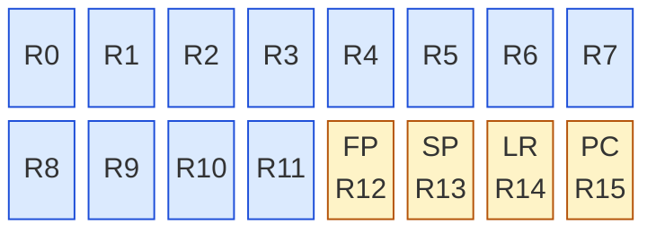

# Kapitel 1 — Warum eine 16-Bit-CPU?

> Die 6502 dient in diesem Buch als vertrauter Ausgangspunkt: ein einfacher,
> klassischer Prozessor, den viele kennen. Im Mittelpunkt steht aber die
> Deep16 — jede Idee wird an ihr erklärt. Ein Vergleich mit der 6502 taucht nur
> dort auf, wo er wirklich erhellt; solche Stellen sind hier markiert.
>
> Alle Listings in diesem Buch sind so geschrieben, dass du sie **unverändert
> in den Simulator im Browser kopieren** und mit *Assemble* → *Run* starten
> kannst (siehe §1.3).

---

**Ein Größenvergleich zum Warmwerden.** Der Simulator ist nicht nur
Anschauungsobjekt, er ist schnell: Beim typischen Befehlsmix aus
`scripts/bench.asm` (ALU, Laden und Speichern, Schieben, Sprünge) schafft er
**rund 28 Mio. Befehle pro Sekunde** auf einem gewöhnlichen Rechner von heute.
Ein realer 6502 bei 1 MHz erreicht im typischen Code dagegen etwa **0,43 Mio.**
— und selbst das absolute Maximum sind nur 0,5 Mio., denn keine
6502-Instruktion läuft in einem einzigen Takt. Der Simulator ist damit rund
**65-mal schneller** als die echte Hardware von 1975: Ein Experiment, das auf
einem 1-MHz-System eine Minute rechnen würde, dauert hier weniger als eine
Sekunde. Die Zahlen selbst nachmessen geht mit `node scripts/bench.mjs`.

---

## 1.1 Wo der 8-Bitter stoppt

Der 6502 ist ein guter Lehrmeister — und eine Grenze zugleich. Drei Dinge
halten ihn an der Leistungsgrenze, und keines davon ist ein Konstruktionsfehler:
es sind die Konsequenzen aus 1975.

### Registermangel

Der 6502 besitzt für alles zusammen **drei 8-Bit-Register**: `A`, `X` und `Y`.
Einerseits Akkumulator, andererseits zwei Indexregister — mehr nicht. Wer eine
Adresse durchschreitet, bindet sofort zwei Register (Low und High), wer einen
Zähler braucht, ein drittes, und was von `A` übrig bleibt, reicht selten für
mehr als ein Byte.

```
; 6502: Z = X + Y (16 Bit) — sechs Anweisungen, zwei Byte-Hälften
        CLC
        LDA  X_lo
        ADC  Y_lo
        STA  Z_lo
        LDA  X_hi
        ADC  Y_hi
        STA  Z_hi
```

### 8-Bit-Arithmetik

Die ALU rechnet ein Byte. Eine 16-Bit-Addition ist deshalb eine
Multi-precision-Kette aus `ADC` über beide Hälften; eine 16-Bit-Multiplikation
ist eine Schleife von acht bis sechzehn Durchläufen mit `ASL`/`ROR` und
`ADC`. Das ist machbar — jeder 6502-Programmierer hat die Routinen
schon geschrieben — aber es kostet Registers, Zyklen und Aufmerksamkeit:
das Übertragsflag muss zwischen den Hälften sauber durchgereicht werden.

### Der feste Stack

Der Stack liegt immer auf **Seite 1**: 256 Bytes zwischen `$0100` und
`$01FF`, angezeigt durch ein 8-Bit-Stackpointer-Register. Er ist nicht
verlagerbar, nicht teilbar und für alles da — lokale Variablen,
Rückadressen, Interrupts. Dazu kommt: bei einem Interrupt schiebt der
Prozessor nur PC und Statusbyte auf den Stack; `A`, `X` und `Y` muss das
Programm selbst retten. Zwei gleichzeitig genutzte Stackwelten (etwa
Interrupt-Stack neben Programstack) sind auf dieser Architektur nicht
vorgesehen.

> **Zusammengefasst:** 8 Bit Datenbreite, drei Register, 64 KB
> byteadressierter Raum, ein fester 256-Byte-Stack. Jede dieser vier
> Grenzen wird im Folgenden an der Deep16 aufgelöst — die dritte sogar
> zweimal (Kapitel 2 und 5).

---

## 1.2 Die Deep16 in groben Zügen

Die Deep16 ist eine 16-Bit-RISC-CPU mit festen 16-Bit-Befehlswörtern, einer
5-Stufen-Pipeline und verzweigungsgetöten Sprüchen (Delay Slots, dazu mehr in
Kapitel 4). Vier Entwurfsentscheidungen wirst du sofort spüren:

### 1. Sechzehn Register statt drei



> <span style="color:#1d4ed8">blau</span> = frei nutzbare Arbeitsregister,
> <span style="color:#b45309">gelb</span> = feste Rolle: Frame Pointer,
> Stack Pointer, Link Register, Program Counter.

Alle 16 sind 16 Bit breit. Zähler, Zeiger und Zwischenergebnisse passen
einzeln in ein Register — die 6502-Pflegearbeit „Low-Byte/High-Byte
auseinanderhalten" entfällt. Die 16-Bit-Addition von eben wird zu:

```assembly
; Deep16: Z = X + Y (16 Bit) — ein Befehl
        ADD  R5, R4          ; R5 = R5 + R4, fertig
```

### 2. 20 Bit Adressraum — und wortadressiert

Die Deep16 sieht **20 Bit / 1 M Wörter**. Zwei Dinge sind für
6502-Gewöhnte neu:

- **Es gibt keine Bytes.** Der Speicher ist wortadressiert, jedes Wort
  hat 16 Bit. Zeichenketten sind Arrays von Wörtern, ein Zeichen pro Wort —
  das vereinfacht die Adressrechnung, kostet aber Speicher pro Zeichen.
- **16 reichen nicht.** Mit einem 16-Bit-Offset kommt man nur auf 64 K
  Wörter; der Rest des Raums wird über Segmente erschlossen (nächster
  Punkt). Ohne Segmente bräuchte man — wie die 6502 — Bankswitching.

### 3. Vier Segmente: CS, DS, SS, ES

Vier 16-Bit-Segmentregister (`CS` Code, `DS` Daten, `SS` Stack, `ES` Extra)
geben die oberen Bits vor, die Register oder Instruktionen die unteren:

```
physikalische Adresse  =  (Segment << 4) + Offset
```

Kapitel 2 baut daraus ein einziges, konsistentes Speichermodell (§2.3) und
Kapitel 2.4 den Stack darauf. Wichtig vorab: **Stack und Programm müssen
nicht auf Seite 1 liegen** — sie liegen dort, wo `SS` und `CS` sie
hinsetzen.

### 4. Shadow-Register statt Registerberg

Was der 6502-Programmierer beim Interrupt manuell macht (`A`/`X`/`Y` retten,
Rücksprung aufbauen, hoffen, dass genug Stack da ist), erledigt die Deep16
in Hardware: zu den normalen Registern existiert ein **kompletter zweiter
Satz** — `R0'`–`R3'`, `R13'` (SP), `R14'` (LR), `PC'`, `PSW'` und die vier
Segmentregister, insgesamt 12 Shadow-Register.

Ein `SWI` wechselt per Bit `S` des PSW in den Handlersatz, `RETI` wechselt
zurück; die Anwendungsregister bleiben unberührt und sichtbar. Das ist der
Grund, warum das Bit 5 des PSW in keiner 6502-Entsprechung hat — es ist der
Kern der Interrupt-Mechanik (Kapitel 5). Das vollständige PSW-Diagramm mit
allen Bits findest du in `test/mmtest.md` (und als Spickzettel im Anhang B).

### Der Vergleich auf einen Blick

| | 6502 | Deep16 |
|---|---|---|
| Datenbreite | 8 Bit | 16 Bit |
| Arbeitsregister | `A`, `X`, `Y` | `R0`–`R15` (vier fest belegt) |
| Adressraum | 64 KB, byteadressiert | 1 M Wörter (20 Bit), wortadressiert |
| Speicheraufteilung | feste $0000–$FFFF | vier Segmente, `(Seg<<4)+Offset` |
| Stack | fest auf Seite 1, 256 Byte | `SS` + `SP` (R13), frei wählbar |
| Interrupt-Kontext | Programm rettet `A/X/Y` | Shadow-Register in Hardware |
| Sprungfolge | Sprung sofort | **Delay Slot** — die Nachbarinstruktion läuft mit (Kapitel 4) |

---

## 1.3 Mit dem Buch arbeiten

### Der Simulator im Browser

Das Repository enthält den fertigen „DeepCode"-IDE: Assembler, Disassembler
und zwei bitidentische CPU-Kerne (JavaScript und WebAssembly). Kein Build
nötig — nur ein statischer Server:

```bash
cd Deep16
python3 -m http.server 8000
# dann http://localhost:8000/ öffnen
```

> **Warum ein Server?** Das WASM-Modul muss über HTTP geladen werden.
> Öffnest du `index.html` direkt per `file://`, arbeitet die IDE mit dem
> JS-Kern weiter — für die Listings im Buch reicht das völlig, der
> Rechnergebnis ist dasselbe.

Was dich in der IDE erwartet:

- **Tabs** *Editor*, *Errors*, *Listing* (Maschinencode + Symbole),
  *Screen* (80×25-Zeichenbildschirm, Speicher bei `0xF1000`).
- **Knöpfe** *Assemble* → *Run* / *Step* / *Reset*.
- **Registeranzeige** rechts: `R0`–`R15` inklusive `SP`/`LR`/`PC`,
  die vier Segmentregister, das PSW — **und der komplette Shadow-Satz**
  (`R0'` … `ES'`), damit du den Kontextwechsel in Kapitel 5 live beobachten
  kannst.
- **Load Example**: fertige Programme aus `asm/`, darunter
  `fibonacci.asm` und die Forth-REPL (`forth.asm`).

### Ein erstes Listing

So sieht die Zählschleife von §1.1 in Deep16-Sprache aus — inklusive der
beiden Fallstricke, die dich in Kapitel 1 schon erwarten:

```assembly
; listing 1-2: 16-Bit-Summen in einer Schleife
.org 0x0100

        LSI  R1, 0          ; Summe
        LDI  0x00FF
        MOV  R2, R0         ; Addend 1 = 255
        LDI  0x0100
        MOV  R3, R0         ; Addend 2 = 256
        LSI  R4, 8          ; acht Durchläufe

loop:
        ADD  R1, R2         ; R1 += R2 — 16 Bit, ein Befehl
        SUB  R4, 1
        JNZ  loop
        NOP                 ; Delay Slot zum Sprung
        HALT
```

Kopiere das in den Editor, *Assemble*, *Run* — dann siehst du `R1` in der
Registeranzeige wachsen (Endwert: `8 × 255 = 2040 = 0x07F8`).

### Konventionen in den Listings

- **Kommentare** mit `;`, Labels mit Doppelpunkt, Hexwerte mit `0x`,
  Adressanweisung `.org`. Das Programm startet — wie alle Beispiele im
  Repository — bei `0x0100` (dorthin springt der Boot-ROM).
- **`LDI` landet immer in `R0`**, unabhängig davon, was du schreibst.
  Deshalb der Umweg über `MOV R2, R0`: größere Werte erst nach `R0`, dann
  ans Zielregister. (`LSI` schreibt direkt ins Zielregister, nimmt aber nur
  kleine Werte: **−16 bis 15** — ein größerer Wert erzeugt die
  verständliche Meldung `LSI immediate 1000 out of range (-16 to 15)`.)
- **Nach jedem bedingten Sprung steht eine Instruktion** — im Buch immer
  ein `NOP`, weil der Delay Slot sonst überrascht. Warum das so ist und
  wie man die Lücke produktiv nutzt: Kapitel 4.
- **Programmende** mit `HALT`; Ausgaben erscheinen im Tab *Screen*.
- **6502-Vergleiche** sind als solche eingeleitet (`; 6502:`) — was ohne
  Präfix steht, gilt für die Deep16.

---

## Das solltest du mitnehmen

1. Die Grenzen der 6502 — drei Register, 8-Bit-ALU, fester 256-Byte-Stack —
   sind Konsequenzen der Bauzeit, nicht des Prinzips.
2. Die Deep16 löst sie mit 16 Registern, 16-Bit-ALU, 20-Bit-Wortspeicher,
   Segmenten und einem in Hardware gewechselten Registersatz.
3. Der Simulator im Browser ist Werkbank und Lehrbuch zugleich: jedes
   Listing dieses Buches läuft dort sofort.

**Nächstem Kapitel:** Registerbank und PSW im Detail, das
Segmentmodell `(Seg<<4)+Offset` und der Stack — und „Hallo, Deep16!" auf
dem Bildschirm.
