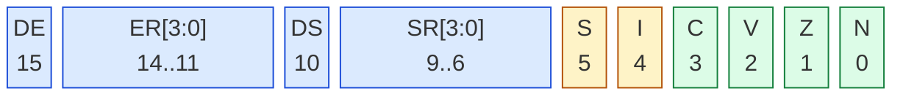

# Kapitel 2 — Register und Speicher organisieren

Kapitel 1 hat die Rechnung auf den Tisch gelegt: sechzehn statt drei
Register, zwanzig Adressbits statt sechzehn, Segmente statt fester Seiten.
Dieses Kapitel liefert die Bausteine einzeln — die Registerbank (§2.1), das
Statuswort (§2.2), das Adressmodell (§2.3) und den Stack (§2.4) — und
schließt mit dem ersten vollständigen Programm, das „Hallo, Deep16!" auf
den Bildschirm schreibt.

---

## 2.1 Die Registerbank R0–R15

Sechzehn Register, jedes 16 Bit breit, alle gleichrangig — das ist die
fundamentale Differenz zum 6502 mit seinen drei 8-Bit-Registern (§1.1).
Dort zwingt dich die Knappheit, ständig Low, High und Zähler durch ein
paar Register zu schaufeln; hier ist Platz: ein Register für den Zeiger,
eins für den Zähler, eins für das Ergebnis — und elf in Reserve.

Kapitel 1 (§1.2) hat die Bank als Diagramm gezeigt. Vier Rollen darin sind
fest verdrahtet, dazu kommt eine Konvention, wer welche Register über einen
Funktionsaufruf hinweg retten muss (Spezifikation §6.1):

| Register | Alias | Rolle | Wer rettet es? |
|----------|-------|-------|----------------|
| `R0`     | —     | Ziel des `LDI`, Zwischenspeicher | Aufrufer |
| `R1`–`R11` | —   | allgemeine Arbeitsregister | Aufrufer |
| `R12`    | `FP`  | Frame Pointer (Stapelrahmen) | Gerufener |
| `R13`    | `SP`  | Stack Pointer | Gerufener |
| `R14`    | `LR`  | Link Register (Rücksprungadresse) | Gerufener |
| `R15`    | `PC`  | Program Counter | — |

**Aufrufer rettet** heißt: Die aufgerufene Routine darf das Register frei
zerstören — wer den Wert über den Aufruf hinaus braucht, sichert ihn
vorher. **Gerufener rettet** heißt umgekehrt: Die Routine muss den
ursprünglichen Wert vor ihrer Rückkehr wiederherstellen. Die
Rücksprung-Mechanik dahinter (`LINK`, `JMP LR`) kommt in §2.4. Der 6502 kennt keine solche
Festlegung — dort rettet jeder, was er selbst weiterbraucht, in der Praxis
meist `A`, `X` und `Y` um einen `JSR` herum. Die Tabelle ist reine
Konvention, keine Hardware erzwingt sie; alle Listings im Repository
halten sich daran.

### `LDI` landet in `R0` — und nur dort

`LDI` hat **keinen Zielregister-Operanden**: es lädt immer `R0`. Wer ein
Ziel dazuschreibt, bekommt einen Assembler-Fehler:

```
Unknown label: R1, 5
```

(Der Assembler liest alles nach `LDI` als Wert oder Label-Namen — und
`R1, 5` ist keiner von beidem.)

Der Wert selbst ist eine 15-Bit-Zahl, die auf 16 Bit **vorzeichenfortgesetzt**
wird. Der Bereich liegt bei −16384 bis 16383, und daraus folgen drei
praktische Konsequenzen:

```assembly
.org 0x0100
        LDI -4096         ; R0 = 0xF000 — der Weg zu Zahlen mit Bit 15
        LDI -16384        ; R0 = 0xC000 — die untere Grenze
        LDI 0x7FFF        ; R0 = 0xFFFF — Achtung: größtes Muster = Negativzahl!
        HALT
```

**Erstens:** Zahlen mit gesetztem Bit 15 schreibt man als negatives
Gegenstück — `-4096` statt `0xF000`. **Zweitens:** Die Eingabe
`LDI 0xF000` gibt es gar nicht; der Assembler lehnt Werte über `0x7FFF` ab:

```
LDI immediate 61440 out of range (0..0x7FFF)
```

**Drittens:** Wer das Bit trotzdem ausdrücklich setzen will, nimmt die
15-Bit-Höchstzahl und invertiert sie:

```assembly
.org 0x0100
        LDI 0x0FFF        ; 15 Bit voll aufgedreht
        INV R0            ; ... invertiert = 0xF000
        HALT
```

Die zweite Variante findet sich in etlichen Listings des Repositories
(`asm/string_demo.asm`, `asm/forth.asm`); den `INV`-Befehl lernst du in
Kapitel 3 (§3.3) kennen.

Für alle anderen Register gilt: erst nach `R0` laden, dann verteilen — das
Muster aus Listing 1-2:

```assembly
.org 0x0100
        LDI 0x1234
        MOV R2, R0        ; R2 = 0x1234
        HALT
```

Kleine Werte umgehen den Umweg: `LSI R5, 12` lädt −16 bis 15 direkt
(Kapitel 1 hat die Grenze zitiert).

### R15 schreiben heißt springen

`PC` ist Register 15 und wie jedes andere per `MOV` beschreibbar —
`MOV PC, R0` springt. Die Delay-Slot-Regel aus §1.3 gilt auch hier: Die
Instruktion nach `MOV PC, R0` läuft noch, bevor gesprungen wird — in den
Listings steht dahinter deshalb ein `NOP`.

Umgekehrt liest man mit `MOV ... , PC` die Adresse der **nächsten**
Instruktion:

```assembly
.org 0x0100
        MOV R6, PC        ; R6 = 0x0101 — die Instruktion danach
        MOV R7, PC, 2     ; R7 = 0x0104 — PC + 2 (eigene Adresse + 3)
        HALT
```

Während der Ausführung zeigt `PC` auf die eigene Adresse + 1 — das ist
keine Eigenheit dieser beiden Zeilen, sondern gilt in jedem Zusammenhang,
auch in einem Delay Slot (Spezifikation §3.4 und §6.2.2). Die Funktion 2
des `imm2`-Feldes (Tabelle 2-1) rechnet `Rs + 2` — mit diesem `PC`-Wert
landet das Ergebnis auf **eigene Adresse + 3**: ein Wort für die folgende
Instruktion und eines für deren Delay Slot. Genau diese Rechnung steckt in
`LINK` (§2.4), das die Rücksprungadresse ins `LR`-Register rettet.

Der dritte Operand ist also keine Zahl, die man addiert, sondern eine
zweibitige **Funktionsauswahl** — `imm2` bestimmt, was mit dem
Quellregister geschieht (Spezifikation §3.4 und §5.1.2):

**Tabelle 2-1: Die vier Funktionen des `imm2`-Feldes in `MOV Rd, Rs`**

| `imm2` | Funktion | Schreibweise |
|--------|----------|--------------|
| `0` | `Rd ← Rs` | `MOV Rd, Rs` |
| `1` | `Rd ← Rs << 1` | `MOV Rd, Rs << 1` |
| `2` | `Rd ← Rs + 2` | `MOV Rd, Rs + 2`, `MOV Rd, Rs, 2` |
| `3` | `Rd ← (Rs << 1) \| 1` | `MOV Rd, Rs << 1 + 1` |

Die vier Funktionen **gemessen** — dieselbe Eingabe, vier Ergebnisse:

```assembly
.org 0x0100
        LSI  R1, 5            ; R1 = 0x0005
        MOV  R2, R1           ; R2 = 0x0005 — Funktion 0: kopieren
        MOV  R3, R1 << 1      ; R3 = 0x000A — Funktion 1: links schieben
        MOV  R4, R1 + 2       ; R4 = 0x0007 — Funktion 2: plus 2
        MOV  R5, R1 << 1 + 1  ; R5 = 0x000B — Funktion 3: schieben, Bit 0 setzen
        HALT
```

(16 Schritte inklusive der 10 Boot-Schritte, `PSW = 0x0000`, JS- und
WASM-Kern identisch.) `+2` ist der einzige gerade Versatz, den es gibt —
und genau den braucht `LINK`. Schreibweisen wie `, 1`, `, 3`, `+1` und
`+3` lehnt der Assembler ab, statt sie stillschweigend in Schiebebefehle
umzudeuten:

```text
Line 2: MOV 'R6, PC, 1' rejected: imm2=1 now means 'Rs << 1', not 'Rs + 1'. Write 'MOV R6, PC << 1'
```

Wer `MOV R7, PC, 2` oben also nach dem Muster „das Immediate addiert"
verallgemeinert, landet genau dort — und die Meldung nennt den Grund
samt der richtigen Schreibweise.

---

## 2.2 Das PSW

Das Processor Status Word ist das 16-Bit-Statusregister der Deep16. Die
unteren Bits (`N Z V C I S`) sind dem 6502-Programmierer sofort vertraut.
Die oberen Bits (`SR DS ER DE`) steuern die Segment-Mechanik — auf dem
6502 gibt es so etwas nicht:



> **Farben:** <span style="color:#1d4ed8">blau</span> = Segment-/Kontext-Mechanik,
> <span style="color:#b45309">gelb</span> = Interrupt-Steuerung,
> <span style="color:#15803d">grün</span> = Arithmetik-Flags.

### Bedeutung der Bits

| Bit(s) | Name | Bedeutung | Vergleich zur 6502 |
|--------|------|-----------|--------------------|
| 0 | `N` | Negative Flag (1 = Ergebnis negativ) | ≙ N |
| 1 | `Z` | Zero Flag (1 = Ergebnis null) | ≙ Z |
| 2 | `V` | Overflow Flag (1 = vorzeichenbehafteter Überlauf) | ≙ V |
| 3 | `C` | Carry Flag (1 = Übertrag/Borrow) | ≙ C |
| 4 | `I` | Interrupt Enable (1 = Interrupts frei) | ≙ I, aber per `SETI`/`CLRI` |
| 5 | `S` | **Shadow View** (1 = Shadow-Kontext aktiv) | **neu!** Kern der Interrupt-Mechanik |
| 6–9 | `SR[3:0]` | Stack-Register-Auswahl (0–15) | **neu!** SS ist frei wählbar |
| 10 | `DS` | Dual Stack (1 = SS via Registerpaar) | **neu!** |
| 11–14 | `ER[3:0]` | Extra-Register-Auswahl (0–15) | **neu!** ES ist frei wählbar |
| 15 | `DE` | Dual Extra (1 = ES via Registerpaar) | **neu!** |

**Reset-Zustand:** `0x0000` — Interrupts gesperrt (`I` = 0), Normalmodus
(`S` = 0), kein Flag gesetzt. Den Shadow-Modus betritt nur `SWI`, nicht
ein Reset. Für 6502-Umsteiger: Es gibt **kein** Dezimal-Flag (`D`) und
**kein** Break-Flag (`B`) — dezimale Arithmetik kennt die Deep16 nicht,
und Interrupts werden über `I` maskiert und über `S` kontextgetrennt
(Kapitel 5).

### Die unteren Bits: Flags und Interrupt

`N`, `Z`, `V` und `C` setzt die ALU — welche Anweisung welche Flags
produziert, ist Thema von Kapitel 3 (§3.2). Vertraut sind die Namen, neu
ist die Freiheit: Auch `V`, das der 6502 nur nebenbei bei der Addition
mitbekommt, ist hier ein vollwertiges, sauber gepflegtes Flag.

`I` ist das Interrupt-Steuerbit, gesetzt und gelöscht mit `SETI`/`CLRI` —
Details in Kapitel 5.

`S` ist das spannendste Bit: Per `SWI` (Software-Interrupt) schaltet die
CPU in den Shadow-Kontext und parkt den bisherigen Zustand in den
Shadow-Registern aus §1.2. Während der Handler läuft, steht das PSW auf
`0x0020` (`S` = 1, sonst nichts); nach `RETI` ist der alte Wert wieder da
— Flags inklusive. Den ganzen Apparat (und die Frage, warum das so viel
billiger ist als ein Register-Berg auf dem Stack) baut Kapitel 5 auf.

### Das PSW lesen und schreiben

Zwei Befehle verbinden das PSW direkt mit der Registerbank:
`SPSW R1` schreibt den Registerinhalt ins PSW, `LPSW R1` liest umgekehrt.
Beide bekommen das Register als Operand — bei `SPSW` ist es die Quelle,
bei `LPSW` das Ziel:

```assembly
.org 0x0100
        LDI 0x0340
        MOV R2, R0
        SPSW R2           ; R2 → PSW: jetzt zeigt SR auf Register 13
        LPSW R3           ; PSW → R3: wieder 0x0340
        HALT
```

Der Wert `0x0340` ist `13 << 6` — also `SR = 13`, die Auswahl für den
Stack. Genau das braucht der nächste Abschnitt: Speicherzugriffe über
`SS` (§2.3) und der Stack selbst (§2.4).

---

## 2.3 Adressierung: ein Speichermodell für alles

### Die Formel

Kapitel 1 (§1.2) hat sie eingeführt, hier steht sie als Arbeitsgerät:

```
physikalische Adresse  =  (Segment << 4) + Offset
```

Die Deep16 ist wortadressiert: Ein Offset-Schritt ist ein Wort (16 Bit),
nicht ein Byte. Das Segment verschmilzt mit dem Offset zu einer Ebene —
die 20 Bit ergeben eine Million Wörter — man hat (noch) keinen Grund,
in Byte-Kategorien zu denken.

Zwei Rechenbeispiele, die gleich wieder auftauchen:

* `SS = 0x1000` → Basis `0x10000` — der Stack in §2.4 sitzt bei
  `0x10000 + 0x7FFF = 0x17FFF`.
* `ES = 0xF000`, Offset `0x1000` → `0xF1000` — der Anfang des
  Bildschirms, das Ziel des Kapitel-Beispiels.

### Vier Segmente, zwei Zugriffsformen

| Segment | Zweck |
|---------|-------|
| `CS` | Code — liest die Befehle (das Boot-ROM setzt es) |
| `DS` | Daten — der Standard-Data-Zugriff |
| `SS` | Stack — wo der `SP` lebt |
| `ES` | Extra — zweites Datensegment |

Werte in die Segmentregister bringt `MVS`: `MVS ES, R0` kopiert den
Registerinhalt nach `ES` — es ist ein ganz normaler Befehl, kein
Zuweisungsoperator.

**Mit Segment im Befehl:** `LDS` und `STS` tragen das Segment als zwei
Bits im Befehlswort (`CS` = 00, `DS` = 01, `SS` = 10, `ES` = 11) und
rechnen mit einem Basisregister — **ohne Offset**: `STS R1, ES, R8`
schreibt das Wort aus `R1` an `ES:(R8)`.

Wer ein Offset dazuschreibt, bekommt einen Fehler, denn den Adressversatz
gibt es bei `LDS`/`STS` nicht:

```
STS has no offset operand (register, segment, base register)
```

**Ohne Segment:** `LD` und `ST` wählen das Segment implizit — und zwar
am **Basisregister**:

1. zeigt `SR[3:0]` (PSW-Bits 9–6) auf das Basisregister → Zugriff über `SS`
2. sonst zeigt `ER[3:0]` (Bits 14–11) darauf → Zugriff über `ES`
3. sonst → Zugriff über `DS`

Der Teufel steckt in der Null: **`SR` = 0 und `ER` = 0 sind ausdrücklich
Aus** — der Normalzustand. Selbst wenn das Basisregister `R0` hieße,
leitet `SR` = 0 nichts um; erst ein Wert zwischen 1 und 15 aktiviert die
Regel. (Was es heißt, wenn `SR` auf `SP` zeigt, zeigt §2.4.)

Bit 10 (`DS`, hier *Dual Stack*, nicht das Segmentregister) erweitert die
`SR`-Auswahl auf das Nachbarregister, Bit 15 (`DE`) dasselbe für `ER` und
`ES` — bei `ER = 8` ist damit auch `R9` ein ES-Basisregister. Die
Stack-Seite davon sitzt in §2.4.

Der Offset von `LD`/`ST` ist 5 Bit breit und vorzeichenfortgesetzt:
**−16 bis +15** — und die Grenze ist hart:

```
Offset 16 out of range (-16..15)
```

Der 6502 hat genau einen Adressraum und trickst mit der Zero Page; die
Deep16 hat vier Fenster — aber eine einzige Formel, und das Fenster folgt
dem Registerzustand.

### Die Speicherkarte

Ein paar physische Adressen sollte man auswendig können:

| Adresse | Was liegt dort? |
|---------|-----------------|
| `0x00100` | Programmstart — dorthin springt das Boot-ROM, alle Listings beginnen hier |
| `0xF0060` | Tastatur-Port: Status |
| `0xF0062` | Tastatur-Port: Daten |
| `0xF1000`–`0xF17CF` | Bildschirm — 2000 Wörter (80 × 25), ein Wort = ein Zeichen |
| `0xFFFF0`–`0xFFFFF` | Boot-ROM — 16 Wörter |

Die Tastatur-Ports werden in Kapitel 6 ausgebaut; den Bildschirm kannst
du ab jetzt im Rahmen schreiben.

### Nach dem Boot ist alles flach

Das Boot-ROM bei `0xFFFF0` ist der erste Code nach einem Reset. Es setzt
`DS` und `SS` auf 0 und springt nach `0x0100` — ein Programm findet also
vor:

* `CS = DS = SS = ES = 0`
* `PC = 0x0100` und `SP = 0x7FFF`
* `PSW = 0x0000`

Damit zeigen zu Beginn alle Segmente auf denselben Nullpunkt — die
Segment-Mechanik ist da, auch wenn sie im einfachen Fall noch nicht wehtut.
Eigene Zugriffe mit explizitem Segment — wie das `STS R1, ES, R8` im
Kapitel-Beispiel — zeigen dann, womit man es zu tun hat.

---

## 2.4 Der Stack

### Kein PUSH, kein POP

Der Stack ist auf der Deep16 kein Magazin mit eigener Befehlswelt,
sondern ein Speicherbereich wie jeder andere. `SP` ist Register 13 und
beginnt nach dem Boot bei `0x7FFF` — der Stack wächst von dort nach unten,
in Richtung der Adresse 0.

Die Befehlssumme kennt **kein `PUSH` und kein `POP`** — der Assembler
lehnt beide Namen ab. Speichern ist `ST`, auch auf dem Stack; was ihn
besonders macht, ist nur die Adressierung. Der 6502 schiebt bei `PHA`,
`PHP` und `JSR` automatisch Bytes weg, immer auf Seite 1; diese Automatik
gibt es hier nicht. Dafür gibt es zwei Dinge, die der 6502 nicht hat.

### Der Stack folgt dem Register: `SR[3:0]`

Erstens: Wo der Stack liegt, sagt das PSW. Regeln von §2.3 in Aktion — bei
`SR` = 0 ist die Auswahl aus, und `ST R1, SP, 0` schreibt über `DS` in die
Zelle `0x07FFF`. Wer den Stack wirklich auf `SS` stellen will, zeigt den
Stack-Zugriffen den Weg:

```assembly
; listing 2-1: der Stack liegt dort, wo SS und SP hinzeigen
.org 0x0100

        LDI  0x0042
        MOV  R1, R0          ; Marker 0x42
        LDI  0x1000
        MOV  R4, R0
        MVS  SS, R4          ; SS-Basis 0x10000

        ST   R1, SP, 0       ; SR = 0: landet in DS:0x7FFF (Zelle 0x07FFF)

        LDI  0x0340          ; 13 << 6 = SR zeigt auf 13
        MOV  R2, R0
        SPSW R2              ; ins PSW schreiben (§2.2)

        ST   R1, SP, 0       ; SR = 13: landet in SS:0x7FFF (Zelle 0x17FFF)
        HALT
```

Lauf es, dann steht der Marker `0x0042` im Speicher-Tab an **beiden**
Stellen: bei `0x07FFF` (über `DS`) und bei `0x17FFF` (über `SS`) — die
Adresse ist gleich, der Weg ein anderer.

### Dual Stack: `SP` und `LR` zusammen (Bit 10)

Zweitens: Bit 10 (`DS` — *Dual Stack*, nicht das Daten-Segmentregister)
erweitert die `SR`-Auswahl auf das **Registerpaar** `R13`/`R14`. Landet
`SR = 13` und ist Bit 10 gesetzt, geht auch ein Zugriff über `LR`
(`R14`) nach `SS`; ohne das Bit läuft derselbe Zugriff über `DS`. Damit
können `SP` und `LR` gemeinsam auf dem Stack liegen. Bit 15 (`DE`) tut
dasselbe für `ER`/`ES` (§2.3). Wann das wichtig wird, zeigt Kapitel 4 —
dort rufen Routinen sich selbst auf.

### Rücksprung im Register: `LINK` und `JMP LR`

`LINK` ist nichts anderes als `MOV LR, PC, 2` — es legt die
Rücksprungadresse ins `LR`-Register, hinter den Delay Slot des folgenden
Sprungs (genau die Rechnung aus §2.1):

```assembly
; listing 2-2: Aufruf ohne Adress-Stapel — LINK und JMP LR
.org 0x0100

        LDI  unterprogramm
        MOV  R4, R0
        LINK                ; LR = Rücksprungadresse
        JMP  R4             ; in die Routine
        ADD  R6, 1          ; Delay Slot: läuft genau einmal
zurueck:
        HALT                ; hier landet die Rückkehr

unterprogramm:
        JMP  LR             ; zurück zum Aufrufer
        NOP                 ; Delay Slot
```

Nach dem Lauf gilt: `LR = 0x0105` (die Adresse hinter dem Delay Slot des
`JMP`), `R6 = 1` (der Slot lief genau einmal), und das Programm ist
beendet — ganz ohne Stack.

Der 6502 drückt bei `JSR` die Rücksprungadresse (zwei Bytes) auf den
Seiten-1-Stack und zieht sie bei `RTS` wieder ab; Rekursion funktioniert
dort deshalb praktisch von selbst. Die Deep16 parkt die Adresse im
Register: Nicht-rekursive Routinen berühren gar keinen Stack, und der
Rückweg ist ein einziger Befehl. Wer sich aber selbst aufruft, muss das
`LR` vorher sichern — genau dafür gibt es den Stack aus diesem
Abschnitt. In Kapitel 4 (§4.2) wird das zum Argument für eine echte
Rückkehr-Struktur.

---

## Beispiel: „Hallo, Deep16!" auf dem Bildschirm

Jetzt kommt das erste vollständige Programm zusammen: Es schreibt den Text
`Hallo, Deep16!` Zeichen für Zeichen auf den Bildschirm — dorthin, wo die
Speicherkarte (§2.3) das Screen-Segment verspricht.

Auf einem echten System würde niemand den Bildschirm selbst beschreiben:
Dort hält ein BIOS Ausgaberoutinen bereit, die man per `SWI` aufruft. Der
Simulator hat kein BIOS — die `SWI`-Mechanik aus §2.2 kommt in Kapitel 5
zur Entfaltung. Deshalb schreibt unser Beispiel direkt in das
Screen-Segment:

```assembly
; listing 2-3: „Hallo, Deep16!" auf dem Bildschirm
.org 0x0100

        LDI  -4096           ; R0 = 0xF000 (Zweierkomplement)
        MVS  ES, R0          ; ES = 0xF000, das Bildschirm-Segment

        LDI  0x1000
        MOV  R8, R0          ; R8 = Bildschirm-Offset 0x1000 → 0xF1000

        LDI  hallo
        MOV  R3, R0          ; R3 → Anfang des Textes
        LDI  schleife
        MOV  R5, R0          ; R5 = Sprungziel für den Schleifenrücksprung

schleife:
        LD   R1, R3, 0       ; R1 = nächstes Zeichen
        ADD  R1, 0           ; Flags setzen — LD tut das nicht
        JZ   fertig          ; NUL erreicht?
        NOP                  ; Delay Slot
        STS  R1, ES, R8      ; Zeichen ans Screen-Segment
        ADD  R8, 1           ; Bildschirmposition +1
        ADD  R3, 1           ; Textzeiger +1
        JMP  R5              ; zurück zur Schleife
        NOP                  ; Delay Slot

fertig:
        HALT

.org 0x0200
hallo:
        .text "Hallo, Deep16!"
```

Der Anfang rechnet zweimal: `LDI -4096` liefert `0xF000` (die 15-Bit-
Regel aus §2.1 — die Variante `LDI 0x0FFF` + `INV R0` erzeugt dasselbe
und steht in etlichen Listings), `MVS ES, R0` trägt das Segment ein.
Danach ist `ES` bei `0xF000`, und mit `R8 = 0x1000` erreicht die
Bildschirm-Adresse `0xF1000` — die Formel aus §2.3.

Drei Register halten den Faden: `R3` den Textzeiger, `R8` die
Bildschirmposition, `R5` das Sprungziel für den Schleifenrücksprung.
Jedes bekommt seinen Wert per `LDI` + `MOV`, weil `LDI` nur `R0` kennt.
Die Schleife selbst hat ein feines Detail: `LD` holt das Zeichen, aber
**die Flags bleiben unangetastet** — und genau die braucht `JZ`. Deshalb
schaltet `ADD R1, 0` die Flags scharf: Ein Null-Addit, das am Wert nichts
ändert und nur `N`, `Z`, `V` und `C` setzt.

Am Ende zeigt `R8` auf `0x100E` — 14 Zeichen weiter — und das Programm
hält. Auf dem Bildschirm (Reiter *Screen*) steht `Hallo, Deep16!`.

---

## Das solltest du mitnehmen

1. **Sechzehn Register, vier feste Rollen.** `FP`, `SP`, `LR` und `PC`
   haben Namen und Konventionen; `LDI` lädt immer `R0` (15 Bit,
   vorzeichenfortgesetzt), `MOV` verteilt weiter, und `R15` zu schreiben
   heißt springen.
2. **Das PSW ist ein Werkzeug, kein Anhängsel.** Unten die vertrauten
   Flags `N Z V C` plus `I` und `S`, oben die Segment-Kontextauswahl;
   Reset-Zustand `0x0000`, lesen und schreiben mit `LPSW`/`SPSW`.
3. **Ein einziges Adressmodell.** `phys = (Segment << 4) + Offset`.
   `LDS`/`STS` nennen das Segment explizit (zwei Bits im Befehl),
   `LD`/`ST` wählen es am Basisregister über `SR`/`ER` — und `0`
   schaltet die Auswahl aus.
4. **Der Stack ist ein Speicherbereich.** Kein `PUSH`/`POP`, dafür
   `SP` + `SR[3:0]` für den Ort und `LINK`/`JMP LR` für den Rückweg —
   ganz ohne Stack, bis Rekursion ihn braucht.

**Nächstes Kapitel:** Die ALU-Werkstatt — Laden und Speichern im Detail,
16-Bit-Arithmetik mit ehrlichen Flags, `SET`/`CLR` fürs PSW und eine
Zählschleife, die die ganze Registerbank ausspielt.