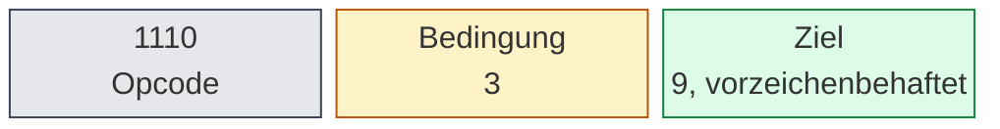
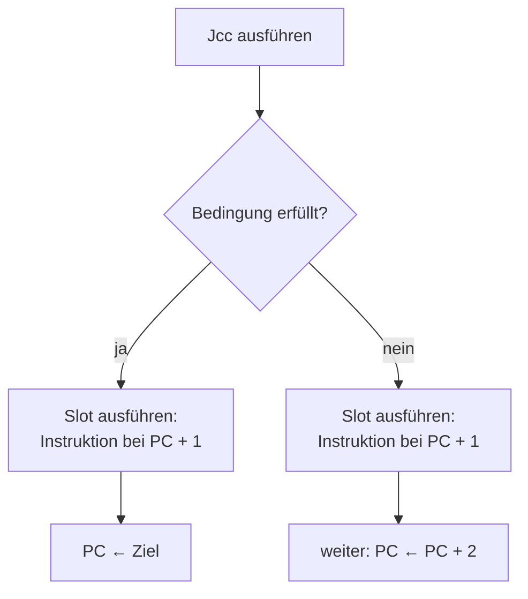
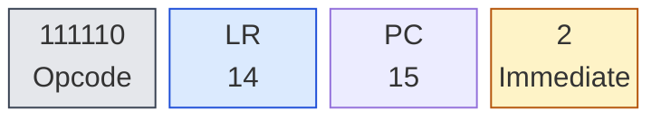
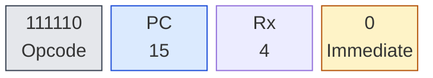

# Kapitel 4 — Flusskontrolle und Unterprogramme

Kapitel 2 hat die Bühne aufgebaut: Registerbank, Statuswort, Adressmodell
und Stack. Aber bis hierher lief jedes Programm stur von oben nach unten —
Kontrolle über den Programmfluss gab es noch nicht. Zwei Dinge holt dieses
Kapitel nach: die **Entscheidung** beim Laufen (§4.1) und die
**Wiederholung als Baustein** (§4.2). Der erste davon kostet dich einen
mentalen Modellwechsel: Die Deep16 braucht für jeden bedingten Sprung
einen **Delay Slot** — und dessen Regel kennst du schon aus §1.3. Jetzt
wird sie zur Falle.

Und wie in allen Kapiteln davor gilt: keine Behauptung ohne Messung. Jede
Zahl hier stammt aus einem Lauf über beide Kerne (JS und WASM); du kannst
die Listings kopieren und bekommst exakt dasselbe.

---

## 4.1 Bedingte Sprünge: `Jcc` und der Delay Slot

Acht Sprünge decken alle vier Status-Flags ab. Sie heißen alle gleich —
ein bedingter Sprung PLUS Bedingung, kurz `Jcc` — und unterscheiden sich
nur in den drei Bits 9 bis 7:

**Tabelle 4-1: Die acht Sprungbedingungen**

| Sprung | genommen, wenn … | Bits 9–7 | Befehlswort |
|--------|------------------|----------|-------------|
| `JZ target` | Z = 1 (Ergebnis war 0) | `000` | `1110 000 ttttttttt` |
| `JNZ target` | Z = 0 (Ergebnis ≠ 0) | `001` | `1110 001 ttttttttt` |
| `JC target` | C = 1 (Übertrag/Borrow) | `010` | `1110 010 ttttttttt` |
| `JNC target` | C = 0 | `011` | `1110 011 ttttttttt` |
| `JN target` | N = 1 (Ergebnis negativ) | `100` | `1110 100 ttttttttt` |
| `JNN target` | N = 0 | `101` | `1110 101 ttttttttt` |
| `JO target` | V = 1 (Vorzeichenüberlauf) | `110` | `1110 110 ttttttttt` |
| `JNO target` | V = 0 | `111` | `1110 111 ttttttttt` |

Ziel ist ein **9-Bit-Offset mit Vorzeichen**, der zur Adresse `PC + 1`
addiert wird (die `PC` zeigt während der Ausführung schon auf die nächste
Instruktion). Von der Sprungadresse aus gezählt sind das −256 bis +255
Wörter Reichweite:

**`Jcc` — Bedingter Sprung mit 9-Bit-Ziel**



Weiter springt der Befehl nicht — wer weiter muss, lädt das Ziel in ein
Register und springt mit `JMP Rx` (§4.2). Der Assembler prüft die
Reichweite beim Übersetzen; gemessen schlägt ein Ziel fehl, das 256 Wörter
vorwärts liegt, mit

```text
Line 2: Jump target too far: 256 words from current position
```

Das ist zugleich die Erklärung, warum Schleifen in diesem Buch so oft in
der Nähe bleiben: `JNZ loop` rückwärts ist hier nur −2 Wörter, kein
Problem fürs 9-Bit-Ziel.

### Das Delay-Slot-Gesetz

Kapitel 1 hat die Regel für `MOV PC, R0` formuliert; jetzt gilt sie für
jeden `Jcc`: **Die Instruktion direkt hinter dem Sprung läuft immer** —
sowohl wenn der Sprung genommen wird als auch wenn nicht. Der Beweis ist
ein Zähler im Slot:

```assembly
; listing 4-1: der Delay Slot läuft immer — genommen oder nicht
.org 0x0100

        LSI  R1, 5          ; Rest-Durchläufe
        LSI  R7, 0          ; Slot-Zähler

loop:
        SUB  R1, 1          ; R1: 4, 3, 2, 1, 0
        JNZ  loop
        ADD  R7, 1          ; Slot: läuft auch beim letzten Mal
        HALT
```

`JNZ loop` wird viermal genommen, beim fünften Mal nicht mehr — und
trotzdem steht am Ende `R7 = 5`: Das `ADD R7, 1` hinter dem `JNZ` lief in
jedem Durchlauf, auch in dem, in dem der Sprung nicht genommen wurde.
(28 Taktschritte inklusive der 10 Boot-Schritte.)

Der Ablauf hinter einem Sprung — genommen oder nicht — sieht also so
aus:

**`Jcc` — Ablauf mit Delay Slot**



### Überspringen will gelernt sein

Wer vom 6502 kommt, will folgenden Block-Code schreiben: Sprung über eine
Instruktion hinweg, wenn die Bedingung stimmt. Auf der Deep16 ist genau
das die größte Falle für Neuankömmlinge — die „übersprungene" Instruktion
ist nämlich der Delay Slot und läuft trotzdem:

```assembly
; listing 4-2a: übersprungen? Von wegen — der Slot läuft mit
.org 0x0100

        SET  1              ; Z = 1
        JZ   vorbei         ; Sprung wird genommen …
        ADD  R6, 1          ; … trotzdem läuft das hier
vorbei:
        LDI  0x002a
        MOV  R8, R0
        HALT
```

Gemessen: `R6 = 1`. Das `ADD R6, 1` ist der Delay Slot des `JZ` — ein
genommener Sprung führt ihn *vor* dem Sprung aus, nicht danach. Auf dem
6502 hätte `BEQ vorbei` das `INX` übersprungen; Deep16-`JZ` tut das nicht.

Der Ausweg ist das Muster, das dieses Buch von jetzt an überall
verwendet: **NOP in den Slot, der zu überspringende Block folgt.**

```assembly
; listing 4-2b: mit NOP im Slot wird das Überspringen echt
.org 0x0100

        SET  1              ; Z = 1
        JZ   vorbei
        NOP                 ; Delay Slot
        ADD  R6, 1          ; nur bei JZ = falsch
vorbei:
        LDI  0x002a
        MOV  R8, R0
        HALT
```

Jetzt gemessen: `R6 = 0` — der Sprung wurde genommen und der Block davor
blieb aus. Drehst du `SET 1` in `CLR 1`, nimmt `JZ` den Sprung nicht, der
NOP läuft, und `R6` wird 1: erst dann erreicht der Block sein Ziel.

> **Zusammengefasst:** Nach jedem bedingten Sprung steht eine Instruktion,
> die *immer* läuft. Kein NOP, keine Arbeit dorthin — nur die Lösung für
> „Bedingung erfüllt → das hier überspringen" heißt NOP in den Slot, Block
> danach.

Ein Grenzfall noch, gemessen: Zwei `Jcc` direkt hintereinander — der
zweite ist der Slot des ersten — und der innere entscheidet allein. Ist
der innere *nicht* genommen, unterbleibt auch der äußere Sprung; ist er
genommen, gilt sein Ziel. Kleiner Test mit dem äußeren `JNZ` (genommen)
und einem inneren `JO` im Slot: `JO` nicht genommen → das Programm läuft
geradeaus weiter, `R6 = 1, R7 = 0`; `JO` genommen → es springt ans Ziel
des `JO`, `R8 = 1, R6 = 0`. Wer zwei Entscheidungen hintereinander
braucht, legt zwischen die Sprünge einen NOP.

### Die acht Bedingungen in einem Lauf

Tabelle 4-1 will gemessen sein. Das Listing legt jede Bedingung einmal
mit `SET`, einmal mit `CLR` an und zählt die Fälle „nicht genommen" in
`R8`:

```assembly
; listing 4-3: die acht Jcc-Bedingungen — im Zähler gefangen
.org 0x0100

        LSI  R8, 0          ; Zähler: „nicht genommen“

        SET  1              ; Z = 1
        JZ   s1
        NOP
        ADD  R8, 1
s1:
        CLR  1              ; Z = 0
        JZ   s2
        NOP
        ADD  R8, 1
s2:
        SET  3              ; C = 1
        JC   s3
        NOP
        ADD  R8, 1
s3:
        CLR  3              ; C = 0
        JC   s4
        NOP
        ADD  R8, 1
s4:
        SET  0              ; N = 1
        JN   s5
        NOP
        ADD  R8, 1
s5:
        CLR  0              ; N = 0
        JN   s6
        NOP
        ADD  R8, 1
s6:
        SET  2              ; V = 1
        JO   s7
        NOP
        ADD  R8, 1
s7:
        CLR  2              ; V = 0
        JO   s8
        NOP
        ADD  R8, 1
s8:
        HALT
```

Acht Proben — viermal ist die Flagge gesetzt (jeweils *nicht* gezählt),
viermal gelöscht (jeweils gezählt). Gemessen: `R8 = 4`, genau zu der
Erwartung — alle acht Bedingungen entscheiden so, wie Tabelle 4-1 es
sagt. (40 Taktschritte.)

---

## 4.2 Unterprogramme ohne Adress-Stapel: `LINK` und `JMP LR`

Jetzt wird die Flusskontrolle zum Baustein: Code, der *betreten* und
*wieder verlassen* wird. Der 6502 kennt dafür `JSR`/`RTS` und ein
Hardware-Magazin für Rücksprungadressen auf Seite 1. Die Deep16 hat
**weder** `JSR` **noch** `RTS` — der Assembler lehnt beides ab
(gemessen: `Unknown instruction: JSR`). Ein Unterprogramm ist hier nur ein Sprungziel, und die Rücksprungadresse
wohnt in einem Register: `LR`, dem Link Register (R14).

Zwei Befehle tragen das ganze Konzept. `LINK` ist ein Pseudonym für
`MOV LR, PC, 2`:

**`LINK` — Rücksprungadresse sichern (`MOV LR, PC, 2`)**



Die Rechnung dahinter kennst du aus §2.1: `PC` zeigt während der
Ausführung auf die eigene Adresse + 1; das Immediate 2 schiebt das
Ergebnis auf **eigene Adresse + 3**. Ein Wort für den `JMP`, der folgt,
eines für dessen Delay Slot, und eine Adresse mehr: dort steht die
Instruktion, an der das Unterprogramm zurückkommen soll. Hätte `LINK` nur
eigene Adresse + 2 gerechnet, käme die Rückkehr mitten in den Delay Slot
— eine echte Instruktion dort würde beim Rückkehren doppelt laufen.
Gemessen steht das in jedem Aufruf unten: `LR` zeigt auf die Instruktion
direkt hinter dem Slot.

Der Rückweg ist `JMP LR` — ein Sprung aus dem Register heraus, alias
`MOV PC, LR, 0`:

**`JMP Rx` — Sprungziel im Register (`MOV PC, Rx, 0`)**



Der Assembler wertet `JMP Rx` in genau dieses `MOV PC, Rx` um — und weil
`PC` ein Register wie jedes andere ist, ist auch `MOV PC, R0` der Sprung.
Auch `JMP` läuft über den Delay Slot: In jedem Listing folgt dem `JMP`
(und dem `JMP LR` am Ende) ein NOP.

### Aufruf und Rückkehr

```assembly
; listing 4-4: Aufruf und Rückkehr — LINK, dann JMP LR
.org 0x0100

        LDI  lade
        MOV  R3, R0          ; Sprungziel
        LINK                 ; LR = 0x0105 (hinter dem Slot des JMP)
        JMP  R3
        NOP
zurueck:
        LDI  0x0055
        MOV  R9, R0          ; Beweis: hier steht die Rückkehr
        HALT

lade:
        LDI  0x1234
        MOV  R6, R0
        JMP  LR              ; zurück zu zurueck
        NOP
```

Ablauf: `LDI lade` lädt die Adresse des Unterprogramms nach `R0`, `MOV
R3, R0` schiebt sie in ein zweites Register. `LINK` rettet die
Rücksprungadresse
`0x0105` (die Zeile `zurueck:`) nach `LR`; `JMP R3` springt mit seinem
Delay Slot `NOP`. `lade` erledigt die Arbeit und kehrt mit `JMP LR`
zurück — der Slot des Rückkehr-Sprungs ist wieder `NOP`.

Gemessen nach dem Lauf: `LR = 0x0105`, `R6 = 0x1234` (das geladene Wort),
`R9 = 0x55` (die Beweis-Marke setzte genau einmal) — und 22 Taktschritte
inklusive Boot. Der Aufrufer holt sein Ergebnis aus Registern zurück und
findet von hinten nichts vor — es gibt keinen Adress-Stapel, den man
auflösen müsste.

### Der Preis: ein LR für alle Aufrufe

Zwei Aufrufe dürfen sich nicht überlappen — `LR` ist ein einziges
Register, und der zweite `LINK` überschreibt den Rückweg des ersten. Das
ist der Preis für das Leben ohne Adress-Stapel: **wer verschachtelt,
sichert vorher.** Das Muster heißt: `LR` in ein freies Register
verschieben, telefonieren, zurückverschieben:

```assembly
; listing 4-5: zwei Aufrufe, ein LR — Zähler zeigen, was passiert
.org 0x0100

        LDI  outer
        MOV  R2, R0          ; Adresse von outer
        LINK                 ; LR = A: Rückweg von main
        JMP  R2
        NOP
haupt_zurueck:
        LDI  0x00aa
        MOV  R8, R0          ; outer kam korrekt zurück
        HALT

outer:
        ADD  R6, 1           ; outer betreten
        MOV  R5, LR          ; A sichern — der entscheidende Schritt
        LDI  inner
        MOV  R3, R0          ; Adresse von inner
        LINK                 ; LR = B: Rückweg von inner
        JMP  R3
        NOP
        ADD  R6, 1           ; inner kam zurück
        MOV  LR, R5          ; A wiederherstellen
        JMP  LR              ; zurück zu haupt_zurueck
        NOP
inner:
        ADD  R7, 1           ; inner betreten
        JMP  LR              ; zurück zu outer
        NOP
```

`outer` telephoniert zweimal und zählt beide Betreten in `R6`, `inner`
zählt sein Betreten in `R7`. Der Beweis, dass die Rückkehr wirklich nach
`haupt_zurueck` lief, ist `R8 = 0xAA`.

Gemessen: `R6 = 2`, `R7 = 1`, `R8 = 0xAA`, `R5 = 0x0105` (der gesicherte
Rückweg A) — 32 Taktschritte. Rückkehr-Kette: main → outer (über A),
outer → inner (über B), inner → outer (B), outer → main (A, wieder aus
R5). Genau ein LR, zwei Aufrufe, vier Adress-Sprünge — und der Preis:
ein Register pro Verschachtelungsebene.

Was ohne die Sicherung passiert, ist ebenfalls gemessen: Lässt man das
`MOV R5, LR` weg, laufen innerer Rückweg und äußerer Rückweg beide über
B — `outer` kehrt nie nach `haupt_zurueck` zurück. Das Programm dreht
eine Schleife zwischen dem `ADD R6, 1` und dem `JMP LR` in `outer`: nach
1000 Schritten (gemessen, beide Kerne) ist es nie stehen geblieben und
`R8` ist noch immer 0.

> **Zusammengefasst:** `LINK`/`JMP LR` ersetzen `JSR`/`RTS`, aber die
> Sicherung der Rücksprungadresse ist deine Aufgabe. Nicht-rekursive
> Aufrufe brauchen gar nichts; jede Verschachtelung braucht ein
> Regalbrett für den alten `LR` — das Register R5 im Beispiel, bei
> Rekursion ein Software-Stack wie in §2.4. Genau diese Arbeit nimmt
> Kapitel 5 der Routine in Hardware ab.

---

## Beispiel: Ein Tokenizer

Der Klassiker, auf dem Kapitel 7 (das Forth) aufbaut: ein Text wird in
Wörter zerlegt. Der Tokenizer liest „eine zwei drei" aus dem Speicher,
schneidet drei Wörter heraus und legt für jedes Wort ein Paar
(Startadresse, Länge) in eine Tabelle. Alles, was dieses Kapitel
eingeführt hat, steckt drin: `Jcc` mit NOP-Slot, eine Schleife mit
`JMP Rx` und ein Unterprogramm.

```assembly
; listing 4-6: ein Tokenizer — Wörter aus einem Text schneiden
.org 0x0100

        ; --- Text „eine zwei drei“ ab 0x0200 aufbauen ---
        LDI   0x0200
        MOV   R14, R0        ; Textpuffer
        LDI   0x0065         ; 'e'
        ST    R0, R14, 0
        ADD   R14, 1
        LDI   0x0069         ; 'i'
        ST    R0, R14, 0
        ADD   R14, 1
        LDI   0x006E         ; 'n'
        ST    R0, R14, 0
        ADD   R14, 1
        LDI   0x0065         ; 'e'
        ST    R0, R14, 0
        ADD   R14, 1
        LDI   0x0020         ; ' '
        ST    R0, R14, 0
        ADD   R14, 1
        LDI   0x007A         ; 'z'
        ST    R0, R14, 0
        ADD   R14, 1
        LDI   0x0077         ; 'w'
        ST    R0, R14, 0
        ADD   R14, 1
        LDI   0x0065         ; 'e'
        ST    R0, R14, 0
        ADD   R14, 1
        LDI   0x0069         ; 'i'
        ST    R0, R14, 0
        ADD   R14, 1
        LDI   0x0020         ; ' '
        ST    R0, R14, 0
        ADD   R14, 1
        LDI   0x0064         ; 'd'
        ST    R0, R14, 0
        ADD   R14, 1
        LDI   0x0072         ; 'r'
        ST    R0, R14, 0
        ADD   R14, 1
        LDI   0x0065         ; 'e'
        ST    R0, R14, 0
        ADD   R14, 1
        LDI   0x0069         ; 'i'
        ST    R0, R14, 0
        ADD   R14, 1
        LDI   0x0000         ; String-Ende
        ST    R0, R14, 0

        ; --- Sprungziele der Schleifen einmal in Register legen ---
        LDI   loop
        MOV   R11, R0
        LDI   scan
        MOV   R12, R0

        ; --- Tokenizer starten ---
        LDI   0x0200
        MOV   R1, R0         ; Scan-Position
        LDI   0x0300
        MOV   R4, R0         ; Tabellen-Zeiger
        LDI   0x0020
        MOV   R10, R0        ; Leerzeichen
        LSI   R5, 0          ; Token-Zähler

loop:
        LD    R3, R1, 0
        LSI   R0, 0
        CMP   R3, R0         ; Ende erreicht?
        JZ    fertig
        NOP
        CMP   R3, R10        ; Leerzeichen überspringen
        JNZ   wortbeginn
        NOP
        ADD   R1, 1
        JMP   R11
        NOP

wortbeginn:
        MOV   R2, R1         ; Token-Start
        ADD   R5, 1          ; Token gefunden

scan:
        LD    R3, R1, 0
        LSI   R0, 0
        CMP   R3, R0         ; Ende erreicht?
        JZ    token_ende
        NOP
        CMP   R3, R10        ; Leerzeichen erreicht?
        JZ    token_ende
        NOP
        ADD   R1, 1
        JMP   R12            ; weiter scannen
        NOP

token_ende:
        MOV   R6, R1
        SUB   R6, R2         ; Länge = Ende − Start
        ST    R2, R4, 0      ; Start ablegen
        ST    R6, R4, 1      ; Länge ablegen
        ADD   R4, 2
        LSI   R0, 0
        CMP   R3, R0         ; am String-Ende?
        JZ    fertig
        NOP
        ADD   R1, 1          ; über das Leerzeichen
        JMP   R11
        NOP

fertig:
        HALT
```

Drei Ideen verdienen Erklärung, weil sie typisch Deep16 sind.

**Erstens** formt die Deep16 den Text nicht als `.db`-Daten, sondern als
Programmcode — das Programm *schreibt* den Text erst in den Speicher.
(Kapitel 2 hat das für den Bildschirmtext gemacht, hier landet der Text
in einem Puffer bei `0x0200`.) Der Scan braucht ein Ende-Kennzeichen, die
`0x0000` hinter dem letzten Buchstaben.

**Zweitens** gibt es für den Sprung zurück in die Schleife keine
unbedingte Form mit Zieladresse — `Jcc` sind bedingt, und `JMP` will ein
Register. Die Adressen von `loop` und `scan` stehen zur Assembler-Zeit
fest, deshalb liegen sie **einmal** in `R11` und `R12`; der Rücksprung
ist dann ein billiges `JMP R11`. Pro Schleifendurchlauf spart das zwei
Instruktionen gegenüber `LDI`/`MOV`/`JMP` im Schleifenkörper.

**Drittens** beachte das Muster aus §4.1 überall: nach jedem `Jcc` und
jedem `JMP` wartet ein NOP im Slot, und die „übersprungene" Arbeit steht
erst hinter dem NOP.

Der Ablauf pro Wort: `loop` schiebt Leerzeichen beiseite,
`wortbeginn` merkt die Startadresse in `R2` und zählt in `R5`,
`scan` läuft bis Leerzeichen oder `0x0000`, `token_ende` rechnet die
Länge (`R6 = R1 − R2`), legt das Paar an `R4` ab und rückt `R4` um zwei
Wörter weiter.

Gemessen nach dem Lauf:

| Register | Wert | Bedeutung |
|----------|------|-----------|
| `R5` | 3 | drei Token gefunden |
| `R4` | `0x0306` | Tabellen-Ende nach drei Einträgen |
| `R1` | `0x020E` | Scan-Position am String-Ende (hinter dem NUL) |

Und der Speicher ab `0x0300` hält die Tabelle:

| Adresse | Inhalt | Bedeutung |
|---------|--------|-----------|
| `0x0300` | `0x0200` / `0x0004` | „eine" — Start, Länge 4 |
| `0x0302` | `0x0205` / `0x0004` | „zwei" — Start, Länge 4 |
| `0x0304` | `0x020A` / `0x0004` | „drei" — Start, Länge 4 |

Der ganze Lauf dauert **284 Taktschritte** (inklusive der 10
Boot-Schritte) — gemessen identisch auf beiden Kernen. Jedes der drei
Paare ist der rote Faden für Kapitel 7: Der Forth-Parser wird genau so
durch sein Wörterbuch laufen.

---

## Das solltest du mitnehmen

1. Acht bedingte Sprünge testen `N`, `Z`, `V` und `C`; das 9-Bit-Ziel
   erreicht ±256 Wörter von der Sprungadresse (`PC + 1 + Offset`).
2. **Der Delay Slot ist Pflicht:** nach jedem `Jcc` und jedem `JMP`
   läuft die nächste Instruktion immer — genommen oder nicht. Keine
   sinnvolle Arbeit dort? NOP hinein.
3. „Überspringen“ heißt auf der Deep16: NOP in den Slot, der Block folgt
   dahinter. Ein Sprung überspringt den Slot *nie*.
4. Unterprogramme ohne Adress-Stapel: `LINK` rettet die
   Rücksprungadresse nach `LR` (eigene Adresse + 3), `JMP LR` führt
   zurück. `JSR`/`RTS` gibt es nicht.
5. Ein LR für alle Aufrufe: Verschachtelung und Rekursion sichern den
   alten Rückweg erst ab — ein Register pro Ebene, sonst der Stack aus
   §2.4.
6. Sprungziele in Register zu legen und die Schleife über `JMP Rx`
   zurückzudrehen, ist der übliche Deep16-Stil für lange Schleifen.

**Nächstes Kapitel:** Kapitel 5 nimmt dir das Rettungswesen ab: Mit
Interrupts und Shadow-Registern wechselt die Hardware den Registersatz —
`R0′`–`R3′`, `R13′`, `R14′` und das ganze PSW werden automatisch
getauscht, ohne dass du wie in §4.2 von Hand sichern musst.