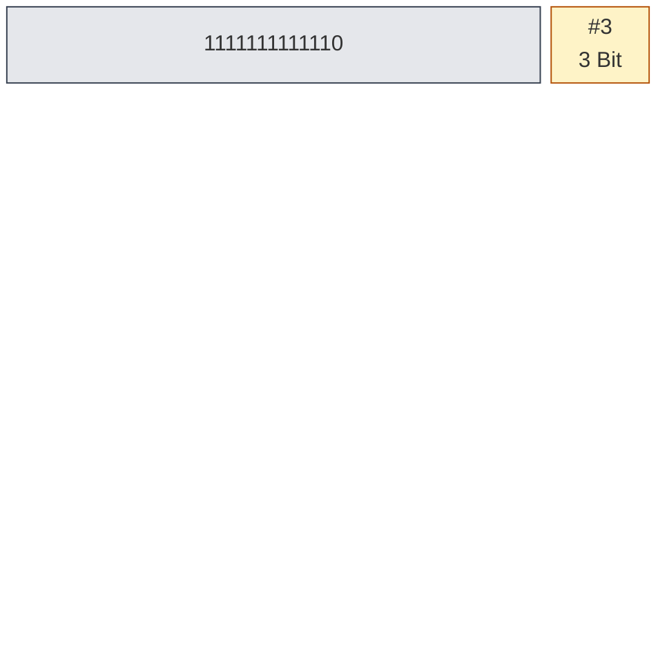
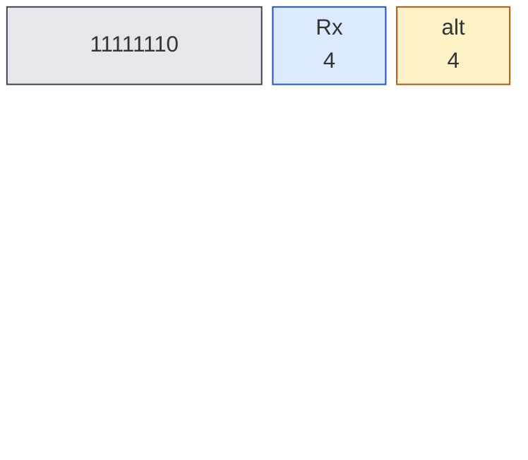
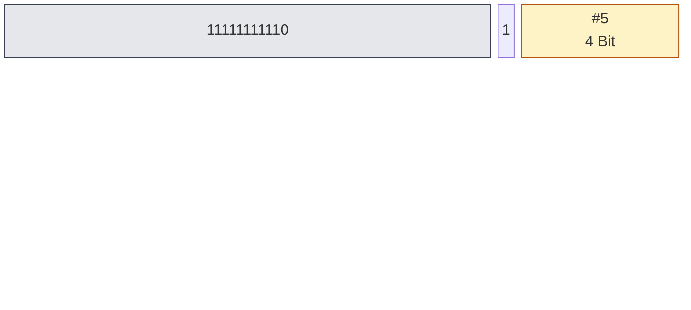
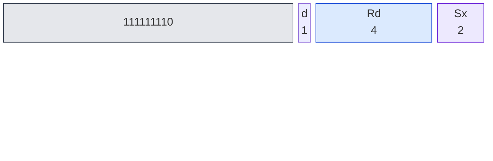

# Kapitel 5 — Interrupts und Shadow-Register

Kapitel 4 hat dir den Programmfluss in die Hand gegeben: Entscheidungen,
Schleifen, Aufrufe — alles von dir geplant und alles im eigenen Takt. Jetzt
kommt etwas, das den Code unterbricht, ohne gefragt zu werden: ein Timer,
ein Fehler, ein Tastendruck — irgendwas sagt „jetzt" und erwartet, dass die
laufende Rechnung danach genauso weitergeht wie davor. Ob davon im Simulator
auch etwas feuert, klärt §5.1.

Auf einem klassischen Prozessor wie der 6502 rettet, wer kann: Der Stapel
fangt drei Bytes, den Rest macht die Software von Hand. Die Deep16 löst
dasselbe Problem radikaler — mit einer **zweiten Registerbank**, die die
Hardware in Bruchteilen eines Takts tauscht. Kein `PHA`, keine Rettungskette,
kein vergessener Akkumulator um drei Uhr morgens. Kapitel 1 hat diesen
Schatten-Kontext einmal am Rande erwähnt; jetzt wirst du ihn vermessen.

Und wieder gilt: keine Behauptung ohne Messung. Jede Zahl in diesem Kapitel
stammt aus einem Lauf über beide Kerne (JS und WASM), die Listings sind
kopierfertig, und die Encodings der neuen Befehle kommen aus
`doc/Deep16-Arch.md` — die Semantik, die du liest, aus dem Simulator.

---

## 5.1 Das Problem: Kontext retten bei einem Interrupt

Ein Interrupt ist eine Zumutung an den Code: Er wird mitten in einer Rechnung
unterbrochen und soll danach exakt dort weitermachen, wo er aufgehört hat.
Die einzige Frage ist, **wer den Zustand rettet**, bevor der Handler beginnt.

Die 6502 antwortet mit „der Stapel, soweit er reicht". Bei einem IRQ schiebt
der Prozessor drei Bytes auf Seite 1 — PCL, PCH und P, in dieser Reihenfolge
nach unten geschoben, also `P` zuletzt oben:

```
; 6502: IRQ-Einstieg — der Prozessor rettet PC und P, den Rest der Software
        PHA
        TXA
        PHA
        TYA
        PHA
        ; PCL, PCH, P liegen schon im Page-1-Stapel
        ; und jetzt: JMP über den Vektor bei $FFFE/$FFFF
```

A, X und Y sind danach immer noch mitten in der Rechnung. Wer den Handler
schreibt, beginnt mit dieser Kette und muss sie am Ende spiegelverkehrt
zurückholen — `PLA`, `TAX`, `PLA`, `TAY`, `PLA` — und wenn eine Zeile
fehlt, spinnt das Programm später an einer ganz anderen Stelle, nicht hier.

Die Deep16 dreht die Frage um: **Warum den Registersatz verschieben, wenn man
einen zweiten haben kann?** Während der Handler läuft, arbeitet die CPU in
einer zweiten Bank — `R0′` bis `R3′`, `R13′`, `R14′`, `PC′`, `PSW′` und die
vier Segmente `CS′`, `DS′`, `SS′`, `ES′`. Die übrigen Register `R4`–`R12`
gehören beiden Kontexten. Nichts wird auf den Stack gelegt, nichts von Hand
gerettet — die Bank wird getauscht, fertig.

Über welchen Einstieg? Der liegt in Segment 0 und ist fest:

**Tabelle 5-1: Die Interrupt-Vektoren in Segment 0** (Spezifikation §4.5)

| Adresse | Vektor | Ausgelöst durch | maskierbar über |
|---------|--------|-----------------|-----------------|
| `0x0000` | `ILL` | unimplementierter Befehl | nein |
| `0x0001` | `HW` | Hardware-Interrupt | `PSW.I` |
| `0x0002` | `SW` | `SWI` — Softwareinterrupt | nein |

Der Interrupt springt nicht zu einer festen Adresse, sondern **liest Wort
`n` und springt dorthin**. Ein Byte Adresse wäre bei 20 Bit Adressraum
unmöglich, und eine Tabelle umzubiegen, ist eine Frage eines Speicherworts.

> **Wo bleibt der Hardware-Interrupt?** Der Vektor `0x0001` existiert, aber
> nichts in den Kernen löst ihn aus: `handleHardwareInterrupt()` steht in
> `js/deep16_simulator.js` und wird nirgends aufgerufen, `lib.rs` des
> WASM-Kerns kennt die Funktion nicht. Die Tastatur bleibt der Port aus
> Kapitel 2, `0xF0060`, den du abfragst. Deshalb startet alles, was folgt,
> mit `SWI` — und nach Spezifikation §4.4 läuft ein echter Hardware-Interrupt
> mit exakt derselben Eintrittsroutine.

Von den drei Vektoren brauchst du für dieses Kapitel nur einen:
`0x0002`. Zwei Dinge musst du über ihn wissen: wohin er nach dem Boot zeigt,
und was `SWI` an der Registerbank anstellt.

---

## 5.2 Die Deep16-Lösung: `SWI`, `RETI` und zwei Banken

### Nach dem Boot zeigen die Vektoren auf uns

Das Boot-ROM räumt vor, bevor es übergibt: Es schreibt die Adresse `0x0100`
— deinen Programmstart — in die Wörter `0`, `1` und `2`. Gemessen auf beiden
Kernen, nachdem ein Minimalprogramm aus einem einzigen `HALT` durchgelaufen
ist:

```text
Speicher 0x0000..0x0002 = 0x0100, 0x0100, 0x0100
```

Damit zeigt der SWI-Vektor nach dem Boot **auf den eigenen Anfang**. Ohne
Reparatur springt `SWI` mitten im Programm zurück auf Zeile 1 und das Ganze
beginnt von vorn — ein stiller Restart, kein Absturz. Gemessen: ein Lauf aus
Listing 5-2 ohne Reparatur war nach 500 Schritten (der Laufgrenze) beider
Kerne noch immer nicht am `HALT`, und der Vektor stand unverändert auf
`0x0100, 0x0100, 0x0100`.

Also reparierst du ihn — mit drei Befehlen, die du vor den eigentlichen Code
setzt:

```text
        LSI   R2, 2          ; Wort-Adresse des SWI-Vektors
        LDI   handler        ; Einsprung des Handlers (Label, eine Adresse)
        STS   R0, DS, R2     ; Wort an DS:2 = physisch 0x0002 schreiben
```

`STS` legt den Wert aus `R0` — `LDI` hat ihn gerade geladen — an `DS:R2`.
Dass `DS` dabei `0` ist, hast du in §2.3 nach dem Boot gemessen; das ist kein
Zufall, sondern die Voraussetzung, dass `DS:2` wirklich Wort `2` meint.

Zum Beweis liest der erste Befehl einfach nur, was dort steht:

```assembly
; listing 5-1: der SWI-Vektor nach dem Boot — er zeigt auf uns selbst
.org 0x0100
        LSI   R2, 2
        LDS   R0, DS, R2      ; R0 = 0x0100
        HALT                  ; 13 Schritte (10 davon Boot), PSW = 0x0000
```

`R0` = `0x0100`, `R2` = `0x0002` — auf beiden Kernen identisch, in 13
Schritten. Der Vektor ist ein Wort wie jedes andere, und `LDS` aus §3.1
reicht, um es zu lesen.

### `SWI` und `RETI` — der Wechsel

Die beiden Befehle, um die es hier geht, sind schlicht: der eine wechselt in
den Schatten-Kontext, der andere zurück.

**`SWI` — Softwareinterrupt: den Kontext wechseln**


**`RETI` — Return from Interrupt: zurück in den normalen Kontext**



Beide sitzen in derselben Befehlsfamilie `SYS` — 13 feste Bits und ein
3-Bit-Code, der die Systemfunktion benennt (`#2` für `SWI`, `#3` für `RETI`).
Spezifikation §4.4 und §4.9 beschreiben den Ablauf so:

1. `SWI` parkt den laufenden `PSW` in `PSW′`, setzt den eigenen `PSW` auf
   `0x0020` (also `S` = 1, `I` = 0, Flags gelöscht) und setzt `CS′`, `DS′`,
   `SS′`, `ES′` auf `0`.
2. Die bankierten Register `R0′`–`R3′`, `R13′`, `R14′` werden auf `0`
   gesetzt — der Handler startet auf einer **leeren** Bank, nicht auf einer
   Kopie deiner Rechnung.
3. `PC′` bekommt den Wert, der an Adresse `0x0002` steht. Von da an läuft der
   Code im Schatten, weil `S` = 1 ist.
4. `RETI` holt nur **eins** zurück: `PSW ← PSW′`, und `PSW′` wird dabei auf
   `0` geleert. Es wird kein Register kopiert — was der Handler auf der
   Schattenbank stehen ließ, bleibt dort stehen.

> **Kein Delay Slot.** Nur bedingte Sprünge schieben sich einen Slot hinter
> sich (Spezifikation §3.12, Tabelle 11) — `SWI` und `RETI` nicht, und beide
> Hälften sind gemessen. Erstens: Die Instruktion hinter `SWI` läuft nicht
> vor dem Handler, sonst hätte der `JZ` aus Listing 5-2 `PSW` = `0x0020`
> vorgefunden, wäre nicht gegangen, und der Marker hätte `R5` auf `0x00EE`
> gesetzt (Tabelle 5-3). Zweitens: Die Instruktion hinter `RETI` läuft
> überhaupt nie — ein eigener Lauf legt eine `LSI R1, 7` direkt hinter das
> `RETI`, setzt `R1` vorher auf `0x00AA` und zählt die Schritte: `R1` bleibt
> `0x00AA`, `PC` endet bei `0x0106`, und die 18 Schritte (10 Boot +
> 7 Hauptprogramm + 1 `RETI`) sind exakt.

### `SMV`: der Blick in die andere Bank

Bevor du den ersten `SWI` laufen lässt, brauchst du ein Werkzeug, um
überhaupt sehen zu können, was dabei passiert. Das ist `SMV` — es liest ein
Register aus dem **inaktiven** Kontext. In normaler Sicht ist das der
Schatten, in Schattensicht ist es die normale Bank — gemeint ist jeweils der,
der gerade *nicht* aktiv ist.

**`SMV Rx, alt` — Wert aus dem anderen Kontext lesen**



Die vier Bits `alt` wählen aus, *was* gemeint ist — Segmente, `PSW` oder ein
benanntes `R`-Register:

**Tabelle 5-2: Die `alt_sel`-Werte von `SMV`** (Codierung: Spezifikation
§3.3, Tabelle F; in normaler Sicht liest die Tabelle den Schatten)

| `alt` | Name | liest … | in diesem Kapitel gemessen |
|-------|------|---------|----------------------------|
| `0000` | `ACS` | `CS`′ | nein |
| `0001` | `ADS` | `DS`′ | nein |
| `0010` | `ASS` | `SS`′ | nein |
| `0011` | `AES` | `ES`′ | ja — Listing 5-6 |
| `0100` | `APSW` | `PSW`′ | ja — Listing 5-5 |
| `0101`–`0111` | — | reserviert | |
| `1000` | `AR0` | `R0`′ | ja — Listings 5-2, 5-3, 5-7 |
| `1001` | `AR1` | `R1`′ | ja — Listings 5-2, 5-6 |
| `1010` | `AR2` | `R2`′ | nein |
| `1011` | `AR3` | `R3`′ | ja — Listing 5-8 |
| `1100` | — | reserviert | |
| `1101` | `AR13` | `SP`′ | nein |
| `1110` | `AR14` | `LR`′ | nein |
| `1111` | `APC` | aktiver `PC` | nein (Ausnahme: nicht die andere Bank) |

`SMV` schreibt nie in den anderen Kontext — es ist der reine Lesezugang, den
du für jeden Registersatz brauchst, der dir gerade nicht gehört. Geschrieben
wird allein das Zielregister, und alle Ziele in diesem Kapitel liegen in
`R4`–`R12`, die auf beide Banken dieselbe Adresse haben: `SMV R10, AR0` holt
`R0`′ heraus und landet trotzdem in deinem normalen `R10`.

### Was wirklich passiert: der Durchlauf

Jetzt der erste eigentliche Interrupt. Das Programm richtet den Vektor,
bereitet zwei Register vor, ruft `SWI` auf und sieht danach nach, wo was
gelandet ist:

```assembly
; listing 5-2: SWI parkt den Kontext, RETI holt ihn zurück
.org 0x0100
        LSI   R2, 2
        LDI   handler
        STS   R0, DS, R2      ; Vektor reparieren
        LDI   0x00AA
        MOV   R1, R0          ; R1 = 0x00AA (normal, bankiert)
        LDI   0x0055
        MOV   R6, R0          ; R6 = 0x0055 (geteilt)
        CMP   R0, R0          ; Z = 1, PSW = 0x0002
        SWI
        JZ    zret            ; R5 = 0x0000 — Z war zurück
        NOP
        LDI   0xEE
        MOV   R5, R0          ; Marker: wird nie erreicht
zret:
        LPSW  R7              ; R7 = 0x0002
        SMV   R10, AR0        ; R10 = 0x2222
        SMV   R11, AR1        ; R11 = 0x0007
        HALT                  ; 29 Schritte, PSW = 0x0002
handler:
        LDI   0x2222          ; → R0′, normal bleibt 0x0055
        LSI   R1, 7           ; → R1′, normal bleibt 0x00AA
        LSI   R6, 9           ; R6 = 0x0009 am Ende — R4–R12 sind geteilt
        RETI                  ; kein Delay Slot
```

**Tabelle 5-3: Endzustand von Listing 5-2** (identisch auf JS- und WASM-Kern,
29 Schritte = 10 Boot + 15 Hauptprogramm + 4 Handler)

| Register | Wert | Was er beweist |
|----------|------|----------------|
| `R0` | `0x0055` | normaler Kontext — unverändert |
| `R1` | `0x00AA` | der Handler schrieb `R1`′, nicht `R1` |
| `R5` | `0x0000` | Marker nie erreicht → `JZ` lief mit `Z` = 1 |
| `R6` | `0x0009` | geteiltes Register: der Handler sah dasselbe `R6` |
| `R7` | `0x0002` | `LPSW` nach `RETI` — der geparkte Wert ist zurück |
| `R10` | `0x2222` | `SMV AR0` — der `LDI` des Handlers |
| `R11` | `0x0007` | `SMV AR1` — der `LSI R1, 7` des Handlers |
| `R13` | `0x7FFF` | Stack unangetastet |
| `PSW` | `0x0002` | `Z` von `CMP`, wiederhergestellt |

Drei Dinge liest du daraus:

- **`SWI` hat keinen Delay Slot.** Wäre der `JZ` sofort nach `SWI`
  gelaufen, hätte er `PSW` = `0x0020` vorgefunden, `Z` wäre 0 gewesen, der
  Marker hätte ausgeführt und `R5` stünde auf `0x00EE`. Er steht auf
  `0x0000`: Der Sprung lief erst nach `RETI`, mit wiederhergestelltem `Z`.
- **Bankiert heißt `R0`–`R3`, `R13`, `R14`.** `R1` blieb unberührt, obwohl
  der Handler es beschrieben hat — gemessen in `R11` = `0x0007`.
- **Geteilt heißt `R4`–`R12`.** `R6` wanderte von `0x0055` auf `0x0009`,
  weil beide Kontexte dasselbe Register meinen.

Und der Stapel? `SWI` legt **nichts** darauf. Gemessen nach dem Lauf: `SP`
steht bei `32767` (`0x7FFF`) und die sechzehn Wörter von `0x7FF0` bis
`0x7FFF` tragen auf beiden Kernen ausnahmslos `0xFFFF` — dort, wo die 6502
drei Bytes geschoben hätte, ist bei der Deep16 nie etwas gewesen.

### Was `SWI` zurücksetzt

Tabelle 5-3 zeigt, was die Bank *während* des Handlers trägt. Die andere
Hälfte ist: Was ist danach noch da? Nichts, weil `SWI` die Schattenbank
**vor jedem Einstieg leert**. Ein Zähler in `R0`′ macht es sichtbar:

```assembly
; listing 5-3: zwei Aufrufe, ein Zähler in R0′ — er bleibt bei 1
.org 0x0100
        LSI   R2, 2
        LDI   handler
        STS   R0, DS, R2
        LDI   0x0044          ; R0 = 0x0044, bleibt es auch
        SWI
        SWI
        SMV   R10, AR0        ; R10 = 0x0001 — nicht 0x0002
        HALT                  ; 22 Schritte, PSW = 0x0000
handler:
        ADD   R0, 1           ; R0′ += 1 — geht bei jedem SWI verloren
        RETI
```

Nach zwei Aufrufen steht `R0`′ bei `0x0001` (`R10` = `0x0001`), nicht bei
`0x0002`. Wäre die Bank nicht geleert worden, stünde dort `0x0002` — der
Beweis, dass der Handler **jedes Mal frisch** beginnt. Gleichzeitig bleibt
`R0` = `0x0044`: Die normale Bank hat von nichts mitbekommen, 22 Schritte
(10 + 8 + 2 × 2), `PSW` = `0x0000`, identisch auf beiden Kernen.

> **Zusammengefasst:** `SWI` ist kein Kopieren, sondern ein **Ersetzen** —
> frischer `PSW` (`0x0020`), leere Schatten-Register, `PC` aus der
> Vektortabelle. `RETI` ist kein Zurückkopieren, sondern ein **Zurücksetzen**
> des `PSW`. Alles andere liegt danach da, wo du es gelassen hast.

### `SETI`, `CLRI` und die `SETS`-Falle

Tabelle 5-1 hat zwei Bits, mit denen du eingreifen kannst: `I` (Bit 4)
maskiert Hardware-Interrupts, `S` (Bit 5) entscheidet, welche Bank gerade
aktiv ist. Für beide gibt es Schaltbefehle — im Gegensatz zu `SET`/`CLR` aus
§3.3 brauchen sie kein Bit-Operand, weil die Zielbits fest verdrahtet sind.

**`SETI` — Interrupt-Bit `I` setzen**


**`CLRI` — Interrupt-Bit `I` löschen**


**`SETS` — Schatten-Bit `S` setzen**


**`CLRS` — Schatten-Bit `S` löschen**



`SETI` und `CLRS` sind beide aus der `SYS`- bzw. der `SET`/`CLR`-Familie
und unterscheiden sich nur in den letzten drei beziehungsweise fünf Bits:
`SYS` trägt die Nummer der Systemfunktion (`#4`, `#5`), `SET`/`CLR` ein
Kommando-Bit (`0` = setzen, `1` = löschen) und die Bit-Nummer (`#5` = das
`S`-Bit). Dass `SETI` genau Bit 4 und `SETS` genau Bit 5 trifft, ist
festgelegt, nicht wählbar — im Gegensatz zu `SET imm` aus §3.3.

Ein Lauf belegt beide:

```assembly
; listing 5-4: I lässt sich schalten, S nicht — ohne den Ablauf zu verlieren
.org 0x0100
        SETI
        LPSW  R1              ; R1 = 0x0010
        CLRS                  ; S war schon 0 — kein Effekt
        LPSW  R2              ; R2 = 0x0010
        CLRI
        LPSW  R3              ; R3 = 0x0000
        LDI   0x1234
        MOV   R5, R0          ; R5 = 0x1234 — bis hierher kam der Code
        SETS                  ; ab hier läuft die normale Ausführung nie weiter
        LDI   0xEE
        MOV   R6, R0          ; R6 = 0x0000 — Marker nie erreicht
        HALT                  ; 23 Schritte, PSW = 0x0020
```

Der Ablauf bis `SETS` ist unspektakulär und gemessen: `R1` = `0x0010` nach
`SETI`, `R2` = `0x0010` nach `CLRS` (das `S`-Bit stand schon auf 0, also
tat sich nichts), `R3` = `0x0000` nach `CLRI`. Danach `LDI 0x1234` und
`R5` = `0x1234` — der Code läuft normal.

Und dann `SETS`. Das Ergebnis ist die Falle, vor der dich §3.3 gewarnt hat:
Der `PC` der normalen Ausführung bleibt stehen (`R6` = `0x0000`, der Marker
dahinter wird nie erreicht), und die CPU arbeitet stattdessen mit
`PC′` weiter — und `PC′` steht auf `0`. Also werden die Wörter bei
Adresse `0` ausgeführt, und das sind die drei Boot-Wörter:

```text
0x0000: 0x0100   →  LDI #0x0100
0x0001: 0x0100   →  LDI #0x0100
0x0002: 0x0100   →  LDI #0x0100
0x0003: 0xFFFF   →  HALT
```

Die Schrittanzahl von 23 passt genau: 10 Boot + 9 eigene Befehle bis
einschließlich `SETS` + 3 Vektorwörter + 1 `HALT`. `PC′` endet bei `0x0003`,
`CS′` und `PSW′` bei `0` — gemessen auf beiden Kernen. Der normale `PC`
bleibt bei `0x0109` stehen; sichtbar ist das im JS-Kern, während
`get_registers()` im WASM-Kern solange den aktiven Schatten-`PC` meldet und
dort `0x0003` anzeigt. Beides ist derselbe Zustand, nur von zwei Seiten gelesen.

> **`SETI`/`CLRI` schalten `I`, `SETS`/`CLRS` schalten `S`.** In diesem
> Simulator hat `I` ohnehin nichts zu maskieren (§5.1), die Bits wirken hier
> also nur als Bits. `S` dagegen wirkt sofort und voll: Es ist der Schalter
> zwischen den beiden Banken. `RETI` ist der einzige Weg, ihn sauber
> zurückzunehmen.

---

## 5.3 Von außen lesen: `APSW`, die Schatten-Segmente und der Simulator

§5.2 hat dir `SMV` gegeben und gezeigt, was `SWI` anrichtet. Jetzt wird der
Blick von außen schärfer: der geparkte `PSW`, die Segmente, ein kompletter
OS-Aufruf — und zum Schluss der Block im Simulator, der den ganzen
Schatten-Kontext anzeigt.

### Der geparkte `PSW`

`LPSW` aus §2.2 liest den **laufenden** `PSW`, `SMV APSW` den **geparkten**
in `PSW′`. Beides zusammen ergibt ein 2×2, das beide Hälften des Mechanismus
zeigt:

```assembly
; listing 5-5: APSW liest den geparkten PSW, LPSW den laufenden
.org 0x0100
        LSI   R2, 2
        LDI   handler
        STS   R0, DS, R2
        CMP   R0, R0          ; PSW = 0x0002 (nur Z)
        SWI
        LPSW  R7              ; R7 = 0x0002 — wieder hergestellt
        SMV   R10, APSW       ; R10 = 0x0000 — RETI hat PSW′ geleert
        HALT                  ; 21 Schritte, PSW = 0x0002
handler:
        LPSW  R12             ; R12 = 0x0020 — der laufende Handler-PSW
        SMV   R11, APSW       ; R11 = 0x0002 — der geparkte PSW′
        RETI
```

**Tabelle 5-4: `LPSW` und `SMV APSW` in Listing 5-5** (21 Schritte,
beide Kerne identisch)

| Sicht | `LPSW` (laufend) | `SMV APSW` (geparkt) |
|-------|------------------|----------------------|
| im Handler (Schatten) | `R12` = `0x0020` | `R11` = `0x0002` |
| danach (normal) | `R7` = `0x0002` | `R10` = `0x0000` |

Damit ist der Eintritt von §5.2 vollständig belegt: Der Handler lief mit
`PSW` = `0x0020` (`S` = 1, alles andere leer), der vorherige Zustand
`0x0002` lag in `PSW′` und kam nach `RETI` unverändert zurück. Dass `PSW′`
dabei auf `0` gesetzt wird, steht in der unteren rechten Zelle: `R10` =
`0x0000`.

Dabei sind alle vier Zielregister in `R4`–`R12` und damit in beiden
Kontexten derselbe geteilte Platz. `SMV` wechselt nur die Lesesicht,
geschrieben wird der geteilte `R`-Register — deshalb findest du die Werte
aus beiden Zeilen in derselben Ansicht wieder.

Ein Schreibzugriff auf den `PSW` — etwa, um Flags selbst zu setzen — wäre
`SPSW`; er steht in §3.3 und taucht hier nicht auf, weil genau das `RETI`
erledigt, was du sonst von Hand machen müsstest.

### Die Schatten-Segmente

`SMV AES` liest `ES`′ aus der anderen Bank. Zum Vergleich brauchst du die
Leseseite von `MVS` — §2.3 hat `MVS` nur beim Schreiben gezeigt
(`MVS ES, R1`), die Codierung für den Gegenweg fehlt bis hierhin:

**`MVS Sx, Rd` / `MOV Rd, Sx` — Segmentregister schreiben und lesen**



Dieselbe Codierung, nur das Kommando-Bit `d` entscheidet die Richtung:
`d` = 0 liest (`MOV R9, ES`), `d` = 1 schreibt (`MVS ES, R1`). Zusammen
zeigen beide, dass die Segmentregister genauso bankiert sind wie `R0`–`R3`:

```assembly
; listing 5-6: SWI setzt die Schatten-Segmente zurück, die normalen nicht
.org 0x0100
        LSI   R2, 2
        LDI   handler
        STS   R0, DS, R2
        LDI   0x2000
        MOV   R1, R0          ; R1 = 0x2000
        MVS   ES, R1          ; ES = 0x2000
        SWI
        SWI
        SMV   R10, AR1        ; R10 = 0x0000 — ES′ war beim 2. Einstieg 0
        SMV   R11, AES        ; R11 = 0x3000 — ES′ nach dem Handler
        SMV   R12, AR0        ; R12 = 0x3000 — R0′ nach dem Handler
        MOV   R9, ES          ; R9 = 0x2000 — normales ES unverändert
        HALT                  ; 31 Schritte, PSW = 0x0000
handler:
        MOV   R1, ES          ; R1′ ← ES′
        LDI   0x3000
        MVS   ES, R0          ; ES′ = 0x3000
        RETI
```

Der Trick ist die **Reihenfolge der beiden `SWI`**. Der Handler liest beim
Einstieg `ES`′ nach `R1`′ und schreibt `0x3000` hinein. Beim zweiten Aufruf
müsste `ES`′ also noch `0x3000` sein, wenn `SWI` es nicht zurückgesetzt
hätte. Gemessen wird `R10` = `0x0000`: Beim zweiten Einstieg war `ES`′
**`0`** — `SWI` hat es gelöscht. Und `R11` = `0x3000` beweist, dass der
Handler es danach wieder belegt hat. Dass dabei das normale `ES` unberührt
bleibt, sieht `R9` = `0x2000`; `R0` = `0x2000` gegenüber `R12` = `0x3000`
liefert dasselbe Paar für die bankierten Register — `LDI 0x3000` landete in
`R0`′, nicht in `R0`.

31 Schritte (10 + 13 + 2 × 4), `PSW` = `0x0000`, beide Kerne identisch.

### Ein OS-Aufruf mit zwei Banken

Der Musterfall, für den die dritte Bank da ist: Der Handler soll Argumente
des Auftraggebers lesen und ein Ergebnis zurückgeben, ohne die Register des
Auftraggebers anzufassen. Die Banken liefern den Umweg von selbst —
Argumente kommen aus dem **inaktiven** Kontext, das Ergebnis landet in der
Bank, die der Handler gerade selbst besetzt:

```assembly
; listing 5-7: ein OS-Aufruf — Argumente von drüben, Ergebnis zurück
.org 0x0100
        LSI   R2, 2
        LDI   handler
        STS   R0, DS, R2
        LDI   0x0033
        MOV   R1, R0          ; R1 = 0x0033, bleibt es
        LDI   21              ; Argument in R0
        SWI
        SMV   R10, AR1        ; R10 = 0x002A — das Ergebnis 42
        HALT                  ; 22 Schritte, PSW = 0x0000
handler:
        SMV   R1, AR0         ; Argument lesen: R1′ ← R0 = 21
        ADD   R1, R1          ; R1′ = 42
        RETI
```

Der Handler liest `R0` = `21` über `SMV AR0` — aus der normalen Bank, weil
er selbst im Schatten läuft —, verdoppelt es in `R1`′ und kehrt zurück.
Zurück in normaler Sicht liest das Hauptprogramm `R10` = `0x002A` (42) und
sieht sein eigenes `R1` = `0x0033` unverändert an. 22 Schritte, beide Kerne
identisch.

### Der Shadow-Block im Simulator

Zum Schluss die Sicht von draußen: Der Simulator zeigt den Schatten-Kontext
in einem eigenen Block namens **Shadow Registers (Interrupt Context)** mit
`PSW′`, `PC′` und `CS′`. Im JS-Kern liest er dazu direkt aus
`simulator.shadowRegisters`, im WASM-Kern aus `get_shadow_state()` — der
liefert genau diese drei Wörter.

Nach dem Lauf von Listing 5-2 zeigen beide Kerne dasselbe:

```text
PSW′ = 0x0000    PC′ = 0x0115    CS′ = 0x0000
```

`PSW′` = `0`, weil `RETI` es beim Zurücksetzen geleert hat. `CS′` = `0`,
weil `SWI` es beim Einstieg auf `0` gesetzt hat und `RETI` nicht anfasst.
Und `PC′` = `0x0115` ist die Adresse hinter dem `RETI` bei `0x0114` — dort,
wo der Handler stehen geblieben wäre, wenn es ihn noch gäbe.

> **Merke:** Der Block zeigt den **letzten** Schatten-Zustand. Solange dein
> Programm keine Interrupts nutzt, ist er nach dem Boot leer — `PSW′`,
> `PC′` und `CS′` stehen auf `0`.

---

## Beispiel: Drei Interrupts, ein Zähler

Jetzt alles zusammen: ein Programm, das sich den SWI-Vektor richtet und sich
dann dreimal unterbrechen lässt, um einen Zähler im Speicher hochzuzählen.
Die Idee dahinter ist die eine Regel, die aus Listing 5-3 folgt:
**Zustand, der einen Interrupt überleben soll, darf nicht in einem bankierten
Register liegen** — er gehört in den Speicher.

```assembly
; listing 5-8: drei Interrupts — im Speicher zählen sie weiter, im Schatten nicht
.org 0x0100
        LSI   R2, 2
        LDI   handler
        STS   R0, DS, R2      ; Vektor reparieren
        LDI   0x0300
        MOV   R4, R0          ; R4 = 0x0300, geteiltes Register
        LSI   R5, 0
        ST    R5, R4, 0       ; Zählerwort auf 0
        LSI   R1, 3           ; genau drei Interrupts
loop:
        SWI
        SUB   R1, 1           ; R1 herunterzählen, Z = 1, wenn 0 erreicht ist
        JNZ   loop
        NOP                    ; Delay Slot des JNZ (§4.1)
        LD    R10, R4, 0      ; R10 = 0x0003 — überlebt hat es
        SMV   R11, AR3        ; R11 = 0x0001 — der Schattenzähler nicht
        HALT                  ; 48 Schritte, PSW = 0x0002
handler:
        LDS   R0, DS, R4      ; Zähler holen
        ADD   R0, 1
        STS   R0, DS, R4      ; zurücklegen
        ADD   R3, 1           ; R3′ zählt mit — und geht bei jedem SWI verloren
        RETI
```

Der Handler braucht zwei Dinge, die beide funktionieren müssen: die
Zähleradresse und das Segment, über das er sie erreicht. Die Adresse steht in
`R4` — und `R4`–`R12` sind geteilt, der Handler findet sie also unverändert
wieder. Das Segment ist `DS`: `SWI` hat `DS`′ auf `0` gesetzt
(Spezifikation §4.4), also auf dieselbe Basis wie davor. Dass der Handler
wirklich dort geschrieben hat, beweist der Zähler selbst —
`LD R10, R4, 0` liest von `0x0300` und findet `3`.

Gemessen, identisch auf beiden Kernen, in 48 Schritten
(10 Boot + 8 Einrichtung + 3 × 9 im Kreis + 3 zum Schluss):

**Tabelle 5-5: Endzustand von Listing 5-8**

| Größe | Wert | Bedeutung |
|-------|------|-----------|
| `R10` | `0x0003` | Speicherzähler — drei Interrupts kamen an |
| `R11` | `0x0001` | Schattenzähler — `SWI` hat `R3`′ zurückgesetzt |
| Speicher `0x0300` | `3` | dasselbe in Wortform |
| `R4` | `0x0300` | geteilte Zähleradresse, unverändert |
| `R13` | `0x7FFF` | auch nach drei Interrupts nie ein Wort auf dem Stack |
| `PSW` | `0x0002` | `Z` vom letzten `SUB R1, 1`, `I` war nie gesetzt |

Die beiden Zahlen nebeneinander sind die Pointe des Kapitels: **3 und 1**.
Der Speicherzähler zählt mit, weil er außerhalb beider Banken liegt. Der
Schattenzähler bleibt bei 1, weil `SWI` die Bank vor jedem Einstieg leert —
genau wie in Listing 5-3. Was du überleben lassen willst, lebt nicht im
Register, sondern dort, wo Interrupts nicht hinreichen: im Speicher.

---

## Das solltest du mitnehmen

1. Ein Interrupt rettet nichts auf den Stack: `SWI` legt **kein Wort** auf
   den Stapel (`SP` bleibt `0x7FFF`, `0x7FF0`–`0x7FFF` bleiben `0xFFFF`),
   sondern tauscht die Registerbank. Die 6502 schiebt drei Bytes und lässt
   dir den Rest.
2. Die Vektoren stehen in Segment 0 (`0x0000` ILL, `0x0001` HW, `0x0002`
   SWI), und nach dem Boot zeigt der SWI-Vektor auf `0x0100` — deinen
   eigenen Anfang. Der Reparatur-Stummel aus drei Befehlen vor
   Listing 5-2 ist deshalb Pflicht, nicht Dekoration.
3. `SWI` ist ein **Ersetzen** (frischer `PSW` = `0x0020`, leere
   Schatten-Register, `PC` aus dem Vektor), `RETI` ein **Zurücksetzen**
   (`PSW ← PSW′`, `PSW′` = `0`). Bankiert sind `R0`–`R3`, `R13`, `R14` und
   alle vier Segmente; `R4`–`R12` teilen sich beide Kontexte.
4. **Kein Delay Slot:** Die Anweisung hinter `RETI` läuft nie, und die nach
   `SWI` läuft erst nach dem Handler — mit wiederhergestellten Flags.
5. `SMV` liest den inaktiven Kontext, `LPSW`/`MVS` den aktiven. Damit ist
   jeder Interrupt-Zustand von außen prüfbar, und der Simulator zeigt
   `PSW′`/`PC′`/`CS′` zusätzlich im Shadow-Block
   (`get_shadow_state()`).
6. `SETI`/`CLRI` schalten `I`, `SETS`/`CLRS` schalten `S` — aber `SETS`
   wechselt dir mitten im Programm in den Schattenkontext: 23 Schritte bis
   zum `HALT` in den Vektorwörtern, `R6` = `0x0000` für den Code, der nie
   erreicht wird. `SET`/`CLR` aus §3.3 bleiben die sichere Wahl.
7. Ein Register, das einen Interrupt überleben soll, muss geteilt sein
   (`R4`–`R12`) oder im Speicher liegen — in der Schattenbank überlebt es
   den nächsten `SWI` nicht (Listing 5-3 vs. Listing 5-8).

**Nächstes Kapitel:** Kapitel 6 macht aus dem Simulator eine Werkbank —
Memory-mapped I/O an den Ports `0xF0060` und `0xF1000`, Debuggen der
Delay-Slot-Fallen und der Schatten-Zustand, den du gerade kennengelernt
hast, im Direktvergleich zwischen JS- und WASM-Kern.
