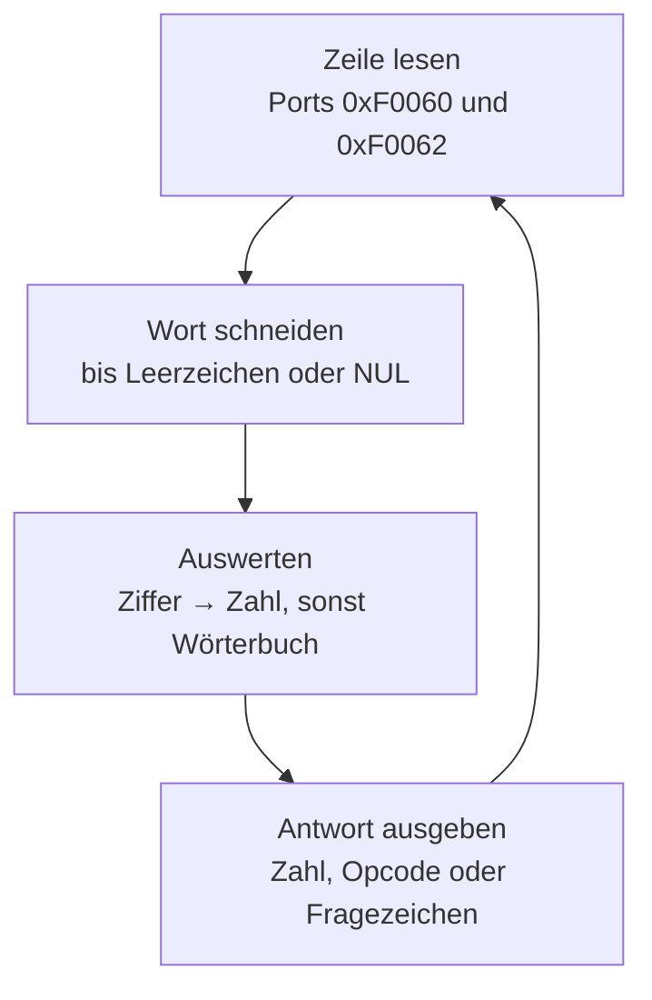

# Kapitel 7 — Ein Mini-Forth

Fünf Kapitel lang haben wir Maschinenprogramme gebaut, die genau eine Sache
tun. Das ist bequem, aber es ist auch der Grund, warum Deep16-Programme in der
Wildnis selten sind: Es fehlt die Umgebung. Ein Programm, das eine Taste
liest, ist ein Experiment. Ein Programm, das eine Zeile liest, ein Wort
zerlegt, es nachsieht und eine Zahl ausgibt, ist ein **Werkzeug** — und der
Beginn von allem, was man auf einem kleinen Rechner überhaupt bauen kann.

Deshalb ist der 6502-Vergleich an dieser Stelle stärker als sonst: Das
FORTH-Projekt von Klaus Hoffmann für den 6502 ist das berühmteste Programm,
das je für diesen Chip geschrieben wurde, und du kennst seine Form bereits
aus der Literatur. Ein Wortpuffer, ein Wörterbuch, ein Stack, ein
`ok`-Prompt — das Muster ist 1970er-Jahre und funktioniert auf einer Deep16
genauso. Was sich ändert, sind die harten Stellen: der Stack, den die 6502
im Speicher hatte, ist hier eine explicit gepflegte Liste im RAM — und genau
daran hängt dieser Kapitel.

Wir bauen das Ding in vier Stufen, von denen jede für sich lauffähig ist und
jede auf **allen drei Kernen** gemessen wurde. Am Ende steht ein Programm,
das `42` eingetippt bekommt und `42` ausgibt, `ABC` erkennt und `XYZ` mit
einem Fragezeichen quittiert.

---

## 7.1 Die REPL-Schleife: eine Zeile holen

Ein REPL — read, eval, print, loop — ist eine Schleife, die eine Zeile holt,
sie auswertet und wieder von vorn beginnt. Der erste Schritt ist erstaunlich
der einfachste, denn Kapitel 6 hat die Maschine schon geliefert: Port
`0xF0060` sagt, ob eine Taste wartet, `0xF0062` holt sie.

Listing 7-1 liest Zeichen, schreibt sie in einen Puffer und spiegelt sie auf
den Bildschirm — ein Echo, damit du siehst, was du tippst.

```assembly
; listing 7-1: eine Zeile von der Tastatur lesen und zurueckspiegeln
.org 0x0100

        LDI  -4096
        MVS  ES, R0                  ; ES = 0xF000 — Peripherie-Fenster
        LDI  0x0060
        MOV  R6, R0                  ; R6 -> Status-Port 0xF0060
        LDI  0x0062
        MOV  R7, R0                  ; R7 -> Daten-Port  0xF0062
        LDI  0x1000
        MOV  R8, R0                  ; R8 -> Bildschirmzelle 0xF1000
        LDI  puffer
        MOV  R9, R0                  ; R9 = Schreibzeiger
        LDI  0
        MOV  R10, R0                 ; R10 = Zeichen in der Zeile
        LDI  1000
        MOV  R11, R0                 ; R11 = Wartebudget
        LDI  lese
        MOV  R12, R0                 ; R12 = Ruecksprungadresse

lese:
        SUB  R11, 1
        JZ   fertig                  ; Budget erschoepft
        NOP
        LDS  R1, ES, R6              ; Status lesen
        ADD  R1, 0                   ; LDS setzt keine Flags
        JZ   lese                    ; nichts da
        NOP
taste:
        LDS  R2, ES, R7              ; Zeichen holen
        CMP  R2, 10                  ; Enter?
        JZ   fertig
        NOP
        ST   R2, R9, 0               ; in den Puffer (DS = 0)
        ADD  R9, 1
        ADD  R10, 1
        STS  R2, ES, R8              ; Echo auf den Bildschirm
        ADD  R8, 1
        JMP  R12
        NOP

fertig:
        LDI  0
        ST   R0, R9, 0               ; NUL-Terminator schliessen
        HALT

.org 0x0400
puffer:
        .word 0, 0, 0, 0, 0, 0, 0, 0
```

Gemessen mit den Tasten `H`, `i`, `Enter` (alle drei Kerne, 76 Schritte):
`R10` = `2`, `R9` = `0x0402`, und der Puffer ab `0x0400` enthält
`0x0048` `0x0069` `0x0000` — `H`, `i`, Ende. Auf dem Bildschirm steht `Hi`.

Ohne jede Taste läuft das Programm sein Budget herunter: 7025 Schritte, dann
`R10` = `0` und ein Puffer voller Nullen. Es beendet sich ordentlich.

Drei Details sind es wert, die du nicht überspringen solltest:

> **Merke:** `LDS` setzt **keine** Flags (§3.1). Ohne das `ADD R1, 0` würde
> `JZ lese` auf einem alten Flag entscheiden und die Schleife enden oder
> hängen, je nachdem, was zuletzt passiert ist. Das ist kein Detail, das ist
> die halbe Fehlersuche in jedem FORTH.

Der Puffer wird mit `ST` geschrieben, nicht mit `STS` — er liegt im RAM, und
`ST R2, R9, 0` adressiert über `DS`, das nach dem Boot `0x0000` ist (§2.3).
Eben deshalb liegt er auf `0x0400` und nicht irgendwo.

Und das Budget ist kein Dekor: Eine Schleife, die endlos wartet, sieht im
Debugger *hängt* aus. Ein begrenztes Budget erlaubt die Frage „wartet das
Programm oder ist es festgefahren?" zu beantworten.

### Das Wort schneiden

Ein FORTH verarbeitet ein Wort nach dem anderen. Also muss aus der Zeile
zuerst das erste Wort herausfallen — alles bis zum ersten Leerzeichen oder
bis zum Ende.

Hier wartet die erste echte Überraschung, und sie ist eine Lektion für die
gesamte zweite Hälfte des Buches. Der Leerzeichen-Code ist `32`, und der
Vergleich **als Immediate** hat nur vier Bit:

```text
        CMP  R5, 32                  ; Leerzeichen?
        → Immediate value 32 out of range (0-15)
```

Das `imm`-Feld der ALU-Befehle trägt 0 bis 15 (§3.2). `32` passt dort nicht
hinein, und der Assembler sagt es deutlich. Die Lösung ist die, die du aus
Kapitel 2 kennst: Konstante in ein Register, dann die **Registerform**.

```assembly
; listing 7-2: die Zeile lesen und das erste Wort herausschneiden
.org 0x0100

        LDI  -4096
        MVS  ES, R0                  ; ES = 0xF000
        LDI  0x0060
        MOV  R6, R0
        LDI  0x0062
        MOV  R7, R0
        LDI  0x1000
        MOV  R8, R0
        LDI  puffer
        MOV  R9, R0
        LDI  0
        MOV  R10, R0                 ; R10 = Zeichenzahl
        LDI  1000
        MOV  R11, R0                 ; R11 = Wartebudget
        LDI  lese
        MOV  R12, R0

lese:
        SUB  R11, 1
        JZ   schneiden
        NOP
        LDS  R1, ES, R6
        ADD  R1, 0
        JZ   lese
        NOP
taste:
        LDS  R2, ES, R7
        CMP  R2, 10
        JZ   schneiden
        NOP
        ST   R2, R9, 0
        ADD  R9, 1
        ADD  R10, 1
        JMP  R12
        NOP

schneiden:
        LDI  puffer
        MOV  R1, R0                  ; R1 = Leszeiger
        LDI  wort
        MOV  R2, R0                  ; R2 = Schreibzeiger
        LDI  0
        MOV  R3, R0                  ; R3 = Laenge
        LDI  32
        MOV  R6, R0                  ; R6 = Leerzeichen
        LDI  0
        MOV  R7, R0                  ; R7 = NUL
        LDI  kopier
        MOV  R4, R0                  ; R4 = Ruecksprung

kopier:
        LD   R5, R1, 0
        CMP  R5, R6                  ; Leerzeichen beendet das Wort
        JZ   fertig
        NOP
        CMP  R5, R7                  ; NUL beendet das Wort
        JZ   fertig
        NOP
        ST   R5, R2, 0
        ADD  R1, 1
        ADD  R2, 1
        ADD  R3, 1
        JMP  R4
        NOP

fertig:
        LDI  0
        ST   R0, R2, 0               ; Wort mit NUL abschliessen
        HALT

.org 0x0400
puffer:
        .word 0, 0, 0, 0, 0, 0, 0, 0, 0, 0, 0, 0
wort:
        .word 0, 0, 0, 0, 0, 0, 0, 0
```

Gemessen (alle drei Kerne):

| Eingabe | `R3` (Wortlänge) | Wort | `R10` (Zeichen) | Schritte |
|---|---|---|---|---|
| `Hallo` + Enter | `5` | `Hallo` | `5` | 204 |
| `Hallo Welt` + Enter | `5` | `Hallo` | `10` | 281 |
| Leerzeichen + `A` + Enter | `0` | *(leer)* | `2` | 88 |

Die zweite Zeile ist die importanteste: Von zehn Zeichen bleibt das erste
Wort. Der Rest wird ignoriert — genau wie im 6502-FORTH, wo der Interpreter
nach dem ersten Wort anhält und den Rest für die nächste Zeile aufhebt.

Die dritte Zeile ist der Sonderfall, an dem man sich die Zählerlogik
erklärt: Ein führendes Leerzeichen ergibt ein Wort der Länge `0`, und weil
`R2` nie wanderte, zeigt es auf den Anfang des Wortpuffers. Das ist kein
Fehler, sondern die Antwort auf eine leere Eingabe.

---

## 7.2 Das Wörterbuch: nachsehen und meckern

Ein Wörterbuch ist eine Tabelle bekannter Wörter. Gesucht wird linear, weil
die Alternative — ein Baum — Aufwand ist, den wir in Kapitel 7 nicht
verdient haben. Der Einzige, der das Programm trägt, ist der Trick im
Vergleich: zwei Wörter sind gleich, wenn ihre Differenz null ist.

Listing 7-3 legt drei Wörter zu je sechs Zeichen an. Jeder Eintrag besteht
aus **sechs Namenswörtern und einem Opcode**; der Opcode ist das, was der
Interpreter später tun wird.

```assembly
; listing 7-3: Woerterbuch — lineare Suche mit '?' als Antwort
.org 0x0100

        LDI  -4096
        MVS  ES, R0
        LDI  0x0060
        MOV  R6, R0
        LDI  0x0062
        MOV  R7, R0
        LDI  0x1000
        MOV  R8, R0
        LDI  puffer
        MOV  R9, R0
        LDI  0
        MOV  R10, R0
        LDI  1000
        MOV  R11, R0
        LDI  lese
        MOV  R12, R0

lese:
        SUB  R11, 1
        JZ   schneiden
        NOP
        LDS  R1, ES, R6
        ADD  R1, 0
        JZ   lese
        NOP
taste:
        LDS  R2, ES, R7
        CMP  R2, 10
        JZ   schneiden
        NOP
        ST   R2, R9, 0
        ADD  R9, 1
        ADD  R10, 1
        JMP  R12
        NOP

schneiden:
        LDI  puffer
        MOV  R1, R0
        LDI  wort
        MOV  R2, R0
        LDI  0
        MOV  R3, R0
        LDI  32
        MOV  R6, R0
        LDI  0
        MOV  R7, R0
        LDI  kopier
        MOV  R4, R0

kopier:
        LD   R5, R1, 0
        CMP  R5, R6
        JZ   suche
        NOP
        CMP  R5, R7
        JZ   suche
        NOP
        ST   R5, R2, 0
        ADD  R1, 1
        ADD  R2, 1
        ADD  R3, 1
        JMP  R4
        NOP

suche:
        LDI  woerter
        MOV  R8, R0                  ; R8 = Eintragsstart
        LDI  0
        MOV  R5, R0                  ; R5 = Treffer-Opcode
        LDI  3
        MOV  R6, R0                  ; R6 = Restliche Eintraege
        LDI  eintrag
        MOV  R7, R0

eintrag:
        MOV  R1, R8
        LDI  wort
        MOV  R2, R0                  ; R2 = Eingabezeiger
        LDI  0
        MOV  R4, R0                  ; R4 = Differenzsumme
        LDI  6
        MOV  R3, R0                  ; R3 = Zaehler
        LDI  vergleich
        MOV  R9, R0

vergleich:
        LD   R10, R1, 0              ; Name des Eintrags
        LD   R11, R2, 0              ; Name der Eingabe
        XOR  R10, R11                ; 0, wenn gleich
        OR   R4, R10                 ; alle Abweichungen sammeln
        ADD  R1, 1
        ADD  R2, 1
        SUB  R3, 1
        JZ   auswertung
        NOP
        JMP  R9
        NOP

auswertung:
        ADD  R4, 0
        JZ   treffer
        NOP
        ADD  R8, 7                   ; zum naechsten Eintrag
        SUB  R6, 1
        JZ   unbekannt
        NOP
        JMP  R7
        NOP

treffer:
        LD   R5, R8, 6               ; Opcode des Eintrags
        LDI  48
        ADD  R5, R0                  ; ASCII '1'..'3'
        LDI  ausgabe
        MOV  R7, R0
        JMP  R7
        NOP

unbekannt:
        LDI  63                      ; '?'
        MOV  R5, R0

ausgabe:
        LDI  0x1000
        MOV  R10, R0
        STS  R5, ES, R10
        HALT

.org 0x0400
puffer:
        .word 0, 0, 0, 0, 0, 0, 0, 0, 0, 0, 0, 0
wort:
        .word 0, 0, 0, 0, 0, 0, 0, 0
woerter:
        .word 65, 66, 67, 0, 0, 0, 1
        .word 68, 69, 70, 0, 0, 0, 2
        .word 71, 72, 73, 0, 0, 0, 3
```

Der Kern der Suche sind drei Befehle:

```text
        XOR  R10, R11                ; 0, wenn die Woerter gleich sind
        OR   R4, R10                 ; jede Abweichung merken
        ...
        ADD  R4, 0                   ; ist die Summe null?
```

`XOR` ist der Gleichheitstest der Maschine: Sind zwei Wörter identisch,
liefert ihr XOR null. Weil aber ein einziges nullwertiges Wort noch nichts
bedeutet, sammelt `OR` alle sechs Differenzen in `R4` — und `R4` ist genau
dann null, wenn **keine** Stelle abweicht. Das ist der Trick, den du in
Kapitel 3 als „Logik-Gruppe" kennengelernt hast, hier in seiner ersten
echten Verwendung.

Gemessen (alle drei Kerne):

| Eingabe | `R5` | Bildschirm | Schritte |
|---|---|---|---|
| `ABC` | `49` | `1` | 238 |
| `DEF` | `50` | `2` | 320 |
| `GHI` | `51` | `3` | 402 |
| `AB` | `63` | `?` | 372 |
| `ABCD` | `63` | `?` | 430 |
| `XYZ` | `63` | `?` | 401 |
| `A` | `63` | `?` | 343 |

Sieben Fälle, sieben gleiche Antworten. Die vier unteren sind genauso wichtig
wie die drei oberen: Ein zu kurzes Wort (`AB`), ein zu langes (`ABCD`), ein
fremdes (`XYZ`) und ein einbuchstabiges (`A`) landen **alle** im
Fragezeichen-Zweig. Kein Absturz, keine Endlosschleife, keine Ausgabe
irgendwo im Speicher. Das ist der Unterschied zwischen einem Programm, das
man benutzen kann, und einem, das man nur zeigen kann.

**`REPL` — der Zyklus, den wir gerade gebaut haben**



Vier Schritte, und der dritte verzweigt sich: Nach dem Schneiden entscheidet
das **erste Zeichen**. Ist es eine Ziffer (`0` bis `9`, §7.3), wandelt Listing
7-4 die ganze Zahl und gibt sie aus. Sonst durchsucht Listing 7-3 das
Wörterbuch und gibt entweder den Opcode des Treffers oder ein Fragezeichen
aus — Listing 7-4 tut beides, je nachdem, was in `R8` steht.
> **Zusammengefasst:** Ein FORTH ist drei Puffer und eine Schleife: Eingabe,
> Wort, Wörterbuch. Die Suche ist eine XOR-und-OR-Kette, und der Fehlerpfad
> ist genauso wichtig wie der Trefferpfad — er ist der Grund, warum man ein
> Programm *benutzen* kann.

---

## 7.3 Zahlen: lesen, wandeln, ausgeben

Ein FORTH versteht zwei Sorten Eingabe: Wörter und Zahlen. Die
Unterscheidung ist billig — das erste Zeichen entscheidet.

Listing 7-4 macht genau das. Ist die Eingabe eine Ziffer, wird sie in eine
Dezimalzahl gewandelt und in Dezimalschreibweise ausgegeben; sonst geht es
ins Wörterbuch. Für die Umrechnung braucht es Division — und `DIV32` ist
genau die Stelle, an der man stolpert.

```assembly
; listing 7-4: Zahl erkennen, in Dezimalzahl wandeln, ausgeben
.org 0x0100

        LDI  -4096
        MVS  ES, R0
        LDI  0x0060
        MOV  R6, R0
        LDI  0x0062
        MOV  R7, R0
        LDI  0x1000
        MOV  R8, R0
        LDI  puffer
        MOV  R9, R0
        LDI  1000
        MOV  R11, R0
        LDI  lese
        MOV  R12, R0

lese:
        SUB  R11, 1
        JZ   schneiden
        NOP
        LDS  R1, ES, R6
        ADD  R1, 0
        JZ   lese
        NOP
taste:
        LDS  R2, ES, R7
        CMP  R2, 10
        JZ   schneiden
        NOP
        ST   R2, R9, 0
        ADD  R9, 1
        JMP  R12
        NOP

schneiden:
        LDI  puffer
        MOV  R1, R0
        LDI  wort
        MOV  R2, R0
        LDI  0
        MOV  R3, R0
        LDI  32
        MOV  R6, R0
        LDI  0
        MOV  R7, R0
        LDI  kopier
        MOV  R4, R0

kopier:
        LD   R5, R1, 0
        CMP  R5, R6
        JZ   parsen
        NOP
        CMP  R5, R7
        JZ   parsen
        NOP
        ST   R5, R2, 0
        ADD  R1, 1
        ADD  R2, 1
        ADD  R3, 1
        JMP  R4
        NOP

parsen:
        LDI  wort
        MOV  R1, R0                  ; R1 = wieder an den Wortanfang
        LDI  48
        MOV  R6, R0                  ; R6 = '0'
        LDI  0
        MOV  R7, R0                  ; R7 = NUL
        LDI  0
        MOV  R8, R0                  ; R8 = Wert
        LDI  ziffer
        MOV  R9, R0

ziffer:
        LD   R5, R1, 0
        CMP  R5, R7                  ; NUL -> fertig
        JZ   ausgeben
        NOP
        SUB  R5, R6                  ; t = zeichen - '0'
        LDI  10
        MOV  R10, R0                 ; R10 = 10 — MUL32 hat es vorher vernichtet
        MOV  R4, R5
        DIV  R4, R10                 ; R4 = t / 10
        ADD  R4, 0
        JZ   rechnen
        NOP
        LDI  63                      ; t >= 10 -> keine Ziffer
        MOV  R5, R0
        LDI  0x1000
        MOV  R2, R0
        STS  R5, ES, R2
        HALT
        NOP

rechnen:
        LDI  10
        MOV  R11, R0
        MOV  R10, R8                 ; R10 = Wert, R11 = 10
        MUL32 R10, R11               ; R10 = hoch, R11 = niedrig
        ADD  R11, R5                 ; Ziffer auf das niedere Wort
        MOV  R8, R11
        ADD  R1, 1
        JMP  R9
        NOP

ausgeben:
        LDI  ziffern
        MOV  R11, R0                 ; R11 = Sammelfeld (von hinten)
        LDI  0x1000
        MOV  R2, R0                  ; R2 = Bildschirmzeiger
        LDI  10
        MOV  R10, R0
        LDI  wandler
        MOV  R12, R0

wandler:
        LDI  0
        MOV  R4, R0                  ; R4 = hohes Wort des Dividenden
        MOV  R5, R8                  ; R5 = niedriges Wort
        DIV32 R4, R10                ; R4 = Quotient, R5 = Rest
        MOV  R1, R4                  ; Quotient merken
        LDI  48
        ADD  R5, R0
        ST   R5, R11, 0
        ADD  R11, 1
        ADD  R1, 0
        JZ   drucken
        NOP
        MOV  R8, R1
        JMP  R12
        NOP

drucken:
        LD   R5, R11, -1
        ADD  R5, 0
        JZ   fertig
        NOP
        STS  R5, ES, R2
        ADD  R2, 1
        SUB  R11, 1
        SUB  R11, 1
        ADD  R11, 1
        LDI  drucken
        MOV  R7, R0
        JMP  R7
        NOP

fertig:
        HALT

.org 0x0400
puffer:
        .word 0, 0, 0, 0, 0, 0, 0, 0, 0, 0, 0, 0
wort:
        .word 0, 0, 0, 0, 0, 0, 0, 0
ziffern:
        .word 0, 0, 0, 0, 0, 0
```

Die Ziffernprüfung nutzt `DIV` als Türsteher: `t = zeichen − '0'`, und wenn
`t / 10` null ist, war `t` höchstens `9` — also eine Ziffer. Das funktioniert
auch für Zeichen *unterhalb* `'0'`, denn der Unterlauf ergibt ein riesiges
`R4`, und dessen Division ist nicht null.

Gemessen (alle drei Kerne):

| Eingabe | Bildschirm | Schritte |
|---|---|---|
| `0` | `0` | 155 |
| `7` | `7` | 155 |
| `42` | `42` | 232 |
| `999` | `999` | 309 |
| `1234` | `1234` | 386 |
| `1999` | `1999` | 386 |
| `65535` | `65535` | 463 |
| `AB` | `?` | — |

### Die zwei Fallen, die mich hier Zeit gekostet haben

Beim Schreiben dieses Listings habe ich zwei Fehler gemacht, die beide
**nicht** abstürzten. Sie stehen hier, weil sie zu den häufigsten gehören und
weil man sie nur findet, wenn man misst.

**Erstens: `MUL32` stellt beide Operandenregister um.** Für `wert × 10` habe
ich `R10` als Wert und `R11` als Zehner benutzt — und danach weiter `R10` als
Divisor gelesen. `MUL32` schreibt aber das Ergebnis in genau diese beiden
Register; `R10` war danach **0** (das hohe Wort eines kleinen Produkts). Der
nächste `DIV R4, R10` teilte also durch Null, und weil Division durch Null
messbar `0xFFFF` ergibt (§3.2), bekam ich ein unauffällig falsches Ergebnis
statt eines Absturzes. Die Lehre steht im Listing als Kommentar: setze `R10`
direkt vor jedem `DIV` neu.

**Zweitens: Das Registerpaar hat eine Reihenfolge, und sie ist nicht
bequem.** Aus Kapitel 3 kennst du die Regel: `MUL32` schreibt das **hohe**
Wort nach `Rd` und das niedere nach `Rd+1`. Für `DIV32` gilt dieselbe
Ordnung für den **Dividenden** — und das ist nirgends so deutlich wie hier:

```text
        LDI  0
        MOV  R4, R0                  ; R4 = hohes Wort des Dividenden
        MOV  R5, R8                  ; R5 = niedriges Wort
        DIV32 R4, R10                ; R4 = Quotient, R5 = Rest
```

Gemessen und überprüft: `MUL32 R10, R11` mit `R10` = `R11` = `300` liefert
`R10` = `1` und `R11` = `0x5F90` — genau `90000 = 0x00015F90` in der
Reihenfolge hoch: niedrig. Und `DIV32` mit dem Dividenden `0:1999` durch `10`
liefert `R4` = `199` und `R5` = `9`.

> **Merke:** Bei `MUL32`/`DIV32` steht das **hohe** Wort in `Rd` und das
> niedere in `Rd+1`. Und beide Befehle überschreiben ihre Operandenregister
> — wer danach noch mit ihnen rechnet, rechnet mit dem Ergebnis.

---

## Beispiel: Ein REPL, der antwortet

Jetzt die drei Teile zusammen. Das Schlussprogramm liest eine Zeile,
schneidet das erste Wort ab, prüft das erste Zeichen und verzweigt: Ziffer
→ Zahl ausgeben, sonst Wörterbuch durchsuchen und den Opcode oder ein
Fragezeichen melden.

```assembly
; listing 7-5: ein REPL, das antwortet — Zahl, Wort oder "?"
.org 0x0100

        LDI  -4096
        MVS  ES, R0
        LDI  0x0060
        MOV  R6, R0
        LDI  0x0062
        MOV  R7, R0
        LDI  0x1000
        MOV  R8, R0
        LDI  puffer
        MOV  R9, R0
        LDI  1000
        MOV  R11, R0
        LDI  lese
        MOV  R12, R0

lese:
        SUB  R11, 1
        JZ   schneiden
        NOP
        LDS  R1, ES, R6
        ADD  R1, 0
        JZ   lese
        NOP
taste:
        LDS  R2, ES, R7
        CMP  R2, 10
        JZ   schneiden
        NOP
        ST   R2, R9, 0
        ADD  R9, 1
        JMP  R12
        NOP

schneiden:
        LDI  puffer
        MOV  R1, R0
        LDI  wort
        MOV  R2, R0
        LDI  0
        MOV  R3, R0
        LDI  32
        MOV  R6, R0
        LDI  0
        MOV  R7, R0
        LDI  kopier
        MOV  R4, R0

kopier:
        LD   R5, R1, 0
        CMP  R5, R6
        JZ   erstes
        NOP
        CMP  R5, R7
        JZ   erstes
        NOP
        ST   R5, R2, 0
        ADD  R1, 1
        ADD  R2, 1
        ADD  R3, 1
        JMP  R4
        NOP

; ---- erste Ziffer? dann Zahl, sonst Woerterbuch ----
erstes:
        LDI  wort
        MOV  R1, R0                  ; R1 = Wortanfang 
        LDI  48
        MOV  R6, R0
        LD   R5, R1, 0
        SUB  R5, R6
        LDI  10
        MOV  R10, R0
        MOV  R4, R5
        DIV  R4, R10
        ADD  R4, 0
        JZ   zahl
        NOP
        LDI  suche
        MOV  R4, R0
        JMP  R4
        NOP

; ---- Zahl: wert = wert * 10 + ziffer ----
zahl:
        LDI  wort
        MOV  R1, R0
        LDI  0
        MOV  R6, R0
        LDI  0
        MOV  R7, R0
        LDI  48
        MOV  R5, R0
        LDI  0
        MOV  R8, R0
        LDI  ziffer
        MOV  R9, R0

ziffer:
        LD   R4, R1, 0
        CMP  R4, R7
        JZ   wandler
        NOP
        SUB  R4, R5
        LDI  10
        MOV  R10, R0
        MOV  R2, R4
        DIV  R2, R10
        ADD  R2, 0
        JZ   rechnen
        NOP
        LDI  frage
        MOV  R1, R0
        JMP  R9
        NOP

rechnen:
        LDI  10
        MOV  R11, R0
        MOV  R10, R8
        MUL32 R10, R11
        ADD  R11, R4
        MOV  R8, R11
        ADD  R1, 1
        JMP  R9
        NOP

frage:
        LDI  63
        MOV  R8, R0
        LDI  druck1
        MOV  R7, R0
        JMP  R7
        NOP

wandler:
        LDI  ziffern
        MOV  R11, R0
        LDI  0x1000
        MOV  R2, R0
        LDI  10
        MOV  R10, R0
        LDI  wloop
        MOV  R12, R0

wloop:
        LDI  0
        MOV  R4, R0
        MOV  R5, R8
        DIV32 R4, R10
        MOV  R1, R4
        LDI  48
        ADD  R5, R0
        ST   R5, R11, 0
        ADD  R11, 1
        ADD  R1, 0
        JZ   drucken
        NOP
        MOV  R8, R1
        JMP  R12
        NOP

drucken:
        LD   R5, R11, -1
        ADD  R5, 0
        JZ   fertig
        NOP
        STS  R5, ES, R2
        ADD  R2, 1
        SUB  R11, 1
        SUB  R11, 1
        ADD  R11, 1
        LDI  drucken
        MOV  R7, R0
        JMP  R7
        NOP

druck1:
        STS  R8, ES, R2
        HALT

fertig:
        HALT

; ---- Woerterbuch: 2 Eintraege zu je 6 Woertern + 1 Opcode ----
suche:
        LDI  woerter
        MOV  R8, R0
        LDI  0
        MOV  R5, R0
        LDI  2
        MOV  R6, R0
        LDI  eintrag
        MOV  R7, R0

eintrag:
        MOV  R1, R8
        LDI  wort
        MOV  R2, R0
        LDI  0
        MOV  R4, R0
        LDI  6
        MOV  R3, R0
        LDI  vergleich
        MOV  R9, R0

vergleich:
        LD   R10, R1, 0
        LD   R11, R2, 0
        XOR  R10, R11
        OR   R4, R10
        ADD  R1, 1
        ADD  R2, 1
        SUB  R3, 1
        JZ   auswertung
        NOP
        JMP  R9
        NOP

auswertung:
        ADD  R4, 0
        JZ   treffer
        NOP
        ADD  R8, 7
        SUB  R6, 1
        JZ   unbekannt
        NOP
        JMP  R7
        NOP

treffer:
        LD   R5, R8, 6
        LDI  48
        ADD  R5, R0
        MOV  R8, R5
        LDI  0x1000
        MOV  R2, R0
        STS  R5, ES, R2
        HALT
        NOP

unbekannt:
        LDI  63
        MOV  R8, R0
        LDI  0x1000
        MOV  R2, R0
        STS  R8, ES, R2
        HALT

.org 0x0400
puffer:
        .word 0, 0, 0, 0, 0, 0, 0, 0, 0, 0, 0, 0
wort:
        .word 0, 0, 0, 0, 0, 0, 0, 0
ziffern:
        .word 0, 0, 0, 0, 0, 0
woerter:
        .word 65, 66, 67, 0, 0, 0, 1
        .word 68, 69, 70, 0, 0, 0, 2
```

Gemessen (alle drei Kerne):

| Eingabe | Bildschirm | Schritte |
|---|---|---|
| `42` | `42` | 247 |
| `7` | `7` | 170 |
| `1999` | `1999` | 401 |
| `ABC` | `1` | 247 |
| `DEF` | `2` | 329 |
| `XYZ` | `?` | 331 |
| `AB` | `?` | 303 |

Sieben Eingaben, sieben Antworten, und keine davon führt in eine
Endlosschleife. Was in den Listings 7-1 bis 7-4 einzeln vorkam, entscheidet
hier ein einziger Vergleich — und deshalb ist es ein Programm und kein
Programmfragment.

Der fehlende Schritt ist der, den Listing 7-3 nur angedeutet hat: Der
gefundene Opcode muss noch **etwas tun**. In unserem Wörterbuch trägt der
Eintrag `ABC` die `1` und `DEF` die `2`; im echten FORTH stünde dort der
Sprung zum ausführenden Code. Wir geben nur die Nummer aus, weil ein Sprung
Tabellen in einer 16-Bit-Adresse braucht, und genau das ist der Stoff für
Kapitel 8.

> **Übung:** Tippe eine eigene Zeile in den Simulator — z. B. `12345`, oder
> `ABC 42` und beobachte, dass nur `1` herauskommt. Was müsste passieren,
> damit der Rest der Zeile ausgewertet wird? Genau das ist der Unterschied
> zwischen einem Scanner und einem Interpreter.

---

## Das solltest du mitnehmen

1. **Ein REPL ist Puffer, Schleife und Wörterbuch.** Eingabepuffer,
   Wortpuffer, Wörterbuch — mehr braucht ein FORTH nicht, um nützlich zu
   sein. Die Schleife ist der Ort, an dem alle Fehler sichtbar werden.
2. **Das Leerzeichen `32` passt nicht ins Immediate-Feld** (0–15).
   `Immediate value 32 out of range (0-15)` — Konstanten gehören in
   Register, sobald sie größer als 15 sind. Das ist keine Eigenheit der
   Tastatur, es gilt für jedes Byte im Maschinencode.
3. **`XOR` ist der Gleichheitstest, `OR` macht daraus einen Vergleich über
   ein ganzes Wort.** Eine einzige Null bedeutet nichts; die gesammelte
   Differenzsumme schon. Sechs Wörter vergleichen kostet sechs Befehle.
4. **Der Fehlerpfad ist Teil des Programms.** `AB`, `ABC`, `A` und `XYZ`
   enden alle im Fragezeichen-Zweig — gemessen, nicht behauptet. Ein
   Interpreter, der bei unbekannten Wörtern abbricht, ist kein Interpreter.
5. **Vier-Bit-Immediates, 16-Bit-Werte:** Die ALU kennt Konstanten bis `15`.
   Alles darüber braucht ein Register, und alles über 15 Bit ein Literalpool
   (§6.1).
6. **`MUL32`/`DIV32`: das hohe Wort steht in `Rd`, das niedere in `Rd+1`** —
   für Ergebnis *und* für den Dividenden. Und beide Befehle überschreiben
   ihre Operandenregister. Beides hat mich beim Schreiben dieses Kapitels
   zwei Fehler gekostet, die beide **nicht** abstürzten.
7. **Division durch Null ist messbar `0xFFFF`** (§3.2) — kein Absturz, kein
   Flag, einfach eine Zahl, die niemand wollt. Deshalb lohnt die Warnung in
   Listing 7-4.

**Nächstes Kapitel:** Kapitel 8 baut aus diesen Bausteinen ein echtes
Programm mit Bild, Tastatur und Zeit — eine Terminal-Uhr oder ein Snake im
80 × 25 grossen Bildschirmpuffer.