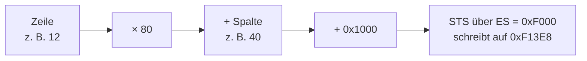

# Kapitel 8 — Ein Spiel: Snake auf dem Bildschirmpuffer

Sieben Kapitel lang haben wir auf die Maschine geschaut. In diesem Kapitel
drehen wir den Spieß um: Wir schreiben etwas, das man **spielen** kann, und
sehen dabei, wie viele der Bausteine aus den Kapiteln 2 bis 7 auf einmal
gebraucht werden. Das Ergebnis ist ein rund 250 Zeilen langes Programm ohne
eine einzige fremde Bibliothek — und es läuft auf demselben Simulator, auf
dem du seit Kapitel 2 arbeitest.

Das Spiel ist Snake: Ein Kopf wandert über ein 80 × 25 Felder großes Spielfeld,
jeder Tastendruck setzt ihn eine Zelle in eine der vier Richtungen, und wer in
den Rand läuft, verliert. Snake ist keine zufällige Wahl. Es ist die kleinste
Aufgabe, die **alle drei Ebenen** dieses Buches gleichzeitig braucht: Adressrechnung
auf dem Bildschirmpuffer (§8.1), Blockbewegung von Speicherblöcken (§8.2) und
eine Zustandsmaschine mit Unterprogrammen, die über Register läuft (§8.3).

Und noch etwas kommt dazu, das in den ersten sieben Kapiteln keine Rolle
gespielt hat: **Das Spiel muss auf Eingabe reagieren, ohne zu warten.** Ein
Programm, das 50000 Poll-Durchläufe lang auf eine Taste wartet, sieht in einem
Debugger *hängt* aus — nicht * wartet*. Diese Unterscheidung, ein Wartebudget
und die Frage, wie man sie sauber zieht, ist der rote Faden des Kapitels.

---

## 8.1 Adressrechnung: aus Zeile und Spalte wird eine Adresse

Der Bildschirmpuffer aus Kapitel 6 ist **flach**: 2000 Wörter von `0xF1000`
bis `0xF17CF`, in Zeilen von je 80 Zellen. Ein Spiel, das „Zeile 12, Spalte 40"
sagen will, muss daraus eine Adresse rechnen, und die Formel ist denkbar
einfach:

> **Zusammengefasst:** `EA = 0x1000 + Zeile × 80 + Spalte`, geschrieben über
> `ES = 0xF000`.

Listing 8-1 setzt ein `X` in Zeile 2, Spalte 7 und prüft die Adresse.

```assembly
; listing 8-1: Adressrechnung — Zeile 2, Spalte 7 auf dem Bildschirm
.org 0x0100

        LDI  -4096
        MVS  ES, R0          ; ES = 0xF000 — Peripherie-Fenster
        LDI  0x1000
        MOV  R8, R0          ; R8 -> Basis der ersten Zelle
        LDI  2
        MOV  R1, R0          ; R1 = Zeile 2
        LDI  80
        MOV  R9, R0
        MUL  R1, R9          ; R1 = Zeile * 80 = 160
        LDI  7
        MOV  R2, R0          ; R2 = Spalte 7
        ADD  R1, R2          ; R1 = Index 167
        ADD  R1, R8          ; R1 = EA 0x10A7
        LDI  0x0058          ; 'X'
        MOV  R3, R0
        STS  R3, ES, R1      ; Zelle beschreiben
        HALT
```

Gemessen (alle drei Kerne, 27 Schritte): `R1` = **`0x10A7`** — nach der
letzten Addition steht die vollständige Effektivadresse im Register, nicht der
nackte Index. Der Index `167` ist nur der Zwischenwert nach `ADD R1, R2`.
Die Zelle `0xF10A7` enthält `0x0058`, die Nachbarzelle `0xF10A6` bleibt
`0xFFFF` — unberührt. Genau deshalb steht am Ende `ADD R1, R8`: Ein
Programm, das die EA braucht, sollte sie am Ende auch im Register haben.

**Tabelle 8-1: Adressen an den Rändern des Spielfelds** (alle drei Kerne
identisch)

| Zeile | Spalte | Index | EA | Inhalt |
|---|---|---|---|---|
| 2 | 7 | `167` | `0x10A7` | `0x0058` ✔ |
| 2 | 79 | `239` | `0x10EF` | `0x0058` ✔ |
| 24 | 79 | `1999` | `0x17CF` | `0x0058` ✔ |

**`Bildschirmzelle` — Adressrechnung in drei Schritten**



Die drei Schritte sind drei Anweisungen — `MUL`, `ADD`, `ADD` — und der
Segmentwert kommt aus dem einmal gesetzten `ES`. Genau deshalb kostet das
Beschreiben einer Zelle nur vier Befehle, wenn Zeile und Spalte bereits in
`R10` und `R11` stehen.

Die dritte Zeile ist die interessanteste: `0x17CF` ist exakt die letzte Zelle
des Puffers aus Kapitel 6. Die Formel läuft also über den ganzen Bildschirm,
ohne einen Sonderfall an der Grenze.

### Der Rahmen: 2000 Zellen in zwei Schleifen

Jetzt die erste echte Aufgabe: den Spielfeldrand zeichnen. Sie besteht aus
zwei **verschachtelten** Schleifen — außen über die 25 Zeilen, innen über die
80 Spalten — und genau darin steckt eine Falle, die beim ersten Versuch
garantiert zuschlägt.

```assembly
; listing 8-2: das Spielfeld — 25 Zeilen mal 80 Spalten, Rand und Innenraum
.org 0x0100

        LDI  -4096
        MVS  ES, R0                  ; ES = 0xF000
        LDI  0x1000
        MOV  R8, R0                  ; R8  = Basis der ersten Zelle
        LDI  25
        MOV  R11, R0                 ; R11 = Zeilenzahl
        LDI  80
        MOV  R9, R0                  ; R9  = Spaltenzahl
        LDI  24
        MOV  R12, R0                 ; R12 = letzte Zeile
        LDI  79
        MOV  R13, R0                 ; R13 = letzte Spalte
        LDI  0x002A                  ; '*'
        MOV  R5, R0                  ; R5  = Rahmenzeichen
        LDI  0x0020                  ; ' '
        MOV  R4, R0                  ; R4  = Fuellzeichen
        LDI  0
        MOV  R1, R0                  ; R1  = Zeile
        MOV  R7, R0                  ; R7  = Konstante 0
        LDI  zeilen
        MOV  R14, R0                 ; R14 = aeusserer Eintrag
        LDI  zelle
        MOV  R6, R0                  ; R6  = Rumpf (innerer Ruecksprung)

zeilen:
        LDI  0
        MOV  R2, R0                  ; R2  = Spalte

zelle:
        MOV  R10, R4                 ; R10 = Fuellzeichen
        CMP  R1, R12                 ; letzte Zeile?
        JZ   rahmen
        NOP
        CMP  R2, R13                 ; letzte Spalte?
        JZ   rahmen
        NOP
        CMP  R1, R7                  ; erste Zeile?
        JZ   rahmen
        NOP
        CMP  R2, R7                  ; erste Spalte?
        JZ   rahmen
        NOP
        LDI  schreiben
        MOV  R3, R0
        JMP  R3
        NOP
rahmen:
        MOV  R10, R5                  ; R10 = Rahmenzeichen

schreiben:
        MOV  R3, R1
        MUL  R3, R9                  ; R3  = Zeile * 80
        ADD  R3, R2                  ; R3  = + Spalte
        ADD  R3, R8                  ; R3  = EA
        STS  R10, ES, R3             ; Zeichen in die Zelle

spalten:
        ADD  R2, 1
        CMP  R2, R9
        JZ   zeilen_ende
        NOP
        JMP  R6
        NOP

zeilen_ende:
        ADD  R1, 1
        CMP  R1, R11
        JZ   fertig
        NOP
        JMP  R14
        NOP

fertig:
        HALT
```

**Gemessen** (alle drei Kernne, 54463 Schritte): **206** Rahmenzeichen und
**1794** Leerzeichen, sonst nichts. Die Rechnung stimmt: `2 × 80 + 2 × 25 − 4 =
206`, und `23 × 78 = 1794`. Beide Zahlen sind nicht geraten, sondern über alle
2000 Zellen ausgezählt.

Der Bildschirm danach:

```text
|********************************************************************************|
|*                                                                              *|
|*                                                                              *|
|*                                                                              *|
|*                                                                              *|
| … 23 Zeilen mit derselben Form …                                              |
|*                                                                              *|
|********************************************************************************|
```

> **Die Falle:** In der ersten Fassung stand die Zeile `MOV R2, R0` (Spalte = 0)
> **im Kopf der inneren Schleife** — und direkt danach das `ADD R2, 1`, das sie
> hochzählt. Gemessen endete das Programm nach 500000 Schritten ohne `HALT`:
> Der Spaltenzähler wurde auf 0 zurückgesetzt, bevor er je 80 erreichen konnte.
> Zähler gehören **vor** die Schleife, Inkrementieren **hinein**. Dasselbe gilt
> für die äußere Schleife, und deshalb sind es hier drei Sprungmarken
> (`zeilen`, `zelle`, `spalten`) statt zwei.

Beachte auch die Stellen, an denen das Programm springt: `LINK` allein ist kein
Aufruf, es setzt nur `LR`. Der eigentliche Sprung ist ein eigenes `JMP R3`, und
`R3` wurde unmittelbar davor mit `LDI schreiben / MOV R3, R0` gefüllt. Das ist
das Muster aus Kapitel 4 — und aus demselben Grund funktioniert der
Registersprung hier besser als ein `JNZ`: die Delay-Slot-Regel aus §4.1 will
genau ein `NOP` neben jedem bedingten Sprung, und ein unbedingter `JMP Rn`
verlangt es gar nicht.

---

## 8.2 Scrollen: 1920 Wörter in einem Durchgang

Bevor es an die Schlange geht, braucht das Spiel noch eine Fähigkeit, die auf
einer Maschine mit flachem Speicher nicht selbstverständlich ist: **den
Bildschirm um eine Zeile nach oben schieben.** Bei einem echten Terminal
macht das die Hardware. Hier musst du es selbst.

Der Trick ist, die Bewegung **von hinten nach vorn** zu gehen. Würdest du von
vorn nach hinten arbeiten, überschriebe jede Zeile die noch nicht kopierte
Nachbarzeile, und am Ende stünde überall dasselbe Zeichen.

```assembly
; listing 8-3: eine Zeile scrollen — 1920 Wörter nach oben ruecken
.org 0x0100

        LDI  -4096
        MVS  ES, R0                  ; ES = 0xF000
        LDI  0x1000
        MOV  R8, R0                  ; R8 = Basis
        LDI  0
        MOV  R9, R0                  ; R9 = Index beim Fuellen
        LDI  2000
        MOV  R10, R0                 ; R10 = Zellen
        LDI  255
        MOV  R6, R0                  ; R6 = 0x00FF
        LDI  fuel
        MOV  R11, R0

fuel:
        MOV  R1, R9
        ADD  R1, R8                  ; R1 = EA
        MOV  R2, R9
        AND  R2, R6                  ; R2 = Index mod 256
        STS  R2, ES, R1
        ADD  R9, 1
        CMP  R9, R10
        JZ   schritt
        NOP
        JMP  R11
        NOP

schritt:
        LDI  80
        MOV  R12, R0                 ; R12 = Spaltenzahl
        MOV  R9, R8                  ; R9  = Zielzeiger  (0x1000)
        MOV  R2, R9
        ADD  R2, R12                 ; R2  = Quellzeiger (0x1000 + 80)
        LDI  1920
        MOV  R13, R0                 ; R13 = Anzahl Verschiebungen
        LDI  lauf
        MOV  R14, R0

lauf:
        LDS  R3, ES, R2              ; Quelle holen
        STS  R3, ES, R9              ; eine Zeile hoeher legen
        ADD  R9, 1
        ADD  R2, 1
        SUB  R13, 1
        JZ   fertig
        NOP
        JMP  R14
        NOP

fertig:
        HALT
```

Damit lässt sich die Verschiebung prüfen, ohne ein einziges Bild zu betrachten:
Das Programm füllt vorher jede Zelle mit ihrem eigenen Index (gekürzt auf ein
Byte) und schiebt dann. Danach muss Zelle `i` den Wert `(i + 80) mod 256`
tragen.

**Gemessen** (alle drei Kerne, 39308 Schritte): **1920 von 1920 Zellen wie
erwartet, 0 Abweichungen, 0 Kernunterschiede.** Geprüft wurde jede einzelne
Zelle, nicht eine Stichprobe.

Die letzten 80 Zellen bleiben unberührt — das ist korrekt und kein Fehler: Der
Scrollbereich endet bei Zelle 1919, weil die unterste Bildschirmzeile stehen
bleibt. Zelle 1999 trägt danach weiterhin `0x00CF` (`1999 mod 256`), den Wert
aus der Füllphase.

> **Merke:** Bei einer Blockverschiebung im Speicher gilt immer **rückwärts**,
> wenn du nach oben schiebst, und **vorwärts**, wenn du nach unten schiebst.
> Die Richtung entscheidet, ob du eine Zeile kopierst oder sie zerstörst.

---

## 8.3 Das Spiel: Zustand in Registern

Jetzt kommt alles zusammen. Das Spiel kennt genau vier Dinge, die sich von
Tastendruck zu Tastendruck ändern: die Kopfzeile, die Kopfspalte, die Richtung
und das Zeichen, das gezeichnet wird. Alle vier passen in vier Register, und
**das ist die eigentliche Design-Entscheidung**: Ein Spielzustand, der in
Registern liegt, muss nicht gespeichert und geladen werden, sondern ist
automatisch dort, wo die Rechnung ihn ohnehin braucht.

**Tabelle 8-2: Der Spielzustand und seine Register**

| Register | Inhalt | Startwert | Warum dieses Register |
|---|---|---|---|
| `R10` | Kopfzeile | `12` | wird in der Bewegungsrechnung gelesen |
| `R11` | Kopfspalte | `40` | dito |
| `R12` | Richtung (`0` hoch, `1` rechts, `2` runter, `3` links) | `1` | nur gelesen, nie als EA benutzt |
| `R5` | zu zeichnendes Zeichen | `0x004F` (`O`) | direkt an `STS` übergeben |
| `R8` | Bildschirmbasis `0x1000` | — | Konstante der Adressrechnung |
| `R9` | Spaltenzahl `80` | — | Konstante der Adressrechnung |

Listing 8-4 ist das vollständige Spiel. Es hat **zwei Unterprogramme** — `feld`
berechnet die EA, `setz` schreibt das Zeichen — und beide werden über
`LINK` + `JMP Rn` aufgerufen und über `JMP LR` verlassen.

```assembly
; listing 8-4: Snake — Kopf, Richtungen, Randtreffer
.org 0x0100

        LDI  -4096
        MVS  ES, R0                  ; ES = 0xF000
        LDI  0x0060
        MOV  R6, R0                  ; R6 -> Status-Port
        LDI  0x0062
        MOV  R7, R0                  ; R7 -> Daten-Port
        LDI  0x1000
        MOV  R8, R0                  ; R8  = Basis Bildschirm
        LDI  80
        MOV  R9, R0                  ; R9  = Spaltenzahl
        LDI  12
        MOV  R10, R0                 ; R10 = Kopfzeile
        LDI  40
        MOV  R11, R0                 ; R11 = Kopfspalte
        LDI  1
        MOV  R12, R0                 ; R12 = Richtung: rechts
        LDI  0x004F                  ; 'O'
        MOV  R5, R0                  ; R5  = Kopfzeichen
        LDI  runde
        MOV  R13, R0                 ; R13 = Adresse der Pollschleife
        LDI  100
        MOV  R1, R0                  ; R1 = aeusseres Budget

        ; ---- Kopf an der Startposition zeichnen ----
        LDI  feld
        MOV  R4, R0
        LINK
        JMP  R4
        NOP
        LDI  setz
        MOV  R4, R0
        LINK
        JMP  R4
        NOP

runde:
        LDI  500
        MOV  R2, R0                  ; R2 = inneres Budget

warten:
        SUB  R2, 1
        JZ   runde_ende              ; innen durch -> naechste Runde
        NOP
        LDS  R2, ES, R6              ; Status lesen
        ADD  R2, 0                   ; LDS setzt keine Flags
        JZ   warten                  ; nichts da
        NOP
        LDI  auswerten
        MOV  R4, R0
        JMP  R4                      ; Taste da -> auswerten
        NOP

runde_ende:
        SUB  R1, 1
        JZ   fertig                  ; Budget erschoepft -> Ende
        NOP
        LDI  runde
        MOV  R4, R0
        JMP  R4
        NOP

auswerten:
        LDI  10
        MOV  R4, R0
        LDS  R3, ES, R7              ; Taste holen
        CMP  R3, R4
        JZ   fertig                  ; Enter -> Ende
        NOP

        ; ---- Richtung aus der Taste ableiten ----
        LDI  0x0077                  ; 'w'
        MOV  R4, R0
        CMP  R3, R4
        JZ   richtung_hoch
        NOP
        LDI  0x0073                  ; 's'
        MOV  R4, R0
        CMP  R3, R4
        JZ   richtung_runter
        NOP
        LDI  0x0061                  ; 'a'
        MOV  R4, R0
        CMP  R3, R4
        JZ   richtung_links
        NOP
        LDI  0x0064                  ; 'd'
        MOV  R4, R0
        CMP  R3, R4
        JZ   richtung_rechts
        NOP
        JMP  R13                     ; unbekannte Taste: zurueck zur Pollschleife
        NOP

richtung_hoch:
        LDI  0
        MOV  R12, R0
        LDI  bewegen
        MOV  R4, R0
        JMP  R4
        NOP
richtung_runter:
        LDI  2
        MOV  R12, R0
        LDI  bewegen
        MOV  R4, R0
        JMP  R4
        NOP
richtung_links:
        LDI  3
        MOV  R12, R0
        LDI  bewegen
        MOV  R4, R0
        JMP  R4
        NOP
richtung_rechts:
        LDI  1
        MOV  R12, R0

bewegen:
        ; ---- alte Kopfposition loeschen ----
        LDI  0x0020                  ; ' '
        MOV  R5, R0
        LDI  feld
        MOV  R4, R0
        LINK
        JMP  R4
        NOP
        LDI  setz
        MOV  R4, R0
        LINK
        JMP  R4
        NOP

        ; ---- neue Position bestimmen ----
        LDI  0
        MOV  R4, R0
        CMP  R12, R4
        JZ   nach_hoch
        NOP
        LDI  1
        MOV  R4, R0
        CMP  R12, R4
        JZ   nach_rechts
        NOP
        LDI  3
        MOV  R4, R0
        CMP  R12, R4
        JZ   nach_links
        NOP
        ADD  R10, 1                  ; Richtung 2 = runter
        LDI  pruefen
        MOV  R4, R0
        JMP  R4
        NOP
nach_hoch:
        SUB  R10, 1
        LDI  pruefen
        MOV  R4, R0
        JMP  R4
        NOP
nach_rechts:
        ADD  R11, 1
        LDI  pruefen
        MOV  R4, R0
        JMP  R4
        NOP
nach_links:
        SUB  R11, 1

pruefen:
        ; ---- Rand getroffen? ----
        LDI  24
        MOV  R4, R0
        CMP  R10, R4
        JZ   ende
        NOP
        LDI  0
        MOV  R4, R0
        CMP  R10, R4
        JZ   ende
        NOP
        LDI  79
        MOV  R4, R0
        CMP  R11, R4
        JZ   ende
        NOP
        LDI  0
        MOV  R4, R0
        CMP  R11, R4
        JZ   ende
        NOP

        ; ---- neuen Kopf zeichnen ----
        LDI  0x004F                  ; 'O'
        MOV  R5, R0
        LDI  feld
        MOV  R4, R0
        LINK
        JMP  R4
        NOP
        LDI  setz
        MOV  R4, R0
        LINK
        JMP  R4
        NOP
        JMP  R13                     ; naechster Zug
        NOP

ende:
        LDI  0x0058                  ; 'X'
        MOV  R5, R0
        LDI  feld
        MOV  R4, R0
        LINK
        JMP  R4
        NOP
        LDI  setz
        MOV  R4, R0
        LINK
        JMP  R4
        NOP

fertig:
        HALT

; ------------------------------------------------------------------
; feld: EA = 0x1000 + R10 * 80 + R11   (Ergebnis in R1)
; ------------------------------------------------------------------
feld:
        MOV  R1, R10
        MUL  R1, R9                  ; R1 = Zeile * 80
        ADD  R1, R11                 ; + Spalte
        ADD  R1, R8                  ; + Basis -> R1 = EA
        JMP  LR
        NOP

; ------------------------------------------------------------------
; setz: Zelle an EA (R1) mit Zeichen R5 beschreiben
; ------------------------------------------------------------------
setz:
        STS  R5, ES, R1              ; R1 = EA aus feld
        JMP  LR
        NOP
```

### Gemessene Spielzüge

Jeder Fall wurde auf **allen drei Kernen** ausgeführt; Register, `PSW` und der
gesamte Bildschirmpuffer stimmen jeweils überein. Die Tabelle nennt, was nach
dem Zug auf dem Bildschirm steht — geprüft wurde jede der 2000 Zellen, nicht
eine Stichprobe.

**Tabelle 8-3: Gemessene Spielzüge** (Bildschirmangabe = Position des verbliebenen Zeichens)

| Eingabe | Erwartetes Ergebnis | Bildschirm danach | `R10`, `R11` | Schritte |
|---|---|---|---|---|
| `d` | einen Schritt rechts | `O` bei (12,41) | `12`, `41` | 500000 |
| `a` | einen Schritt links | `O` bei (12,39) | `12`, `39` | 500000 |
| `dswa` | Quadrat, zurück auf dem Startfeld | `O` bei (12,40) | `12`, `40` | 500000 |
| `ddds` | drei rechts, dann runter | `O` bei (13,43) | `13`, `43` | 500000 |
| `z` | unbekannte Taste, ignoriert | `O` bei (12,40) | `12`, `40` | 500000 |
| Enter | sofortiges Ende | `O` bei (12,40) | `12`, `40` | 71 |
| `d` × 39 | Treffer rechts | `X` bei (12,79) | `12`, `79` | 4725 |
| `w` × 12 | Treffer oben | `X` bei (0,40) | `0`, `40` | 1288 |
| `s` × 12 | Treffer unten | `X` bei (24,40) | `24`, `40` | 1463 |
| `a` × 40 | Treffer links | `X` bei (12,0) | `12`, `0` | 4850 |

Vier Beobachtungen lohnen sich:

**Die vierten Fälle sind die aussagekräftigsten.** `dswa` beschreibt ein
geschlossenes Quadrat — nach vier Schritten steht der Kopf auf exakt
(12,40), dem Feld, von dem er gestartet ist, und die drei dazwischen
freigeräumten Zellen tragen Leerzeichen. Das prüft Adressrechnung *und*
Löschen *und* Richtungswechsel in einem Durchlauf.

**`Enter` ist der schnellste Fall: 71 Schritte.** Kein einziger Poll-Durchlauf
vergeht, kein Budget wird verbraucht. Genau das ist der Unterschied zwischen
„wartet auf Eingabe" und „ist hängengeblieben", und es ist der Grund, warum das
Spiel diese Taste braucht: Es ist der einzige Weg aus dem Programm heraus, ohne
den Simulator neu zu starten.

**Die Trefferfälle kosten 1288 bis 4850 Schritte** und laufen alle über den
kurzesten Weg in den Rand. Am billigsten ist die obere Kante mit 1288 Schritten
(12 Züge), am teuersten die linke mit 4850 (40 Züge).

**Die ersten sechs Fälle zeigen 500000 Schritte.** Das ist das **Wartebudget**,
nicht ein Fehler: Das Programm wartet nach dem Zug weiter auf die nächste Taste,
und der Simulator rechnet dabei bis zum Limit. In der echten Anwendung stehen
dort 100 äußere Runden zu je 500 inneren Poll-Durchläufen, also 50000 Versuche
— danach bricht das Programm ab und geht kontrolliert zu `HALT`.

---

## Das solltest du mitnehmen

1. **Der Bildschirm ist flach.** `EA = 0x1000 + Zeile × 80 + Spalte`, geschrieben
   über `ES = 0xF000`. Kein Sonderfall an den Rändern — Zelle (24,79) liegt auf
   `0x17CF`, dem letzten Wort des Puffers.
2. **Zähler gehören vor die Schleife, nicht hinein.** Ein `MOV Rn, R0` im Kopf
   einer Schleife, die `Rn` selbst hochzählt, setzt den Zähler zurück und lässt
   das Programm endlos laufen (gemessen: 500000 Schritte ohne `HALT`). Bei
   verschachtelten Schleifen braucht es deshalb drei Sprungmarken: Eintrag,
   Rumpf, Ausstieg.
3. **Blockverschiebung läuft rückwärts.** 1920 von 1920 Zellen stimmen, wenn die
   Quelle hinter dem Ziel läuft; in der anderen Richtung zerstört man die
   Nachbarzeile.
4. **Der Spielzustand gehört in Register.** Vier Werte — Kopfzeile, Kopfspalte,
   Richtung, Zeichen — und ein Programm ohne ein einziges `ST` in den
   Zustandsbereich. Ein Zustand im Speicher müsste gesichert und geladen werden;
   im Register ist er dort, wo die Rechnung ihn ohnehin braucht.
5. **`LINK` ist kein Aufruf.** Es setzt nur `LR`; der Sprung ist ein eigenes
   `JMP Rn`. Und der Rückweg braucht ein Ergebnisregister, das vom
   `LDI`-Scratch unabhängig ist — sonst überschreibt `LDI ziel` die gerade
   berechnete Adresse, und das Spiel zeichnet in den Programmspeicher statt auf
   den Bildschirm. Genau dieser Fehler trat beim Bauen auf: Die ersten drei
   Versionen schrieben nach `0x0110` und `0x01C4` — Adressen im Programm.
6. **Ein Wartebudget unterscheidet Warten von Hängen.** Ohne Budget sieht ein
   Programm, das auf eine Taste hört, im Debugger tot aus. Mit Budget läuft es
   kontrolliert in `HALT` — im Fall `Enter` nach 71 Schritten, ohne eine einzige
   verbrauchte Pollschleife.
7. **Der Fehlerpfad gehört zum Spiel.** Alle vier Randtreffer enden sichtbar
   (ein `X` an der getroffenen Zelle) und kontrolliert, nicht in einer
   Endlosschleife. Ein Spiel, das bei einem Fehler hängen bleibt, ist kein
   Spiel.

**Nächstes Kapitel:** Die Anhänge bringen das Nachschlagewerk: die vollständige
Befehlsreferenz mit den Codierungen aus Kapitel 3, die PSW-Belegung als
Spickzettel, ein Glossar mit den 6502-Entsprechungen und die Liste aller
Werkzeuge, mit denen jedes Listing dieses Buches gemessen wurde.