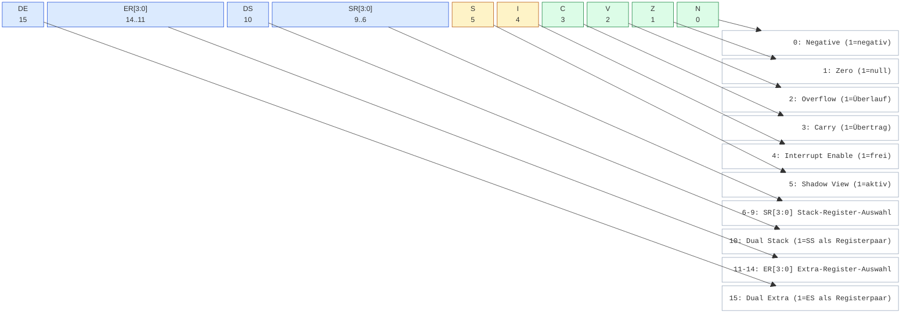

# Mermaid-Test: Das PSW

> Testdatei für die Illustrationen des Buches **»Deep16 für 6502-Programmierer«**.
>
> Das Diagramm nutzt `block-beta` mit unbenannten Blöcken — das rendert in allen
> gängigen Werkzeugen (GitHub, VS Code, Typora, mermaid.ink) identisch.
> Die Feldbeschreibungen sind **direkt ins Diagramm integriert**: von jedem Feld
> führt eine Linie nach unten und rechts zur zugehörigen Beschreibung am rechten
> Rand — die klassische ASCII-»Leiter« aus den Prozessor-Handbüchern.

## Das Processor Status Word (PSW)

Das PSW ist das 16-Bit-Statusregister der Deep16. Die unteren Bits (`N Z V C I`)
sind dem 6502-Programmierer sofort vertraut. Die oberen Bits (`SR DS ER DE`)
steuern die Segment-Mechanik — auf der 6502 gibt es so etwas nicht, genau das
macht Kapitel 2 des Buches spannend.

> **Farben:** blau = Segment-/Kontext-Mechanik,
> gelb = Interrupt-Steuerung,
> grün = Arithmetik-Flags.
> Die Beschreibungsspalte rechts ist bewusst neutral gehalten (weiß/grau) und
> alle Textzeilen enden bündig am rechten Rand — wie in der ASCII-Vorlage.

### Bedeutung der Bits

| Bit(s) | Name | Bedeutung | Vergleich zur 6502 |
|--------|------|-----------|--------------------|
| 0 | `N` | Negative Flag (1 = Ergebnis negativ) | ≙ N |
| 1 | `Z` | Zero Flag (1 = Ergebnis null) | ≙ Z |
| 2 | `V` | Overflow Flag (1 = vorzeichenbehafteter Überlauf) | ≙ V |
| 3 | `C` | Carry Flag (1 = Übertrag/Borrow) | ≙ C |
| 4 | `I` | Interrupt Enable (1 = Interrupts frei) | ≙ I, aber per `SETI`/`CLRI` |
| 5 | `S` | **Shadow View** (1 = Shadow-Kontext aktiv) | **neu!** Kern der Interrupt-Mechanik |
| 6–9 | `SR[3:0]` | Stack-Register-Auswahl (0–15) | **neu!** SS ist frei wählbar |
| 10 | `DS` | Dual Stack (1 = SS via Registerpaar) | **neu!** |
| 11–14 | `ER[3:0]` | Extra-Register-Auswahl (0–15) | **neu!** ES ist frei wählbar |
| 15 | `DE` | Dual Extra (1 = ES via Registerpaar) | **neu!** |

**Reset-Zustand:** `0x0020` → nur Bit 5 (`S`=1) gesetzt, Interrupts gesperrt.
Weitere Hinweise für 6502-Umsteiger: Es gibt **kein** Dezimal-Flag (`D`) und
kein Break-Flag (`B`) — dezimale Arithmetik kennt die Deep16 nicht; Interrupts
werden über `I` maskiert und über `S` kontextgetrennt (Kapitel 5).