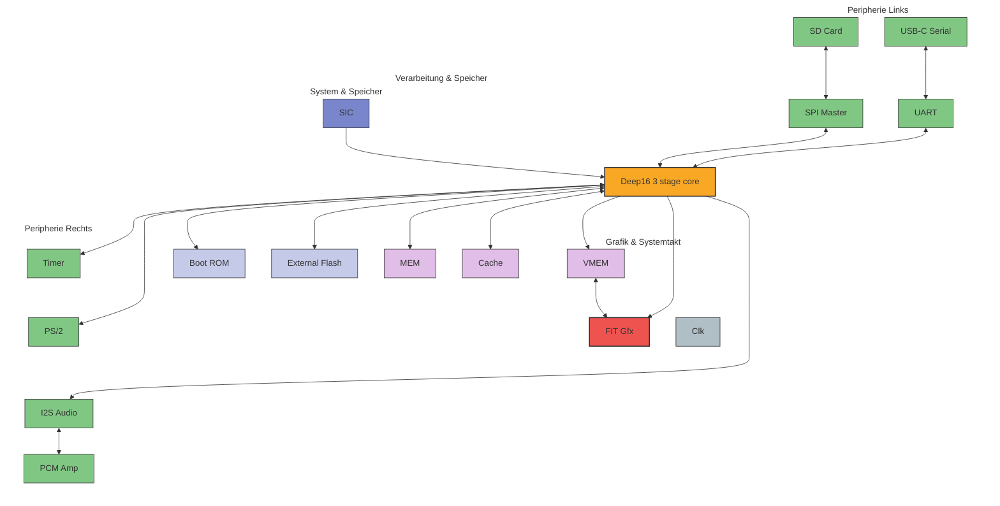

```mermaid
flowchart TB
    %% Layout-Strukturierung durch Spalten (Subgraphs)
    subgraph LeftSide [Peripherie Links]
        direction TB
        SDCard[SD Card]
        SPIMaster[SPI Master]
        USBCSerial[USB-C Serial]
        UART[UART]
        
        %% Vertikale Ausrichtung links erzwingen
        SDCard <--> SPIMaster
        USBCSerial <--> UART
    end

    subgraph CenterColumn [Verarbeitung & Speicher]
        direction TB
        
        %% Obere Sektion
        subgraph TopMem [System & Speicher]
            direction LR
            BootROM[Boot ROM]
            ExtFlash[External Flash]
            MEM[MEM]
            Cache[Cache]
            SIC[SIC]
        end

        %% Haupt-Core im Zentrum
        Core[Deep16 3 stage core]

        %% Untere Sektion
        subgraph BottomGfx [Grafik & Systemtakt]
            direction LR
            VMEM[VMEM]
            FITGfx[FIT Gfx]
            Clk[Clk]
            VMEM <--> FITGfx
        end

        %% Vertikale Hierarchie erzwingen
        TopMem ~~~ Core ~~~ BottomGfx
    end

    subgraph RightSide [Peripherie Rechts]
        direction TB
        Timer[Timer]
        PS2[PS/2]
        I2SAudio[I2S Audio]
        PCMAmp[PCM Amp]
        
        %% Vertikale Ausrichtung rechts erzwingen
        Timer ~~~ PS2 ~~~ I2SAudio
        I2SAudio <--> PCMAmp
    end

    %% Reale Signalverbindungen zwischen den Blöcken
    Core --> BootROM
    Core --> ExtFlash
    Core <--> MEM
    Core <--> Cache
    SIC --> Core

    SPIMaster <--> Core
    UART <--> Core

    Core <--> Timer
    Core <--> PS2
    Core --> I2SAudio

    Core --> VMEM
    Core --> FITGfx

    %% Styling (Farbanpassung an das Original)
    style Core fill:#F9A825,stroke:#333,stroke-width:2px;
    style FITGfx fill:#EF5350,stroke:#333,stroke-width:2px;
    
    style BootROM fill:#C5CAE9,stroke:#333;
    style ExtFlash fill:#C5CAE9,stroke:#333;
    style MEM fill:#E1BEE7,stroke:#333;
    style Cache fill:#E1BEE7,stroke:#333;
    style VMEM fill:#E1BEE7,stroke:#333;
    style SIC fill:#7986CB,stroke:#333;

    style Timer fill:#81C784,stroke:#333;
    style PS2 fill:#81C784,stroke:#333;
    style I2SAudio fill:#81C784,stroke:#333;
    style PCMAmp fill:#81C784,stroke:#333;
    style SDCard fill:#81C784,stroke:#333;
    style SPIMaster fill:#81C784,stroke:#333;
    style UART fill:#81C784,stroke:#333;
    style USBCSerial fill:#81C784,stroke:#333;
    
    style Clk fill:#B0BEC5,stroke:#333;

    %% Subgraph-Rahmen unsichtbar machen für sauberen Look
    style LeftSide fill:none,stroke:none;
    style RightSide fill:none,stroke:none;
    style CenterColumn fill:none,stroke:none;
    style TopMem fill:none,stroke:none;
    style BottomGfx fill:none,stroke:none;
```
