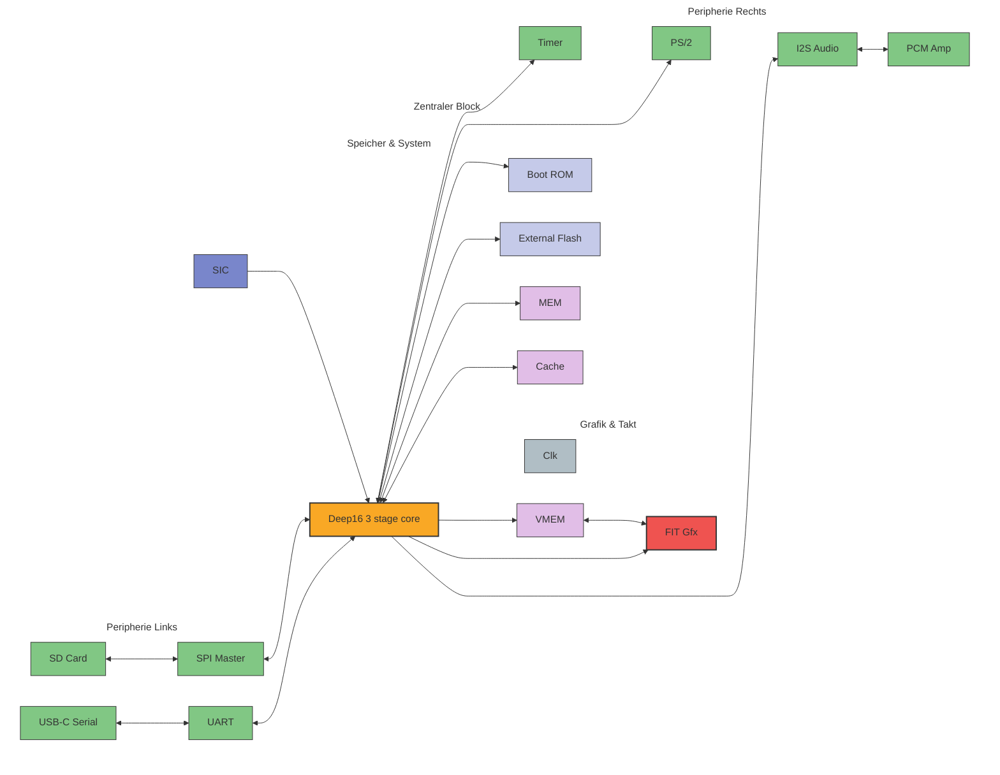

```mermaid
flowchart LR
    %% Definition der horizontalen Spalten-Struktur (Links nach Rechts)
    subgraph LeftCol [Peripherie Links]
        direction TB
        SDCard[SD Card]
        SPIMaster[SPI Master]
        USBCSerial[USB-C Serial]
        UART[UART]
        
        %% Vertikale Paarung erzwingen
        SDCard <--> SPIMaster
        USBCSerial <--> UART
    end

    subgraph CenterCol [Zentraler Block]
        direction TB
        
        subgraph TopBlocks [Speicher & System]
            direction LR
            BootROM[Boot ROM]
            ExtFlash[External Flash]
            MEM[MEM]
            Cache[Cache]
            SIC[SIC]
        end

        Core[Deep16 3 stage core]

        subgraph BottomBlocks [Grafik & Takt]
            direction LR
            Clk[Clk]
            VMEM[VMEM]
            FITGfx[FIT Gfx]
            VMEM <--> FITGfx
        end

        %% Struktur-Reihenfolge in der Mitte erzwingen
        TopBlocks ~~~ Core ~~~ BottomBlocks
    end

    subgraph RightCol [Peripherie Rechts]
        direction TB
        Timer[Timer]
        PS2[PS/2]
        I2SAudio[I2S Audio]
        PCMAmp[PCM Amp]
        
        %% Vertikale Kette rechts erzwingen
        Timer ~~~ PS2 ~~~ I2SAudio <--> PCMAmp
    end

    %% Querverbindungen von den Seiten in die Mitte (Erzwingt das 3-Spalten-Layout)
    SPIMaster <--> Core
    UART <--> Core
    Core <--> Timer
    Core <--> PS2
    Core --> I2SAudio

    %% Verbindungen innerhalb der Hauptsäule
    Core --> BootROM
    Core --> ExtFlash
    Core <--> MEM
    Core <--> Cache
    SIC --> Core
    Core --> VMEM
    Core --> FITGfx

    %% Styling (Farbanpassung an das Original)
    style Core fill:#F9A825,stroke:#333,stroke-width:2px;
    style FITGfx fill:#EF5350,stroke:#333,stroke-width:2px;
    
    style BootROM fill:#C5CAE9,stroke:#333;
    style ExtFlash fill:#C5CAE9,stroke:#333;
    style MEM fill:#E1BEE7,stroke:#333;
    style Cache fill:#E1BEE7,stroke:#333;
    style VMEM fill:#E1BEE7,stroke:#333;
    style SIC fill:#7986CB,stroke:#333;

    style Timer fill:#81C784,stroke:#333;
    style PS2 fill:#81C784,stroke:#333;
    style I2SAudio fill:#81C784,stroke:#333;
    style PCMAmp fill:#81C784,stroke:#333;
    style SDCard fill:#81C784,stroke:#333;
    style SPIMaster fill:#81C784,stroke:#333;
    style UART fill:#81C784,stroke:#333;
    style USBCSerial fill:#81C784,stroke:#333;
    
    style Clk fill:#B0BEC5,stroke:#333;

    %% Hilfsrahmen unsichtbar machen für ein sauberes Gesamtbild
    style LeftCol fill:none,stroke:none;
    style CenterCol fill:none,stroke:none;
    style RightCol fill:none,stroke:none;
    style TopBlocks fill:none,stroke:none;
    style BottomBlocks fill:none,stroke:none;
```
